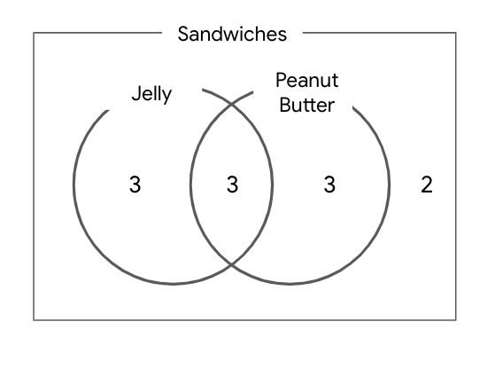

# Get a read on your analytical skills

## Question 1: This practice quiz will help you get a read on the analytical skills you already have

After you respond to each question, be sure to check the feedback you receive. This will help you check your own thinking against the expected thinking for these questions. The analytical skills assessed in this quiz will come in handy and be further developed as you progress in the program.

- Identify the pattern from left to right in the set of blocks below and try to predict which block should replace the block with the question mark.

- Answer: 

## Question 2: Here's a more complex pattern. Identify the pattern from left to right in the images below and try to predict which image should come next

- Answer: 

## Question 3: Now, find a pattern in a different format. Select the next number in the sequence

Fill in the blank: 9, 13, 17, 21, 25, 29, _____

- Answer: 33

## Question 4: The following numbers are in a sequence from left to right. Determine the pattern and decide which number should come next: Fill in the blank: 4, 9, 16, 25, 36, 49, _____

4 = 2*2
9 = 3*3
16 = 4*4
25 = 5*5
36 = 6*5
49 = 7*7
64 = 8*8

- Answer: 64

## Question 5: The following question is about recognizing and matching patterns in shapes that are the same, but viewed from different angles

Two shapes are similar when one can become the other after a rotation clockwise ⟳ or counterclockwise ↺, or a reflection horizontally ↔ and/or vertically ↕.

- Your task is to choose the figure that completes the statement. Pay attention to the pattern by which the first and second shapes are related, and then figure out which choice matches shape 3. Fill in the blank:

Answer 5:  - a reflection horizontally

## Question 6: The following question is about recognizing and matching patterns in shapes that are the same, but viewed from different angles. Two shapes are similar when one can become the other after a rotation clockwise ⟳ or counterclockwise ↺, or a reflection horizontally ↔ and/or vertically ↕

Your task is to choose the figure that completes the statement. Fill in the blank:

Answer 6: B.  - a rotation counterclockwise ↺

## Question 7: The following series of codes are in a sequence from left to right. There is a repeating pattern that you will notice. Determine the pattern and decide which code should come next

Fill in the blank: A1, B3, C5, D7, E9, F11, G13, _____

Answer 7: 'H'

## Question 8: The following series of codes are in a sequence from left to right. There is a repeating pattern that you will notice. Determine the pattern and decide which sequence of letters should come next

Fill in the blank: A, AA, AAA, B, BA, BAA, BAAA, BB, BBA, BBAA, BBAAA, BBB, ________

A, AA, AAA, B, BA, BAA, BAAA, BB, BBA, BBAA, BBAAA, BBB

1. A, AA, AAA,
2. B, BA, BAA, BAAA = 1 + B
3. BB, BBA, BBAA, BBAAA = 2 + B
4. BBB, BBBA = 3 + B =>`Answer`

## Question 9: Now, identify patterns in a word problem using a data visualization. There are 12 chocolates in a box: eight have caramel filling, six have coconut filling, and two have both caramel and coconut filling. Choose the best image that describes this box of chocolates

A. 

B. 

C. 

D. 

- 12 chocolates
  - 8 caramel
  - 6 coconut
  - 2 caramel + coconute
- Answer is C

## Question 10: There are 10 children in a class and they have all brought sandwiches for lunch: five children have sandwiches with peanut butter, six children have sandwiches with jelly, and three children have sandwiches with both peanut butter and jelly

Find out how many children have sandwiches with neither peanut butter nor jelly and choose the image that describes the situation best.

A. 

B. 

C. 

D. 

- 10 children
  - 5: peanut butter
  - 6: jelly
  - 3: peanut + butter
- Answer is `B`
