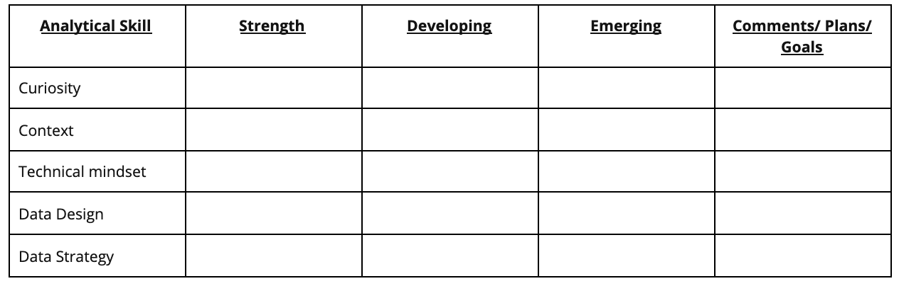

# Learning Log: Reflect on your skills and expectations

## Overview

- You have already learned about the five essential aspects of analytical skills:
  - curiosity
  - understanding context
  - having a technical mindset
  - data design
  - data strategy.
- You have also discovered that you’re already practicing these skills.
- Now, you’ll complete an entry in your learning log exploring your own analytical strengths and weaknesses and your goals for the future.
- By the time you complete this activity, you will have a stronger understanding of your analytical skill set and how you can practice and improve them.
- These analytical skills are key to helping you solve problems and create insights using data analysis. Thinking about them now will help you grow as a data analyst!

## The analytical skills table

First, you’ll fill out an Analytical Skills Table in your learning log entry. The table will appear like this in the template:

- The table has a row for each essential aspect of analytical skills:
  - Curiosity: a desire to know more about something, asking the right questions
  - Understanding context: understanding where information fits into the “big picture”
  - Having a technical mindset: breaking big things into smaller steps
  - Data design: thinking about how to organize data and information
  - Data strategy: thinking about the people, processes, and tools used in data analysis
- You will put an X in the column that you think best describes your current level with each aspect. The three ratings are:
  - Strength: This is an area you feel is one of your strengths
  - Developing: You have some experience with this area, but there’s still significant room for growth
  - Emerging: This is new to you, and will gain experience in this area from this course
- Then update the Comments/Plans/Goals column with a quick note to yourself about why you chose those ratings.

## Access your learning log

To use the template for this course item, click the link below and select “Use Template.”

Link to learning log template: [Reflect on your skills and expectations](https://docs.google.com/document/d/1Wf8-Cf8bEsS_I2ckXGZCoGLSBc3F38KiUn7vCI7M1ZI/template/preview)

OR

If you don’t have a Google account, you can download the template directly from the attachment below.

## Reflection

- After you have completed the Analytical Skills Table, take a moment to reflect on your evaluations. In your learning log entry, write 2-3 sentences (40-60 words) in response to each question below:
  - What do you notice about the ratings you gave yourself in each area? How did you rate yourself in the areas that appeal to you most?
  - If you are asked to rate your experience level in these areas again in a week, what do you think the ratings will be, and why do you think that?
  - How do you plan on developing these skills from now on?

When you’ve finished your entry in the learning log template, make sure to save the document so your response is somewhere accessible. This will help you continue applying data analysis to your everyday life. You will also be able to track your progress and growth as a data analyst.
