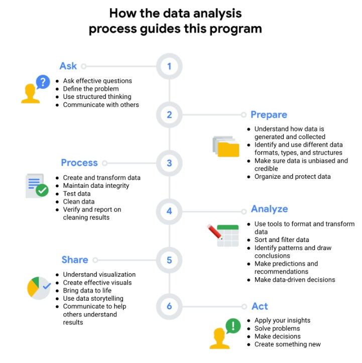

# The data analysis process and this program

**Learn about the process through the program:**

- Learn more about the Ask phase of the process in [the Ask Questions to Make Data-Driven Decisions course](https://www.coursera.org/learn/ask-questions-make-decisions/home/welcome).
- Learn more about the Prepare phase of the process in [the Prepare Data for Exploration course](https://www.coursera.org/learn/data-preparation/home/welcome).
- Learn more about the Process phase of the process in [the Process Data from Dirty to Clean course](https://www.coursera.org/learn/process-data/home/welcome).
- Learn more about the Analyze phase of the process in [the Analyze Data to Answer Questions](https://www.coursera.org/learn/analyze-data/home/welcome) and [Data Analysis with R Programming courses](https://www.coursera.org/learn/data-analysis-r/home/welcome).
- Learn more about the Share phase of the process in [the Share Data Through the Art of Visualization](https://www.coursera.org/learn/visualize-data/home/welcome) and [Data Analysis with R Programming courses](https://www.coursera.org/learn/data-analysis-r/home/welcome).
- Learn more about the Act phase of the process in the [Google Data Analytics Capstone: Complete a Case Study course.](https://www.coursera.org/learn/google-data-analytics-capstone/home/welcome)

Note: The course links are for you to preview and not complete the courses at this time. You may mark this activity as complete after you understand how the courses align to the data analysis process.
