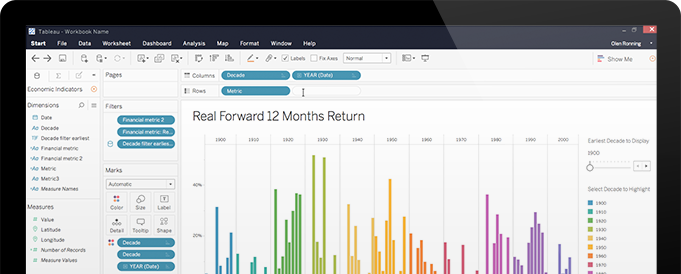

# Planning a data visualization

- Earlier, you learned that data visualization is the graphical representation of information. As a data analyst, you will want to create visualizations that make your data easy to understand and interesting to look at. Because of the importance of data visualization, most data analytics tools (such as spreadsheets and databases) have a built-in visualization component while others (such as Tableau) specialize in visualization as their primary value-add. In this reading, you will explore the steps involved in the data visualization process and a few of the most common data visualization tools available.

## Steps to plan a data visualization

- Let’s go through an example of a real-life situation where a data analyst might need to create a data visualization to share with stakeholders. Imagine you’re a data analyst for a clothing distributor. The company helps small clothing stores manage their inventory, and sales are booming. One day, you learn that your company is getting ready to make a major update to its website. To guide decisions for the website update, you’re asked to analyze data from the existing website and sales records. Let’s go through the steps you might follow.

### Step 1: Explore the data for patterns

- First, you ask your manager or the data owner for access to the current sales records and website analytics reports. This includes information about how customers behave on the company’s existing website, basic information about who visited, who bought from the company, and how much they bought.

- While reviewing the data you notice a pattern among those who visit the company’s website most frequently: geography and larger amounts spent on purchases. With further analysis, this information might explain why sales are so strong right now in the northeast—and help your company find ways to make them even stronger through the new website.

### Step 2: Plan your visuals

- Now that you have decided what kind of information and insights you want to display, it is time to start creating the actual visualizations. Keep in mind that creating the right visualization for a presentation or to share with stakeholders is a process. It involves trying different visualization formats and making adjustments until you get what you are looking for. In this case, a mix of different visuals will best communicate your findings and turn your analysis into the most compelling story for stakeholders. So, you can use the built-in chart capabilities in your spreadsheets to organize the data and create your visuals.

## Build your data visualization toolkit

- There are many different tools you can use for data visualization.

- You can use the visualizations tools in your spreadsheet to create simple visualizations such as line and bar charts.
- You can use more advanced tools such as Tableau that allow you to integrate data into dashboard-style visualizations.
- If you’re working with the programming language R you can use the visualization tools in RStudio.
Your choice of visualization will be driven by a variety of drivers including the size of your data, the process you used for analyzing your data (spreadsheet, or databases/queries, or programming languages). For now, just consider the basics.

## Spreadsheets (Microsoft Excel or Google Sheets)

- In our example, the `built-in charts` and graphs in spreadsheets made the process of creating visuals quick and easy. Spreadsheets are great for creating simple visualizations like bar graphs and pie charts, and even provide some advanced visualizations like maps, and waterfall and funnel diagrams (shown in the following figures).
- But sometimes you need a more powerful tool to truly bring your data to life. `Tableau` and `RStudio` are two examples of widely used platforms that can help you plan, create, and present effective and compelling data visualizations.

## Visualization software (Tableau)

- Tableau is a popular data visualization tool that lets you pull data from nearly any system and turn it into compelling visuals or actionable insights. - Tableau là một công cụ trực quan hóa dữ liệu phổ biến cho phép bạn lấy dữ liệu từ gần như bất kỳ hệ thống nào và biến nó thành hình ảnh hấp dẫn hoặc thông tin chi tiết hữu ích
- The platform offers built-in visual best practices, which makes analyzing and sharing data fast, easy, and (most importantly) useful. - Nền tảng này cung cấp các phương pháp hay nhất về hình ảnh được tích hợp sẵn, giúp phân tích và chia sẻ dữ liệu nhanh chóng, dễ dàng và (quan trọng nhất) hữu ích
- Tableau works well with a wide variety of data and includes an interactive dashboard that lets you and your stakeholders click to explore the data interactively.

You can start exploring Tableau from the [How-to Video](https://public.tableau.com/en-us/s/resources)
 resources. Tableau Public is free, easy to use, and full of helpful information. The Resources page is a one-stop-shop for how-to videos, examples, and datasets for you to practice with. To explore what other data analysts are sharing on Tableau, visit the [Viz of the Day](https://public.tableau.com/en-us/gallery/?tab=viz-of-the-day&type=viz-of-the-day)
 page where you will find beautiful visuals ranging from the [Hunt for (Habitable) Planets](https://public.tableau.com/en-us/gallery/hunt-habitable-planets?tab=viz-of-the-day&type=viz-of-the-day)
 to [Who’s Talking in Popular Films](https://public.tableau.com/en-us/gallery/whos-talking-popular-films?tab=viz-of-the-day&type=viz-of-the-day).

## Programming language (R with RStudio)

- A lot of data analysts work with a programming language called R.
- Most people who work with R end up also using RStudio, an integrated developer environment (IDE), for their data visualization needs. As with Tableau, you can create dashboard-style data visualizations using RStudio.
- Check out their website to learn more about [RStudio](https://rstudio.com/).
- You could easily spend days exploring all the resources provided at RStudio.com, but the [RStudio Cheatsheets](https://rstudio.com/resources/cheatsheets/) and the [RStudio Visualize Data Primer](https://rstudio.cloud/learn/primers/3) are great places to start.
- When you have more time, check out the webinars and videos which offer advice and helpful perspectives for both beginners and advanced users.

## Key takeaway

- The best data analysts use lots of different tools and methods to visualize and share their data.
- As you continue learning more about data visualization throughout this course, be sure to stay curious, research different options, and continuously test new programs and platforms to help you make the most of your data.
