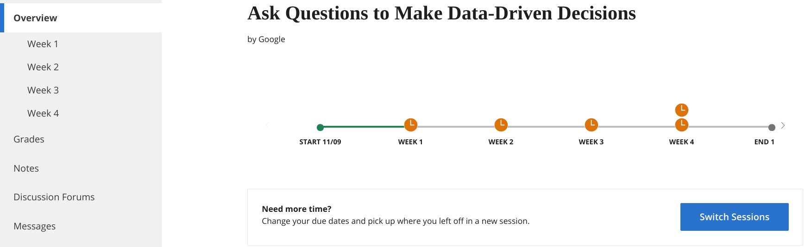
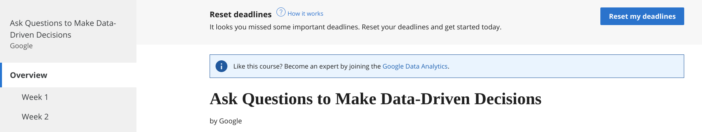

# Course syllabus

Welcome to the second course of the Google Data Analytics Certificate! In this part of the program, you will learn how data analysts use structured thinking to tackle business problems. Think of yourself as a great detective who figures out a case by tracking down the evidence and who organizes it into a powerful story to solve the mystery. You will explore how to ask effective questions and use the answers to tell a meaningful story about the data. Plus, you will learn why it is so important to be on the same page as your stakeholders when you define the problem and present the data with an analysis.

1. [Foundations: Data, Data, Everywhere](https://www.coursera.org/learn/foundations-data/home/welcome)
2. `Ask Questions to Make Data-Driven Decisions (this course)`
3. [Prepare Data for Exploration](https://www.coursera.org/learn/data-preparation/home/welcome)
4. [Process Data from Dirty to Clean](https://www.coursera.org/learn/process-data/home/welcome)
5. [Analyze Data to Answer Questions](https://www.coursera.org/learn/analyze-data/home/welcome)
6. [Share Data Through the Art of Visualization](Share Data Through the Art of Visualization)
7. [Data Analysis with R Programming](https://www.coursera.org/learn/data-analysis-r/home/welcome)
8. [Google Data Analytics Capstone: Complete a Case Study](https://www.coursera.org/learn/google-data-analytics-capstone/home/welcome)

## Course content

Course 2 – Ask Questions to Make Data-Driven Decisions

1. Asking effective questions: To do the job of a data analyst, you need to ask questions and problem-solve. In this part of the course, you’ll check out some common analysis problems and how analysts solve them. You’ll also learn about effective questioning techniques that can help guide your analysis.

2. Making data-driven decisions: In analytics, data drives decision making. In this part of the course, you’ll explore data of all kinds and its impact on decision making. You’ll also learn how to share your data through reports and dashboards.

3. Mastering spreadsheet basics: Spreadsheets are an important data analytics tool. In this part of the course, you’ll learn both why and how data analysts use spreadsheets in their work. You’ll also explore how structured thinking can help analysts better understand problems and come up with solutions.

4. Always remembering the stakeholder: Successful data analysts learn to balance needs and expectations. In this part of the course, you’ll learn strategies for managing the expectations of stakeholders while establishing clear communication with your team to achieve your objectives.  

5. Completing the Course Challenge: At the end of this course, you will be able to put everything you have learned into practice with the Course Challenge. The Course Challenge will ask you questions about key principles you have been learning about and then give you an opportunity to apply those principles in three scenarios.

## What to expect

Each week of this course includes hands-on assignments and projects based on the life of a data analyst. To keep you engaged, each series of lessons offers a lot of different types of learning opportunities, including:

- Videos of instructors teaching new concepts and demonstrating the use of tools
- In-video questions that pop up during or at the end of a video to check your learning
- Readings to introduce new ideas and build on the concepts from the videos
- Discussion forums to discuss, explore, and reinforce new ideas for better learning
- Discussion prompts to promote thinking and engagement in the discussion forums
- Hands-on activities to introduce real-world, on-the-job situations, and the tools and tasks to complete assignments
- Practice quizzes to prepare you for graded quizzes
- Graded quizzes to measure your progress and give you valuable feedback

Hands-on activities promote additional opportunities to build your skills. Try to get as much out of them as possible. Assessments are based on the approach taken by the course to offer a wide variety of learning materials and activities that reinforce important skills. Graded and ungraded quizzes will  help the content sink in. Ungraded practice quizzes are a chance for you to prepare for the graded quizzes. Both types of quizzes can be taken multiple times. 

As a quick reminder, this course is designed for all types of learners, with no degree or prior experience required. Everyone learns differently, so the Google Data Analytics Certificate has been designed with that in mind. Personalized deadlines are just a guide, so feel free to work at your own pace. There is no penalty for late assignments. If you prefer, you can extend your deadlines by returning to `Overview` in the navigation pane and clicking  `Switch Sessions`.

If you already missed previous deadlines, click `Reset my deadlines` instead.

If you would like to review previous content or get a sneak peek of upcoming content, you can use the navigation links at the top of this page to go to another course in the program. When you pass all required assignments, you will be on track to earn your certificate.

And, after you earn the certificate, you will be ready for an entry-level job as a junior or associate data analyst, helping organizations in a variety of industries make decisions with data-driven strategies.

## Optional speed track for those experienced in data analytics

The Google Data Analytics Certificate provides instruction and feedback for learners hoping to earn a position as an entry-level data analyst. While many learners will be brand new to the world of data analytics, others may be familiar with the field and simply wanting to brush up on certain skills.

If you believe this course will be primarily a refresher for you, we recommend taking the practice diagnostic quiz offered this week. It will enable you to determine if you should follow the speed track, which is an opportunity to proceed to Course 3 after having taken each of the Course 2 Weekly Challenges and the overall Course Challenge. Learners who earn 100% on the diagnostic quiz can treat Course 2 videos, readings, and activities as optional. Learners following the speed track are still able to earn the certificate.

## Tips

- It is strongly recommended to go through the topics in the course in the order they appear because each new section builds on information and concepts covered in previous ones.
- Take advantage of the additional resources that are linked throughout the course. They are designed to support your learning.
- When you encounter useful links in the course, remember to bookmark them so you can refer to the information for study or review.
- Additional resources are free, but some sites place limits on how many articles can be accessed for free each month. Sometimes you can register on the site for full access, but you can always bookmark a resource and come back to view it later.
- Take part in all learning opportunities to gain as much knowledge and experience as possible.
- If something is confusing, feel free to rewatch a video, revisit a reading, or seek out additional resources.
- Get ready to take the next step in your data analytics journey!
