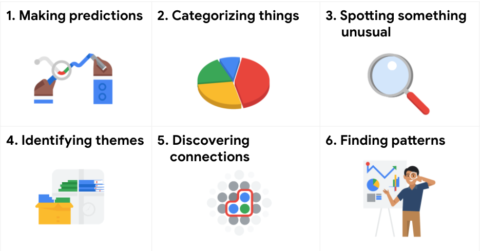

# Six problem types

Data analytics is so much more than just plugging information into a platform to find insights. It is about solving problems. To get to the root of these problems and find practical solutions, there are lots of opportunities for creative thinking. No matter the problem, the first and most important step is understanding it. From there, it is good to take a problem-solver approach to your analysis to help you decide what information needs to be included, how you can transform the data, and how the data will be used.

## Data analysts typically work with six problem types

A  video, [Common problem types](./1_VIDEO_Common-problem-types.md), introduced the six problem types with an example for each. The examples are summarized below for review.

**Making predictions**
A company that wants to know the best advertising method to bring in new customers is an example of a problem requiring analysts to make predictions. Analysts with data on location, type of media, and number of new customers acquired as a result of past ads can't guarantee future results, but they can help predict the best placement of advertising to reach the target audience.

**Categorizing things**
An example of a problem requiring analysts to categorize things is a company's goal to improve customer satisfaction. Analysts might classify customer service calls based on certain keywords or scores. This could help identify top-performing customer service representatives or help correlate certain actions taken with higher customer satisfaction scores.

**Spotting something unusual**
A company that sells smart watches that help people monitor their health would be interested in designing their software to spot something unusual. Analysts who have analyzed aggregated health data can help product developers determine the right algorithms to spot and set off alarms when certain data doesn't trend normally.

**Identifying themes**
User experience (UX) designers might rely on analysts to analyze user interaction data. Similar to problems that require analysts to categorize things, usability improvement projects might require analysts to identify themes to help prioritize the right product features for improvement. Themes are most often used to help researchers explore certain aspects of data. In a user study, user beliefs, practices, and needs are examples of themes. - Các nhà thiết kế trải nghiệm người dùng (UX) có thể dựa vào các nhà phân tích để phân tích dữ liệu tương tác của người dùng. Tương tự như các vấn đề yêu cầu nhà phân tích phân loại mọi thứ, các dự án cải thiện khả năng sử dụng có thể yêu cầu nhà phân tích xác định các chủ đề để giúp ưu tiên các tính năng sản phẩm phù hợp cần cải tiến. Các chủ đề thường được sử dụng nhiều nhất để giúp các nhà nghiên cứu khám phá các khía cạnh nhất định của dữ liệu. Trong nghiên cứu người dùng, niềm tin, thực tiễn và nhu cầu của người dùng là những ví dụ về chủ đề.

By now you might be wondering if there is a difference between categorizing things and identifying themes. The best way to think about it is: categorizing things involves assigning items to categories; identifying themes takes those categories a step further by grouping them into broader themes.

Discovering connections
A third-party logistics company working with another company to get shipments delivered to customers on time is a problem requiring analysts to discover connections. By analyzing the wait times at shipping hubs, analysts can determine the appropriate schedule changes to increase the number of on-time deliveries.

Finding patterns
Minimizing downtime caused by machine failure is an example of a problem requiring analysts to find patterns in data. For example, by analyzing maintenance data, they might discover that most failures happen if regular maintenance is delayed by more than a 15-day window.

Key takeaway
As you move through this program, you will develop a sharper eye for problems and you will practice thinking through the problem types when you begin your analysis. This method of problem solving will help you figure out solutions that meet the needs of all stakeholders.
