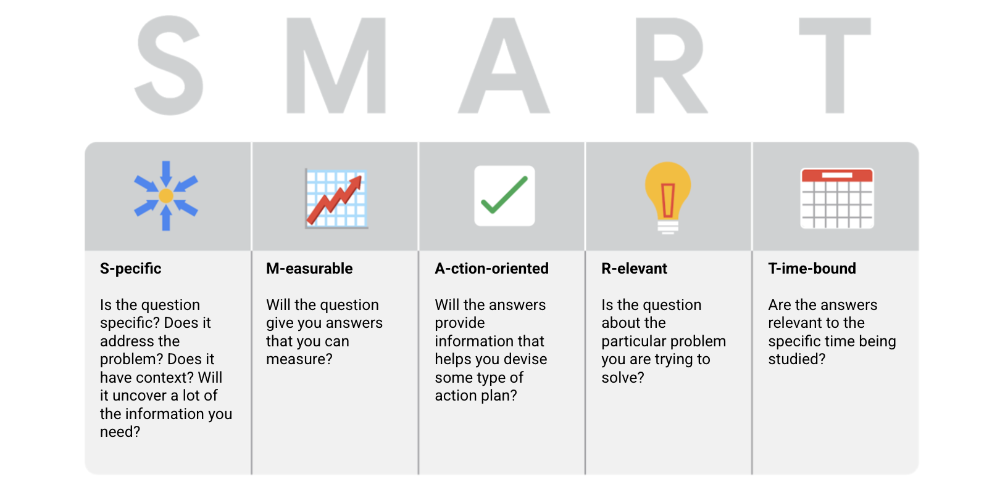

# READING: More about SMART questions

Companies in lots of industries today are dealing with rapid change and rising uncertainty. Even well-established businesses are under pressure to keep up with what is new and figure out what is next. To do that, they need to ask questions. Asking the right questions can help spark the innovative ideas that so many businesses are hungry for these days.

The same goes for data analytics. No matter how much information you have or how advanced your tools are, your data won’t tell you much if you don’t start with the right questions. Think of it like a detective with tons of evidence who doesn’t ask a key suspect about it.  Coming up, you will learn more about how to ask highly effective questions, along with certain practices you want to avoid.

**Highly effective questions are SMART questions:**

## Examples of SMART questions

Here's an example that breaks down the thought process of turning a problem question into one or more SMART questions using the SMART method: **What features do people look for when buying a new car?**

- `Specific`: Does the question focus on a particular car feature?
- `Measurable`: Does the question include a feature rating system?
- `Action-oriented`: Does the question influence creation of different or new feature packages?
- `Relevant`: Does the question identify which features make or break a potential car purchase?
- `Time-bound`: Does the question validate data on the most popular features from the last three years?

Questions should be `open-ended`. This is the best way to get responses that will help you accurately qualify or disqualify potential solutions to your specific problem. So, based on the thought process, possible SMART questions might be:

- On a scale of 1-10 (with 10 being the most important) how important is your car having four-wheel drive?
- What are the top five features you would like to see in a car package?
- What features, if included with four-wheel drive, would make you more inclined to buy the car?
- How much more would you pay for a car with four-wheel drive?
- Has four-wheel drive become more or less popular in the last three years?

## Things to avoid when asking questions

**Leading questions**: questions that only have a particular response

- Example: `This product is too expensive, isn’t it?`

This is a leading question because it suggests an answer as part of the question. A better question might be, “What is your opinion of this product?” There are tons of answers to that question, and they could include information about usability, features, accessories, color, reliability, and popularity, on top of price. Now, if your problem is actually focused on pricing, you could ask a question like “What price (or price range) would make you consider purchasing this product?” This question would provide a lot of different measurable responses.

**Closed-ended questions**: questions that ask for a one-word or brief response only

- Example: `Were you satisfied with the customer trial?`

This is a closed-ended question because it doesn’t encourage people to expand on their answer. It is really easy for them to give one-word responses that aren’t very informative. A better question might be, “What did you learn about customer experience from the trial.” This encourages people to provide more detail besides “It went well.”

**Vague questions**: questions that aren’t specific or don’t provide context

- Example: `Does the tool work for you?`

This question is too vague because there is no context. Is it about comparing the new tool to the one it replaces? You just don’t know. A better inquiry might be, “When it comes to data entry, is the new tool faster, slower, or about the same as the old tool? If faster, how much time is saved? If slower, how much time is lost?” These questions give context (data entry) and help frame responses that are measurable (time).

## ĐỌC: Thêm về câu hỏi SMART

Các công ty trong nhiều ngành công nghiệp hiện nay đang phải đối mặt với sự thay đổi nhanh chóng và sự không chắc chắn gia tăng. Ngay cả các doanh nghiệp có uy tín cũng đang phải đối mặt với áp lực để bắt kịp những gì mới và tìm hiểu về điều gì tiếp theo. Để làm điều đó, họ cần đặt câu hỏi. Đặt câu hỏi đúng có thể giúp kích thích những ý tưởng sáng tạo mà nhiều doanh nghiệp đang khao khát trong thời gian này.

Tương tự như vậy trong phân tích dữ liệu. Cho dù bạn có bao nhiêu thông tin hoặc có các công cụ tiên tiến đến đâu, dữ liệu của bạn sẽ không nói nhiều nếu bạn không bắt đầu bằng những câu hỏi đúng. Hãy nghĩ về nó như một thám tử có hàng tấn bằng chứng nhưng không hỏi một nghi can chính về chúng. Tiếp theo, bạn sẽ tìm hiểu thêm về cách đặt câu hỏi hiệu quả hơn, cùng với những thực hành cụ thể bạn nên tránh.

**Câu hỏi hiệu quả là câu hỏi SMART:**

### Ví dụ về câu hỏi SMART

Dưới đây là một ví dụ phân tích quá trình suy nghĩ để biến một câu hỏi về vấn đề thành một hoặc nhiều câu hỏi SMART bằng cách sử dụng phương pháp SMART: **Người ta tìm kiếm những tính năng nào khi mua một chiếc xe mới?**

- `Cụ thể`: Câu hỏi tập trung vào một tính năng cụ thể của xe hơi không?
- `Có thể đo lường`: Câu hỏi có bao gồm hệ thống xếp hạng tính năng không?
- `Hướng tới hành động`: Câu hỏi có ảnh hưởng đến việc tạo ra các gói tính năng khác biệt hoặc mới không?
- `Liên quan`: Câu hỏi có xác định các tính năng nào quyết định việc mua xe hơi hay không?
- `Có thời hạn`: Câu hỏi có xác minh dữ liệu về các tính năng phổ biến nhất trong ba năm qua không?

Câu hỏi nên là `câu hỏi mở`. Điều này là cách tốt nhất để có được các phản hồi sẽ giúp bạn xác định hoặc loại trừ các giải pháp tiềm năng cho vấn đề cụ thể của bạn. Vì vậy, dựa trên quá trình suy nghĩ, các câu hỏi SMART có thể có:

- Trên thang điểm từ 1-10 (với 10 là quan trọng nhất) thì tính năng có bốn bánh lái của chiếc xe của bạn quan trọng bao nhiêu?
- Top năm tính năng bạn muốn thấy trong gói xe hơi là gì?
- Nếu có các tính năng, nếu được bao gồm với bốn bánh lái, liệu bạn sẽ cảm thấy sẵn lòng mua chiếc xe không?
- Bạn sẽ trả thêm bao nhiêu tiền cho chiếc xe có bốn bánh lái?
- Bốn bánh lái đã trở nên phổ biến hơn hay ít hơn trong ba năm qua?

## Những điều cần tránh khi đặt câu hỏi

**Câu hỏi dẫn dắt**: câu hỏi chỉ có một câu trả lời cụ thể

- Ví dụ: `Sản phẩm này quá đắt phải không?`

Đây là một câu hỏi dẫn dắt vì nó gợi ý một câu trả lời là một phần của câu hỏi. Một câu hỏi tốt hơn có thể là, "Ý kiến của bạn về sản phẩm này là gì?" Có hàng tá câu trả lời cho câu hỏi này, và chúng có thể bao gồm thông tin về khả năng sử dụng, tính năng, phụ kiện, màu sắc, độ tin cậy và độ phổ biến, ngoài giá. Bây giờ, nếu vấn đề của bạn thực sự tập trung vào giá cả, bạn có thể đặt câu hỏi như "Giá (hoặc khoảng giá) nào sẽ khiến bạn xem xét việc mua sản phẩm này?" Câu hỏi này sẽ cung cấp nhiều câu trả lời khác nhau có thể đo lường được.

**Câu hỏi kết thúc sớm**: câu hỏi yêu cầu chỉ một câu trả lời một từ hoặc ngắn gọn

- Ví dụ: `Bạn có hài lòng với phiên dùng thử của khách hàng không?`

Đây là một câu hỏi kết thúc sớm vì nó không khuyến khích mọi người mở rộng câu trả lời của họ. Điều này dễ dàng đối với họ để đưa ra câu trả lời một từ không chứa nhiều thông tin. Một câu hỏi tốt hơn có thể là, "Bạn đã học được điều gì về trải nghiệm của khách hàng từ phiên dùng thử." Điều này khuyến khích mọi người cung cấp nhiều chi tiết hơn ngoài việc "Nó diễn ra tốt".

**Câu hỏi mập mờ**: câu hỏi không cụ thể hoặc không cung cấp ngữ cảnh

- Ví dụ: `Công cụ này có hoạt động với bạn không?`

Câu hỏi này quá mập mờ vì không có ngữ cảnh. Liệu đó có phải là so sánh công cụ mới với công cụ cũ không? Bạn đơn giản không biết. Một câu hỏi tốt hơn có thể là, "Khi nói về việc nhập dữ liệu, công cụ mới có nhanh hơn, chậm hơn, hoặc tương tự so với công cụ cũ không? Nếu nhanh hơn, thì tiết kiệm được bao nhiêu thời gian? Nếu chậm hơn, thì mất bao nhiêu thời gian?" Những câu hỏi này cung cấp ngữ cảnh (nhập dữ liệu) và giúp xác định những câu trả lời có thể đo lường (thời gian).
