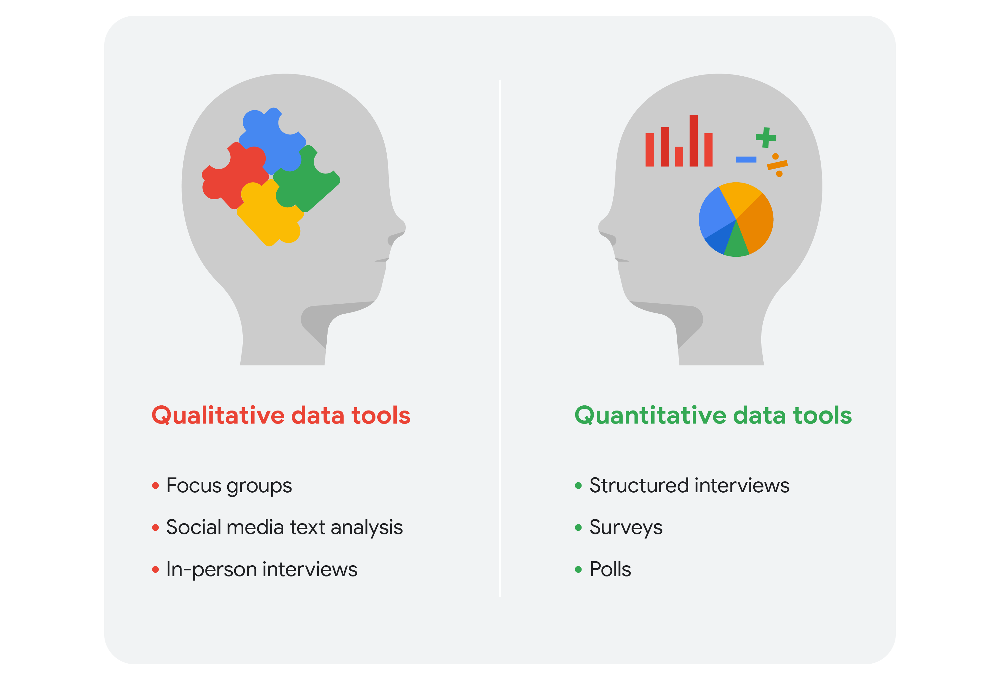

# Qualitative and quantitative data in business

This reading further elaborates on the meaning of **qualitative** versus **quantitative**.

As you have learned, there are two types of data: qualitative and quantitative.

We can take a closer look at the data types and data collection tools. Imagine that you are a data analyst for a chain of movie theaters. Your manager wants you to track trends in:

- **Movie attendance over time**
- **Profitability of the concession stand**
- **Evening audience preferences**

In our scenario, we assume quantitative data already exists to monitor all three trends.

## Movie attendance over time

Starting with the historical data the theater has through its loyalty and rewards program, your first step is to investigate what insights you can gain from that data. You look at attendance over the last 3 months. But, because the last 3 months didn’t include a major holiday, you decide it is better to look at a full year’s worth of data. As you suspected, the quantitative data confirmed that average attendance was 550 per month but then rose to an average of 1,600 per month for the months with holidays.

The historical data serves your needs for the project, but you also decide that you will resume the analysis again in a few months after the theater increases ticket prices for evening showtimes.

## Profitability of the concession stand

Profit is calculated by subtracting cost from sales revenue. The historical data shows that while the concession stand was profitable, profit margins were razor thin at less than 5%. You saw that average purchases totaled $20 or less. You decide that you will keep monitoring this on an ongoing basis.

Based on your understanding of data collection tools, you will suggest an online survey of customers so they can comment on the food at the concession stand. This will enable you to gather even more quantitative data to revamp the menu and potentially increase profits.

## Evening audience preferences

Your analysis of the historical data shows that the 7:30 PM showtime was the most popular and had the greatest attendance, followed by the 7:15 PM and 9:00 PM showtimes. You may suggest replacing the current 8:00 PM showtime that has lower attendance with an 8:30 PM showtime. But you need more data to back up your hunch that people would be more likely to attend the later show.

Evening movie-goers are the largest source of revenue for the theater. Therefore, you also decide to include a question in your online survey to gain more insight.

## Qualitative data for all three trends plus ticket pricing

Since you know that the theater is planning to raise ticket prices for evening showtimes in a few months, you will also include a question in the survey to get an idea of customers’ price sensitivity.

Your final online survey might include these questions for qualitative data:

1. What went into your decision to see a movie in our theater today? (movie attendance)
2. What do you think about the quality and value of your purchases at the concession stand? (concession stand profitability)
3. Which showtime do you prefer, 8:00 PM or 8:30 PM, and why do you prefer that time? (evening movie-goer preferences)
4. Under what circumstances would you choose a matinee over a nighttime showing? (ticket price increase)

## Summing it up

Data analysts will generally use both types of data in their work. `Usually, qualitative data can help analysts better understand their quantitative data by providing a reason or more thorough explanation`. In other words, `quantitative data generally gives you the what`, and `qualitative data generally gives you the why`. By using both quantitative and qualitative data, you can learn when people like to go to the movies and why they chose the theater. Maybe they really like the reclining chairs, so your manager can purchase more recliners. Maybe the theater is the only one that serves root beer. Maybe a later show time gives them more time to drive to the theater from where popular restaurants are located. Maybe they go to matinees because they have kids and want to save money. You wouldn’t have discovered this information by analyzing only the quantitative data for attendance, profit, and showtimes.

