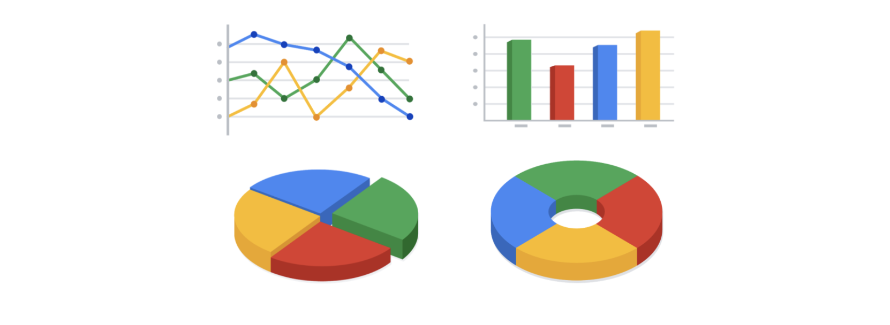

# Designing compelling dashboards

[PDF](./ref_DAC2-Designing-compelling-dashboards.pdf)

## The beauty of dashboards

Dashboards are powerful visual tools that help you tell your data story. A dashboard organizes information from multiple datasets into one central location, offering huge time-savings. Data analysts use dashboards to track, analyze, and visualize data in order to answer questions and solve problems. For a basic idea of what dashboards look like, refer to this article: [6 real-world examples of business intelligence dashboards](https://www.tableau.com/learn/articles/business-intelligence-dashboards-examples). Tableau is one tool that is used to create dashboards and is covered later in the program.

The following table summarizes the benefits of using a dashboard for both data analysts and their stakeholders.

|Benefits|For Data Analysts|For Stakeholders|
|-------|-----------------|----------------|
|Centralization|Sharing a single source of data with all stakeholders|Working with a comprehensive view of data, initiatives, objectives, projects, processes, and more
|Visualization|Showing and updating live, incoming data in real time*|Spotting changing trends and patterns more quickly|
|Insightfulness|Pulling relevant information from different datasets|Understanding the story behind the numbers to keep track of goals and make data-driven decisions
|Customization|Creating custom views dedicated to a specific person, project, or presentation of the data|Drilling down to more specific areas of specialized interest or concern|

** It is important to remember that changed data is pulled into dashboards automatically only if the data structure is the same. If the data structure changes, you have to update the dashboard design before the data can update live.*

## Creating a dashboard

Here is a process you can follow to create a dashboard:

### 1. Identify the stakeholders who need to see the data and how they will use it

To get started with this, you need to ask effective questions. Check out this [Requirements Gathering Worksheet](https://s3.amazonaws.com/looker-elearning-resources/Requirements+Gathering+Worksheet.pdf) - [PDF](./ref_Requirements%2BGathering%2BWorksheet.pdf) to explore a wide range of good questions you can use to identify relevant stakeholders and their data needs. This is a great resource to help guide you through this process again and again.

### 2. Design the dashboard (what should be displayed)

- Use these tips to help make your dashboard design clear, easy to follow, and simple:
  - Use a clear header to label the information
  - Add short text descriptions to each visualization
  - Show the most important information at the top

### 3. Create mock-ups if desired

This is optional, but a lot of data analysts like to sketch out their dashboards before creating them.

### 4. Select the visualizations you will use on the dashboard

You have a lot of options here and it all depends on what data story you are telling. If you need to show a change of values over time, line charts or bar graphs might be the best choice. If your goal is to show how each part contributes to the whole amount being reported, a pie or donut chart is probably a better choice.

- To learn more about choosing the right visualizations, check out Tableau’s galleries:
  - For more samples of area charts, column charts, and other visualizations, visit[Tableau’s Viz Gallery](https://www.tableau.com/solutions/gallery). This gallery is full of great examples that were created using real data; explore this resource on your own to get some inspiration.
  - Explore [Tableau’s Viz of the Day](https://public.tableau.com/en-us/gallery/?tab=viz-of-the-day&type=viz-of-the-day) to see visualizations curated by the community. These are visualizations created by Tableau users and are a great way to learn more about how other data analysts are using data visualization tools.  

1. Create filters as needed

Filters show certain data while hiding the rest of the data in a dashboard. This can be a big help to identify patterns while keeping the original data intact. It is common for data analysts to use and share the same dashboard, but manage their part of it with a filter. To dig deeper into filters and find an example of filters in action, you can visit Tableau’s page on [Filter Actions](https://help.tableau.com/current/pro/desktop/en-us/actions_filter.htm). This is a useful resource to save and come back to when you start practicing using filters in Tableau on your own.

## Dashboards are part of a business journey

Just like how the dashboard on an airplane shows the pilot their flight path, your dashboard does the same for your stakeholders. It helps them navigate the path of the project inside the data. If you add clear markers and highlight important points on your dashboard, users will understand where your data story is headed. Then, you can work together to make sure the business gets where it needs to go.

