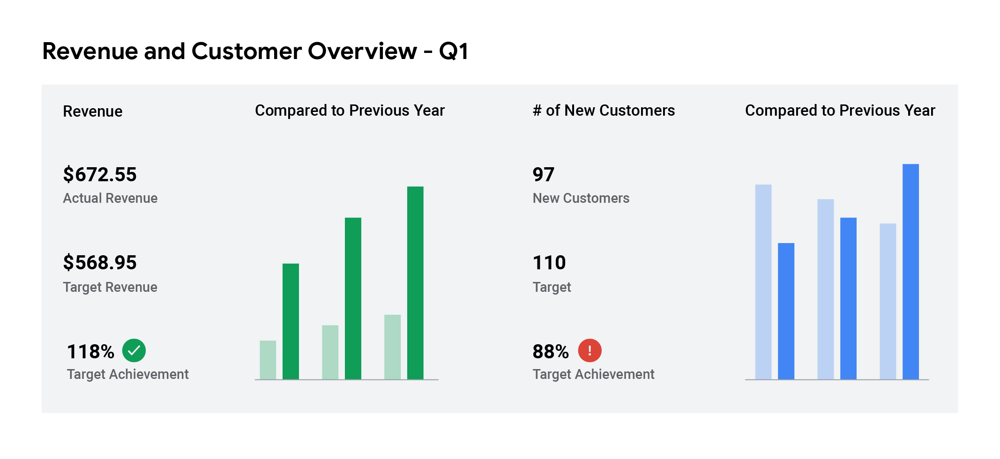
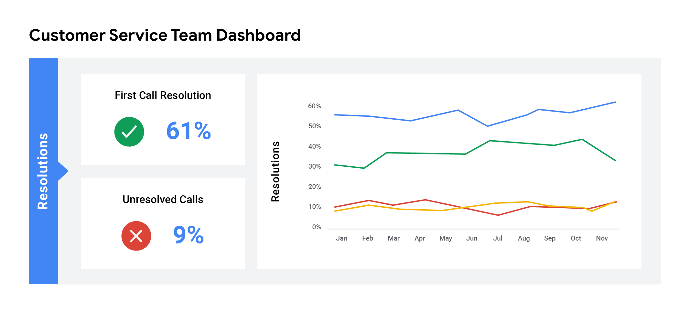
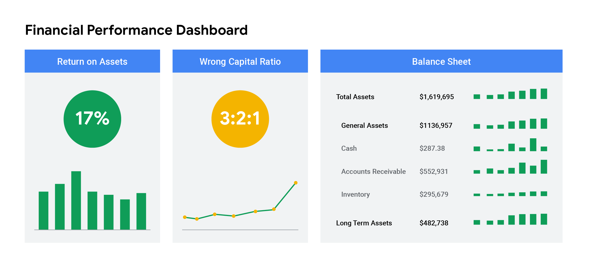

# Practice Quiz:Self-Reflection: Dive deeper into dashboards

## 1

### Overview

Previously, you were introduced to the data management tool known as a dashboard. In this self-reflection, you'llexamine different kinds of dashboards and consider how they are used by data analysts and their employers.
As a refresher, a dashboard is a single point of access for managing a business's information. It allows analysts to pull key information from data in a quick review by visualizing the data in a way that makes findings easy to understand.

This self-reflection will help you develop insights into your own learning and prepare you to connect your knowledge of dashboards to what you know about business needs. As you answer questions—and come up with questions of your own—you will consider concepts, practices, and principles to help refine your understanding and reinforce your learning. You’ve done the hard work, so make sure to get the most out of it: This reflection will help your knowledge stick!

### Types of dashboards

- For a refresher, consider the different types of dashboards a business may use. Often, businesses will tailor a dashboard for a specific purpose. The three most common categories are:
  - `Strategic`: focuses on long term goals and strategies at the highest level of metrics
  - `Operational`: short-term performance tracking and intermediate goals
  - `Analytical`: consists of the datasets and the mathematics used in these sets

#### Strategic dashboards

A wide range of businesses use strategic dashboards when evaluating and aligning their strategic goals. These dashboards provide information over the longest time frame—from a single financial quarter to years.

They typically contain information that is useful for enterprise-wide decision-making. Below is an example of a strategic dashboard which focuses on key performance indicators (KPIs) over a year.



#### Operational dashboards

Operational dashboards are, arguably, the most common type of dashboard. Because these dashboards contain information on a time scale of days, weeks, or months, they can provide performance insight almost in real-time.
This allows businesses to track and maintain their immediate operational processes in light of their strategic goals. The operational dashboard below focuses on customer service.



#### Analytical dashboards

Analytic dashboards contain a vast amount of data used by data analysts. These dashboards contain the details involved in the usage, analysis, and predictions made by data scientists.

Certainly the most technical category, analytic dashboards are usually created and maintained by data science teams and rarely shared with upper management as they can be very difficult to understand. The analytic dashboard below focuses on metrics for a company’s financial performance.



### Reflection

- Consider the different types of dashboards:
  - How are the different types of dashboards similar to each other?
  - In what ways do they differ?

Write 2-3 sentences (40-60 words) in response to each of these questions. Type your response in the text box
below.

## 2

- Now that you have considered the different types of dashboards, think about the impact that dashboards can have on a company:
  - What is an example of a data source a company might use with a dashboard?
  - How would a company benefit from a dashboard that uses this data?
  - What industries or businesses might benefit from using dashboards more than others?

Now, write 2-3 sentences (40-60 words) in response to each of these questions. Type your response in the text box
below.

```textbox
What do you think?
```

Your answer cannot be more than 10000 characters.

## 3

- Finally, think about the person you had your data conversation with in the last activity Ci. Based on thenotes you took during that conversation Ci:
  - Which types of dashboards would you recommend for your conversation partner’s data needs?
  - How would the dashboards you recommend help them better accomplish their goals?

Then, write 2-3 sentences (40-60 words) in response to each of these questions. Type your response in the text box
below.

```textbox
What do you think?
```

## My reflection

### Consider the different types of dashboards

- How are the different types of dashboards similar to each other?
  - All three types of dashboards (strategic, operational, and analytical) aim to provide insights and facilitate decision-making, but they differ in terms of the time frame, focus, and complexity of the data they present.
- In what ways do they differ?
  - Strategic dashboards focus on long-term goals and and high-level metrics, typically spanning from a single financial quarter to several years.
  - Operational dashboards are more immediate and focus on short-term performance tracking. They operate on a time scale of days, weeks, or months, providing almost real-time performance insights.
  - Analytical dashboards contain extensive and detailed data used by data analysts and data scientists.

They differ in terms of the time frame, level of detail, and intended audience.

### Impact can have on a company

#### Impact Example 1

- What is an example of a data source a company might use with a dashboard?
  - A company might use sales data from its online store as a data source for a dashboard.

- How would a company benefit from a dashboard that uses this data?
  - A company could benefit from such a dashboard by gaining real-time insights into sales performance, identifying trends, and making data-driven decisions to optimize pricing, marketing strategies, and inventory management.

- What industries or businesses might benefit from using dashboards more than others?
  - Industries that heavily rely on data-driven decision-making, such as e-commerce, finance, healthcare, and digital marketing, are likely to benefit the most from using dashboards. Additionally, businesses with complex operations and numerous performance metrics can benefit from dashboards to streamline data analysis.

#### Impact Example 2

- What is an example of a data source a company might use with a dashboard?
  - An example of a data source that a company might use with a dashboard is customer behavior data collected from their online platform. This data can include information on page views, click-through rates, purchase history, etc.
- How would a company benefit from a dashboard that uses this data?
  - A company would benefit from a dashboard that uses this data by gaining valuable insights into customer preferences and behaviors. They can identify popular products, optimize website design, and tailor marketing strategies to increase conversion rates and customer satisfaction.
- What industries or businesses might benefit from using dashboards more than others?
  - Industries or businesses heavily reliant on customer engagement and online presence, such as e-commerce, digital marketing agencies, and SaaS companies, might benefit more from using dashboards. Additionally, industries with complex supply chain operations, like manufacturing and logistics, could also benefit significantly from operational dashboards.

### Data conversation continues

- Which types of dashboards would you recommend for your conversation partner’s data needs?
  - Based-on my conversation with my friend - Luu Quang Linh, who works in Marketing for Bao Ngoc Investment Production Corporation, and the specific needs related to the Mid-autumn festival campaign, I would recommend the following types of dashboards:
    - `Operational Dashboard`
    - `Analytical Dashboard`
- How would the dashboards you recommend help them better accomplish their goals?
  - The **Operational Dashboard** would enable Luu Quang Linh to monitor the Mid-autumn festival campaign's real-time performance. He could track metrics like website traffic, social media engagement, and daily sales figures as they happen. This dashboard should include live or near-real-time data on metrics such as website traffic, social media engagement, daily sales figures, and customer feedback. This would empower him to make quick, data-driven decisions and respond promptly to emerging trends or issues during the campaign.
    - This operational dashboard would enable Luu Quang Linh to make quick decisions based on up-to-the-minute data.
    - Any sudden changes in customer behavior or emerging trends could be spotted immediately, allowing for rapid adjustments to the campaign strategy.
    - For example, if the operational dashboard shows a spike in social media mentions for a particular product, Luu Quang Linh could capitalize on this trend by featuring that product more prominently on the website.
  - The **Analytical Dashboard** would be invaluable for post-campaign analysis. It would allow Luu Quang Linh to delve deeper into customer demographics, preferences, and the effectiveness of different marketing strategies. By examining&analyzing historical data, he could uncover insights to optimize future campaigns and enhance long-term customer engagement and loyalty.

