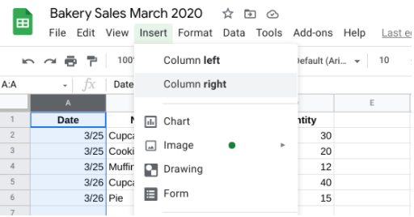

# Hands-On Activity: Introduction to Google Sheets

## 1. Activity overview

By now, you have been introduced to spreadsheets and their role in data analysis. In this activity, you will work
with a spreadsheet in Google Sheets. You will create and edit a spreadsheet, share the sheet with others, and add
comments to the sheet. Google Sheets is a cloud-based spreadsheet application. You can use Sheets to organize
and analyze data from any online device. All the changes you make are automatically saved in the cloud.
By the time you complete this activity, you will be more familiar with some of the key features of Google Sheets.
Knowing how to work with spreadsheet applications is an essential skill for any data analyst. Spreadsheets are
powerful tools because they let you store, organize, analyze, and share data.

### What you will need

There are many excellent spreadsheet applications available to data analysts, such as Google Sheets, Microsoft
Excel, and more. This activity uses Google Sheets. If you want to follow along with a different spreadsheet
application, the steps will be similar.

If you want to use Google Sheets, you will need a Google account. If you don’t yet have a Google account, you can
follow the instructions from the Google account support page L?. Once you have your Google account set up, you
can start working with Google Sheets!

## Create and edit a Google Sheet

As you progress in the program, you will become more familiar with spreadsheets. You’ll learn how to use
functions, formulas, pivot tables, and more to organize and analyze data. For now, you’ll begin with the basics:
how to create, edit, and format your own spreadsheet.

### Create a new spreadsheet

1. To start, go to <www.google.com>
2. Click **Google apps** icon.
3. Then, clock the **Sheets** icon.

4. In the **Start a new spreadsheet** section, click **Blank** to create a new blank spreadsheet.

Now you’ve got a new spreadsheet that you can use to enter your data!

### Edit and format your spreadsheet

For this activity, you want to create a spreadsheet that contains sales data for a local bakery. Here's an example of the spreadsheet you will create:

1. After you create your sheet, give it a title. In the upper left corner of your sheet, click **Untitled spreadsheet** and enter a title. Make your title clear and concise. It should describe what the data in the spreadsheet is
about. For example, you could use the title **Bakery Sales March 2020** or something similar.

2. Next, enter your column headers. The first row of the spreadsheet is for data attributes, which is another name for column headers. An **attribute** is a characteristic or quality of data used to label a column in a table. It's basically labeling the type of data in each column. In this case, you want to enter data for transaction date, product name, price, and quantity. Click in cell Al and enter your first header: Date. Click
in cell Bl and enter your next header: Name. Repeat this process for the rest of the attributes.

3. Next, format your column headings to make them stand out clearly. For example, you can make the headings stand out from the rest of the rows by using bold and center align. Click on cell Al and drag the handle across to cell DI (you have now selected the range A1:D1). Next, click the **bold** icon on the toolbar. Then, click the **Center align** icon on the toolbar.

4. Now, enter relevant data for each column (Date, Name, Price, Quantity). Feel free to use the data contained in the example above, or create your own.
5. If you want to add another column between two existing columns, you can insert a new column. First, click on a column to select it. Then, click **Insert** on the menu bar and choose where to add the column. You can do the same thing to insert rows.

6. If you want to move an existing row or column, click the row number or column letter to select it. Then, drag it to a new location.
7. If you want to delete an existing row or column, right-click on the row number or column letter that you want to delete. Then, select **Delete** in the popup menu.
8. (**Optional**) Feel free to explore some of the other features in Google Sheets. Later in the course, we’ll cover many of these features in detail. For example, you can click **Insert** on the menu bar and experiment with charts, images, drawings, and more.
9. As mentioned earlier, your data is saved automatically as you are working.

Now that you’ve set up your spreadsheet, share it with others.

## Share your spreadsheet

Collaborating with team members is an important part of being a data analyst. When you collaborate, people can make changes at the same time, and you can see their changes as they happen.

### Share a spreadsheet

In Google Sheets, you can only share files that you own or have edit access to. Because you created your
spreadsheet, you are the default owner.

1. To start, click the Share icon.

2. Under Share with people and groups in the pop-up window, enter the email address of your collaborator.
3. In Google Sheets, users have different access privileges. As owner of the sheet, you can choose the access level for your collaborators. Click Editor in the dropdown and choose the access level:

   - **Can edit** — collaborators can add and edit content or comments. Choose this access level if you want them to be able to make changes to your spreadsheet.
   - **Can comment** — collaborators can add comments, but can't edit content. Choose this level if you just want their feedback.
   - **Can view** — collaborators can view the file, but cannot edit or add comments. Choose this level if you want to share a spreadsheet as an optional resource and you don’t need feedback.

4. (**Optional**) By default, Google Sheets will send an email notification to the person or group you share your spreadsheet with to let them know they now have access. You can add a note in that email by entering your text in the Message box. For example, you may want to include a description of what data your spreadsheet contains and why you want that person to check it out. If you don’t want to send an email notification, uncheck the Notify
people box. This is particularly useful during documentation, when you don’t need people to review your work
right away, but may want them to in the future.
5. Click **Send**.

### Share a link to a file or folder

You can send other people a link to a file or folder so that anyone with the link can open it. This is useful when you want to share your file or folder with a large group and do not want to type in everyone’s individual email addresses. You can share files that you own or have edit access to:

   1. To start, click the **Share** icon.
   2. In the **Get link** section of the pop-up window, you’ll notice that the default is **Restricted** so that only users with whom you’ve shared the file or folder via email can access it.
   3. But, if you want to allow others to access your file or folder without having to add their email addresses,click **Change**. By default, your organization is selected. Now choose an access level.
   4. Click **Copy link**.
   5. Click **Done**.
   6. Paste the link in an email or any place you want to share it. If the recipient is in your organization, they will be
able to access your file or folder without you having to grant them individual access.

### Unshare spreadsheets

You can also stop sharing a spreadsheet that you own at any time. You may want to do this if someone switched jobs or teams and should no longer be looking at your data.

1. To start, click the **Share** icon.
2. Click on the dropdown menu that shows the access level for the person you want to stop sharing the file with, then click **Remove**.
3. Finally, click **Save**.

## Comment on your spreadsheet

Google Sheets lets you and your collaborators add comments to your sheet and reply to those comments. As a data analyst, this is a great way to share feedback with your teammates.

1. In your sheet, select the cell or cells you'd like to comment on.
2. Do one of the following:
   - Right click on the cell and click on Comment in the pop-up menu.
   - Or click the Comment icon in the menu bar at the top of your sheet.

3. Next, enter your comment in the box.

4. (**Optional**) To direct your comment to a specific person, enter an **at sign** (@) followed by their email address. You can add as many people as you want. Each person will get an email with your comment and a link to the spreadsheet file. If that person does not currently have access to your file, Google Sheets will notify you in a pop¬up window and ask if you want to grant that user access..
5. (**Optional**) To assign the comment to a specific person, check the **Assign to** box.
6. Finally, click Comment or Assign.

## Confirmation and reflection

In Google Sheets, what access level should you select if you want your collaborator to comment on your spreadsheet, but not edit the content?

- `Can comment`
- Can edit
- Can view
- Can delete

## 2.In this activity, you had the opportunity to learn about some of the basic features in Google Sheets

- In the text box below, write 2-3 sentences (40-60 words) in response to each of the following questions:
  - What do you think are the main advantages of using Google Sheets to organize, analyze, and share your data?
  - How do you think the comment feature in Google Sheets can increase collaboration among teammates?

### My Response

- Advantages of using Google Sheets:

Google Sheets offers several advantages for organizing, analyzing, and sharing data. Firstly, it's a cloud-based platform, which means we can access our data from anywhere with an internet connection. It also allows real-time collaboration, making it easy for multiple team members to work on the same document simultaneously. Additionally, Google Sheets provides powerful tools for data analysis, including functions, formulas, and charts, making it a versatile tool for data analysts.

- Increased collaboration through comments:

The comment feature in Google Sheets enhances collaboration among teammates by providing a platform for discussion and feedback directly within the spreadsheet. Team members can comment on specific cells or sections, asking questions or providing insights. This eliminates the need for separate communication channels and ensures that all feedback is contextually linked to the relevant data. It also allows for threaded discussions, making it easy to track conversations and resolve issues. This feature fosters efficient communication and a more streamlined collaborative process.
