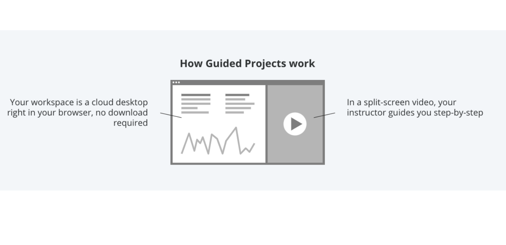

# Hands-on Guided Project: Create a Personal Spending Budget Using Google Sheets

## About Guided Projects

In this Guided Project, you will be assigned a cloud desktop that has the required software pre-installed. This will allow you to follow along with the instructor to complete the project's tasks.

You will work side-by-side with an industry expert to help a fictional client create a personal spending budget in order to make data-informed decisions about how to spend money. To do this, you will apply your knowledge of spreadsheet formulas to add values, calculate averages, and assess spending patterns across different expense categories.

After completing this project, you can reference a summary of the key takeaways from this [document link](https://docs.google.com/document/d/1Lol54vkw9nJsU2x3U098zVMieAm6yCTAQe0VTktC-K8/template/preview) OR [Key-Takeaways_Guided-Project_Create-a-Personal-Spending-Budget-Using-Google-Sheets.docx](./Key-Takeaways_Guided-Project_Create-a-Personal-Spending-Budget-Using-Google-Sheets.docx)

Please refer to the [Coursera Help Center](https://www.coursera.support/s/article/360044549452-Using-a-cloud-workspace-in-Guided-Projects?language=en_US) for more information.

## Ready to get started?

Check the **I agree to use this tool responsibly** box and click the Open Tool button to access your cloud workspace.

This course uses a third-party app, Hands-on Guided Project: Create a Personal Spending Budget Using Google Sheets, to enhance your learning experience. The app will reference basic information like your name, email, and Coursera ID.

**Coursera Honor Code**
I agree to use this app responsibly.

[Launch App](https://projects.coursera.org/run/N6KQAK9B9EPYFWUQEO2A)

OR practice with guidedline video and input spreadsheet file below:

[Personal-spending-budget.xlsx](./Personal-spending-budget.xlsx)

[Guideline Videos directory and theirs transcripts](./3_Guided-project-videos/)

### Scenario

A Client named David

- Goal: Develop a spending budget to make informed decisions about his spending
- David:
  - David has collected the necessary data to create a budget.
  - David wants to make sure he’s spending his money responsibly.
  - Feels like he might be overspending, but he’s not sure.

- Your Role:
  - Develop a spending budget for David, help him identify:
    - Where his money is being spent?
    - How much money he shouldset aside for each spendingcategory in the future?

- Questions to Explore:
  - What is the total amount Davidspends each month?
  - How much does he spend, on average,in each spending category?
  - What percent of his total spending is spent in each of those categories?
