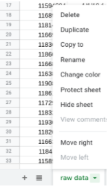
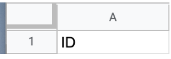
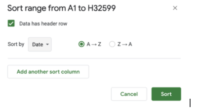
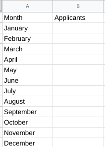
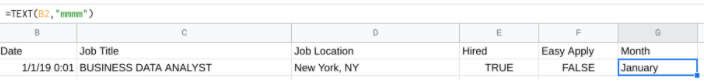
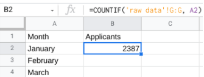
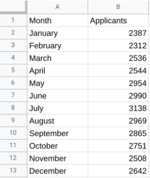
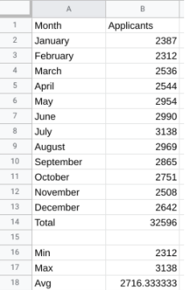

# Hands-On Activity: Create a Custom Data Table

**Receive grade**
**To Pass** 80% or higher

## Activity overview

In this activity, you will import a dataset, build a custom data table, and use functions to analyze your data. For this activity, imagine you're a data analyst working for a recruiting agency. This recruiting agency helps all sorts of companies find skilled people to fill open data analytics jobs. The agency has collected data about job applications for opportunities posted on its website for the year 2019.

The agency has asked your team to optimize its online application process. Your assignment is to summarize the agency’s job application data. In particular, you want to
answer the following questions:

- What was the total number of applications received per month in 2019?
- Which months had the least and greatest number of total applications received?
- What was the average number of applications received per month?

To do this, you’ll work with a spreadsheet. You’ll use spreadsheet functions to make calculations based on your data and create a custom data table to summarize your results.
By the time you complete this activity, you will be able to import a spreadsheet file, sort data, create a custom data table, and use spreadsheet functions to work with your data. Spreadsheets are an essential tool for every data analyst. Using spreadsheets to organize and analyze data is an important skill that you will continue to develop throughout your career.

### What you will need

The agency’s data contains information about all of the data analytics job applications received in 2019. The data includes the following column headers: Applicant ID, Date,
Job Title, Job Location, Hired, and Easy Apply. Below is a description of each column header and sample values.

|Column Name|Column Description|Sample Data|
|-|-|-|
|Applicant ID|Unique identifier for the applicants|11578773|
|Date|The date and time each application was received|1/1/2019 0:01:00
|Job Title|The data analytics position applied for|PHARMACEUTICALDATA ANALYST
|Job Location|Where the job is located|Dallas, TX|
|Hired|Indicates if an applicant was hired|TRUE|
|Easy Apply| TRUE if the application was submitted directly on the agency’s website; FALSE if the application was downloaded and submitted via email|TRUE|

To get started, access the spreadsheet that contains the data. Click the link and make a copy of the [spreadsheet](https://docs.google.com/spreadsheets/d/1oSjDipWleJTyoqtF3ctsyKa_A82A80NcGaUS9LTRJBg/template/preview?resourcekey=0-t7t61ZjRdRnRz8qg9WsxpA#gid=1935285664). (Note: this data set is a bit larger, so it may take 5-7 seconds for the rows to appear.)
Or, if you don’t have a Google account, you may download the dataset directly from the attachment below:
[CSV File - 2019_data_analyst_job.csv](./resources/2019_data_analyst_job.csv)

## Sort your data

Because you want to answer questions based on a specific timeframe (in this case, applications received per month in 2019), it will be useful to start off by sorting the data by
date. Sorting involves arranging data into a meaningful order to make it easier to understand, analyze, and visualize. Considering the order in which each application was
received can help you discover trends in data analytics job applications.

1. First, rename your spreadsheet. In the upper left corner, click **Untitled Spreadsheet** and enter a new name. You can use the name 2019_data_analyst Jobs, or a similar
name that clearly describes the data your spreadsheet contains.
2. Next, rename your current sheet. Later, you will add another sheet to your spreadsheet for your data table. Click the sheet tab and choose Rename on the menu.Then, type **raw data**.

3. If you want to get a better view of your data, you can make the columns wider by dragging the right boundary of the column heading. This may apply to the **Job Title** (C) and **Job Location** (D) columns.
4. Select all the data in the spreadsheet by clicking the rectangle in the top left corner of your sheet.
5. Then, from the menu bar, select **Data** —> **Sort range**. (Note: For some versions of Google Sheets, the selection **advanced range sorting** options may appear on the **Data** drop-down menu instead of **Sort range**).
6. In the pop-up window, click the Data has header row box. Now you can choose specific column headers to sort by.
7. In the Sort by dropdown, choose the header Date. Then, click A —> Z to sort in ascending order.

## Create a data table

Now that you’ve sorted your data, you’re ready to create a custom data table based on the specific questions you want to answer. Your table will clearly display the data you want to summarize. Plus, if you want to share your results, your table presents a well-organized format for your data that’s easy to understand.

As a reminder, you want to answer the following questions:

- What was the total number of applications received per month in 2019?
- Which months had the least and greatest number of total applications  received?
- What was the average number of applications received per month?

Note that the above questions could also be answered using a pivot table. Pivot tables will be discussed in detail later on in the course.
Begin with the first question. You can use spreadsheet functions to help you discover the total number of applications received per month.

1. To start, add another sheet to your spreadsheet. Click the Add sheet icon (the plus sign) at the bottom left corner of your spreadsheet.
2. Rename the new sheet. Click the sheet tab and choose Rename on the menu. Then, type summary data. Labeling your sheets helps organize your data. Plus, if you return to this project in the future after some time has elapsed, your labels will make it easier to recall what you were working on.
3. Next, add column headers to your table. In cell Al of your summary data sheet, type Month. In cell Bl, type Applicants.
4. Add the name of the first month under Month. In cell A2, type January. Press Enter.
5. Now, use autofill to add the rest of the months of the year. Select cell A2 again. A small blue square, or fill handle, will appear in the bottom-right corner of the cell. Click on the fill handle and drag it down to cell A13 to autofill all the months of the year.
At this point, your table should appear like this:

6. Next, you want to convert the number values in the Date column into text. You can use the **TEXT function** to do this. Converting this data to text will help you total the applications by month in your data table later on (see **Step 8**). First, click the **raw data** tab to return to your **raw data** sheet. Now, add a new column header. In cell Gl, type
**Month**.
7. The **TEXT function** converts a number into text according to a specified format. In this case, you want to list the months of the year. You can use the format “mmmm” for the
full name of the month. In cell G2, type the following code (do not copy+paste):
**=TEXT(B2,"mmmm")**
The first entry (**B2**) refers to the cell you want to convert. The second entry (**“mmmm”**) refers to the specific format you want to use. Press **Enter**.
(**Note**: it is very important that you type the formula syntax directly into the calculation field within Google Sheets. Copying + Pasting from these instructions will cause errors
in the calculations).

8. Select cell G2. Then, double-click on the fill handle to copy the function down the column. This will populate all the cells in the column with the corresponding month.
9. Now you're ready to total the applications by month. You could do this manually, by filtering the data and counting the number of entries for each month, but this would take a long time. A more efficient method is to use the COUNTIF function. First, click the summary data tab to return to your summary data sheet.
10. The COUNTIF function quickly counts how many items in a range of cells meet a given criterion. In cell B2, type =COUNTIF('raw data'!G:G,A2). The first entry ('raw data'!G:G) refers to the range where you are counting the data. The range is located on your raw data sheet ('raw data'!) and includes all column G (G:G). This column contains the data for months. The second entry (A2) refers to the criterion you want to count. In this case, it’s “January,” the value in cell A2 of your summary data sheet. The function will tell you how many times January (the criterion) appears in the Date column (the range).
11. Press Enter. You’ll notice the value 2387 appears in cell B2. This means that 2,387 job applications were submitted in January.

12. Select cell B2. **Double-click** the fill handle to copy the function down through cell B12.
Now your table shows the total applications submitted for each month of 2019:

13. You can use the **SUM function** to calculate the overall total for applications submitted in 2019. Before you enter the function, make a label for the result. In cell A14, type **Total**.
14. The **SUM function** adds up the values in a range of cells. Using the SUM function saves time and effort, especially if you have to find the sum of a long sequence of numbers.
In the parentheses of the function, add the range you want to sum (B2:B13). In cell B14, type **=SUM(B2:B13)**.
Now that you’ve organized the monthly job application data in your data table, you’re ready to answer the remaining questions:

- Which months had the least and greatest number of total applications received?
- What was the average number of applications received per month?

You can use the MIN, MAX, and AVERAGE functions to make the necessary calculations, and then add the results to your data table.
15. First, make labels for your results. In cell A16, type **Min**. In cell A17, type **Max**. In cell A18, type **Avg**.
16. Use the **MIN function** to calculate the least number of applications received in a month. The MIN function returns the minimum value in a numeric dataset. In cell B16, type
**=MIN(B2:B13)**.
17. Use the **MAX function** to calculate the greatest number of applications received in a month. The **MAX function** returns the maximum value in a numeric dataset. In cell B17, type
**=MAX(B2:B13)**.
18. Use the **AVERAGE function** to calculate the average monthly applications received in 2019. The **AVERAGE function** returns the average value in a numeric dataset. In cell
B18, type **=AVERAGE(B2:B13)**. Your table should appear like this:

Your table displays the following results for the year 2019: The least number of applications received in a month was 2,312 (February); the greatest number of applications
received in a month was 3,138 (July); the average number of applications received per month was 2,716.333333.

Your work will help your team discover important trends and patterns in the agency’s data and generate insights for optimizing the agency’s online applications process. For
example, because your findings reveal that February was the slowest month, the agency can devote more of its advertising and outreach budget to February and less to the
peak month of July. This is the strategic impact of data analysis.

(**Optional**): Feel free to explore formatting options for your data table using bold, center align, fill color, borders, and more. Formatting lets you highlight important
information, and helps capture the attention of your audience.

## Confirmation and reflection

1. Which of the following functions quickly counts how many items in a range of cells meet a given CRITERION?
   - `The COUNTIF function`
   - The TEXT function
   - The MAX function
   - The SUM function
2. In this activity, you learned how to analyze data using spreadsheet functions. In the text box below, write 2-3 sentences (40-60 words) in response to each of the following
questions:
   - How does using functions to make calculations help you quickly GAIN insights into large amounts of data?
     - Using functions to make calculations is crucial for efficiently analyzing large datasets. Functions allow to automate complex calculations and aggregations, saving time and reducing the risk of errors that manual calculations might introduce. With functions, we can extract valuable insights, such as totals, averages, minimums, and maximums, from extensive datasets in seconds, enabling data analysts to focus on interpreting the results and making informed decisions.
   - How does creating a data table help you organize and communicate important aspects of your data?
     - Creating a data table serves as an organized and structured representation of information, making it easier to grasp and analyze key aspects of the data. It provides a clear visual summary, highlighting important metrics and trends. Additionally, a data table is a valuable communication tool, allowing data analysts to convey insights effectively to stakeholders, team members, or decision-makers. It serves as a reference point for discussions and aids in making informed decisions based on the presented data.

> What do you think?
> Your answer cannot be more than 10000 characters.
