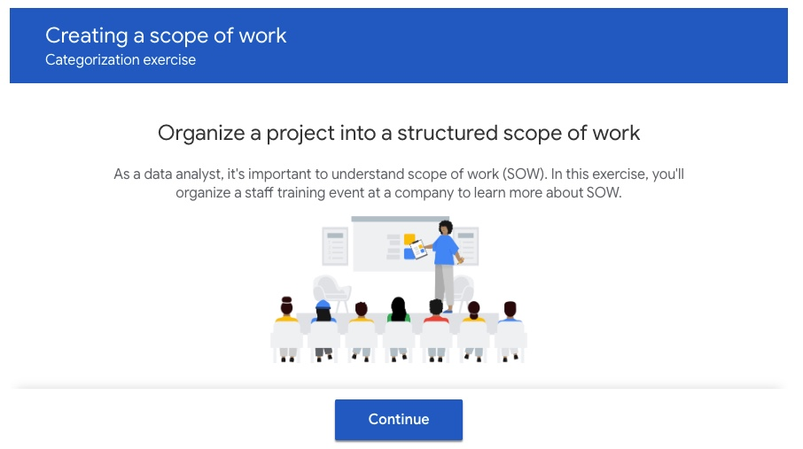
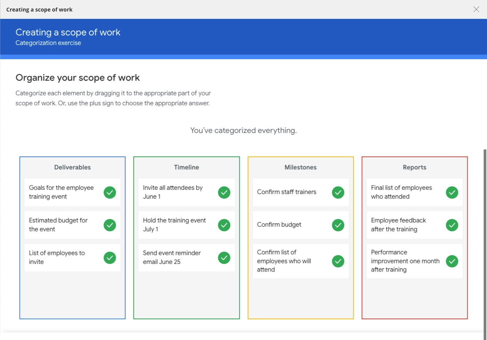

# Creating a scope of work

Categorization exercise

## Organize a project into a structured scope of work

As a data analyst, it's important to understand scope of work (SOW). In this exercise, you'll organize a staff training event at a company to learn more about SOW.

