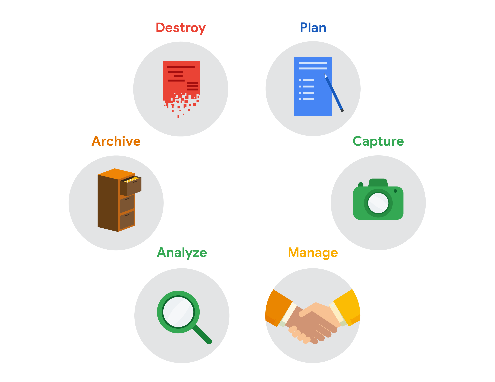

# Spreadsheets and the data life cycle

To better understand the benefits of using spreadsheets in data analytics, let’s explore how they relate to each phase of the data life cycle: `plan`, `capture`, `manage`, `analyze`, `archive`, and `destroy`.

- `Plan` for the users who will work within a spreadsheet by developing organizational standards. This can mean formatting your cells, the headings you choose to highlight, the color scheme, and the way you order your data points. When you take the time to set these standards, you will improve communication, ensure consistency, and help people be more efficient with their time.

- `Capture` data by the source by connecting spreadsheets to other data sources, such as an online survey application or a database. This data will automatically be updated in the spreadsheet. That way, the information is always as current and accurate as possible.

- `Manage` different kinds of data with a spreadsheet. This can involve storing, organizing, filtering, and updating information. Spreadsheets also let you decide who can access the data, how the information is shared, and how to keep your data safe and secure.

- `Analyze` data in a spreadsheet to help make better decisions. Some of the most common spreadsheet analysis tools include formulas to aggregate data or create reports, and pivot tables for clear, easy-to-understand visuals.

- `Archive` any spreadsheet that you don’t use often, but might need to reference later with built-in tools. This is especially useful if you want to store historical data before it gets updated.

- `Destroy` your spreadsheet when you are certain that you will never need it again, if you have better backup copies, or for legal or security reasons. Keep in mind, lots of businesses are required to follow certain rules or have measures in place to make sure data is destroyed properly.

## Resources

Spreadsheet shortcuts can help you become more efficient with spreadsheets. If you’d like to learn more, you can explore the collection of [Google Sheets shortcuts](https://support.google.com/docs/answer/181110), or visit the [Microsoft Excel shortcuts](https://support.microsoft.com/en-us/office/keyboard-shortcuts-in-excel-1798d9d5-842a-42b8-9c99-9b7213f0040f)
 page if you are using Excel. Both of these resources contain a list of spreadsheet shortcuts you can save and reference as you work more with spreadsheets on your own.
