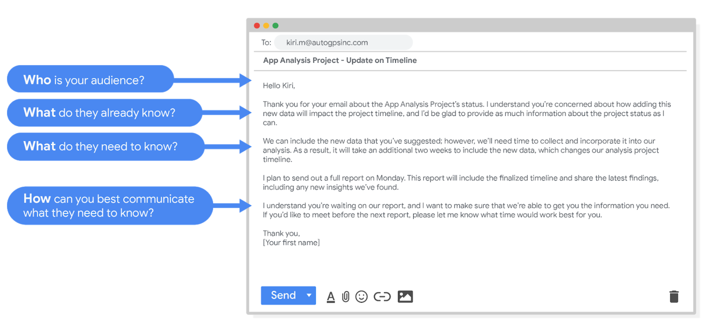
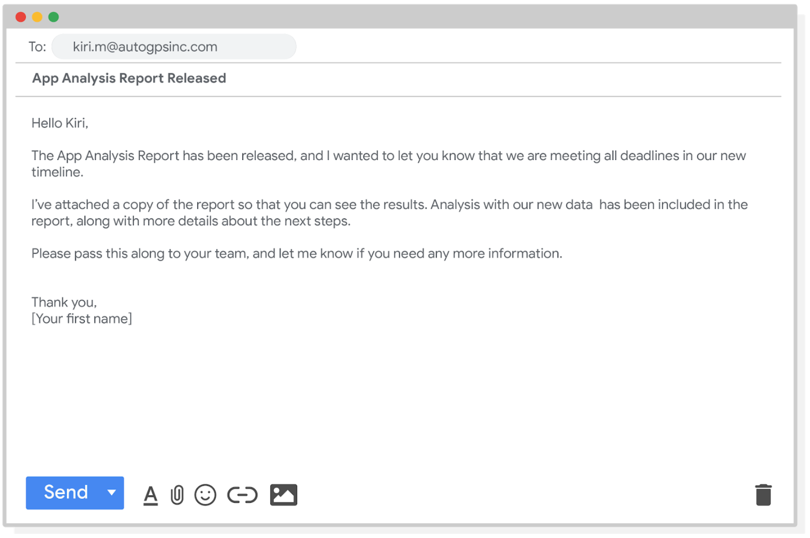

# Data scenarios and responses

Being able to communicate in multiple formats is a key skill for data analysts. Listening, speaking, presenting, and writing skills will help you succeed in your projects and in your career. This reading covers effective communication strategies, including examples of clearly worded emails for common situations.

Here's an important first tip: Know your audience! When you communicate your analysis and recommendations as a data analyst, it's vital to keep your audience in mind.

Be sure to answer these four important questions related to your audience:
    1. Who is your audience?
    2. What do they already know?
    3. What do they need to know?
    4. How can you best communicate what they need to know?

## Project example

As a data analyst, you'll get plenty of requests and questions through email. Let’s walk through an example of how you might approach answering one of these emails. Assume you're a data analyst working at a company that develops mobile apps. Let's start by reviewing answers to the four audience questions we just covered:

Kiri, Product Development Project Manager

Kiri received updates about our project from its planning stages, including the most recent project report, sent two weeks ago.

Kiri needs an update on the analysis project’s progress and needs to know that the executive team approved changes to the data and timeline. You know that adding a new variable to the analysis will impact the current project timeline. Kiri will need to change the project’s milestones and completion date.

You can start by sending an email update to Kiri with the latest timeline for the project, but a meeting might be necessary if she wants to talk through her concerns about missing a deadline.

## Updated timeline email sample

After answering the audience questions, you have the key building blocks you need to write an email to Kiri. Here's an example of how these questions can help organize the flow of the email message:

After receiving your email, Kiri will have a clearer view of the changes to the analysis project and will be able to make adjustments to work with the new timeline.

## Project follow-up email sample

After the next report is completed, you can also send out a project update offering more information. The email could look like this:

Good communication keeps stakeholders updated on progress and ultimately helps prevent problems. Carefully worded responses are key. Whether you gather and address feedback using email, meetings, or reports, everyone you work with will know what to expect. As a result, they will be able to better manage their own schedules, resources, and teams.

## Keypoints

- Communication Strategies:
  - Highlighted as a crucial skill for data analysts, including listening, speaking, presenting, and writing skills.
  - Emphasizes the significance of knowing your audience when communicating analysis and recommendations.
- Four Important Questions:
  - Advises data analysts to consider four questions related to their audience:
    - Who is your audience?
    - What do they already know?
    - What do they need to know?
  - How can you best communicate what they need to know?
- Project Example:
  - Illustrates a scenario where a data analyst, working in a mobile app development company, receives an email from Kiri, the Product Development - Project Manager.
- Answering Audience Questions for the Project Example:
  - Identifies Kiri as the audience and provides details about what she already knows and needs to know.
  - Recognizes that Kiri needs an update on the project's progress and approval changes made by the executive team.
- Email Samples:
  - Offers an example of an email to Kiri, updating her on the project's timeline changes due to the addition of a new variable.
  - Emphasizes the importance of clear and carefully worded responses to keep stakeholders informed and prevent potential issues.
- Follow-Up Email Sample:
  - Suggests sending a project follow-up email after completing the next report to provide additional information and keep stakeholders updated.
- Importance of Communication:
  - Stresses that good communication helps stakeholders manage their schedules, resources, and teams more effective

By providing a practical example and email samples, this section aims to guide data analysts in effectively communicating with stakeholders and addressing common scenarios in a professional manner.
