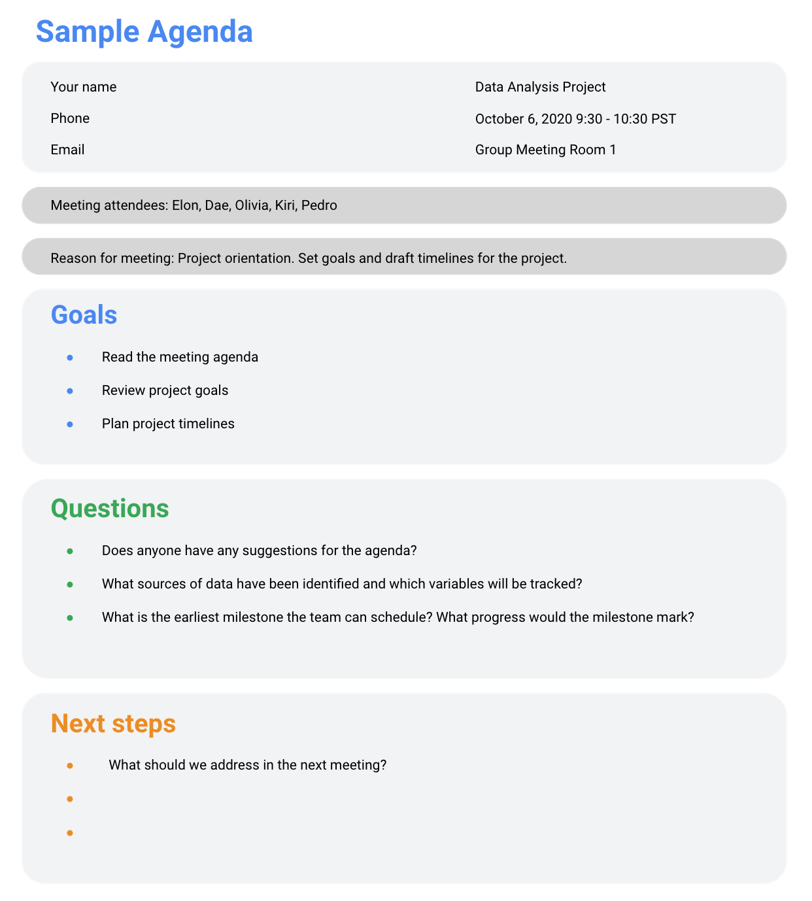

# Leading great meetings

One day soon, you might find yourself planning a meeting in your role as a data analyst. Great things can happen when participants anticipate a well-executed meeting. Attendees show up on time. They aren’t distracted by their laptops and phones. They feel like their time will be well spent. It all comes down to good planning and communication of expectations. The following are our best practical tips for leading meetings.

## Before the meeting

If you are organizing the meeting, you will probably talk about the data. Before the meeting:
    - Identify your objective. Establish the purpose, goals, and desired outcomes of the meeting, including any questions or requests that need to be addressed.
    - Acknowledge participants and keep them involved with different points of view and experiences with the data, the project, or the business.
    - Organize the data to be presented. You might need to turn raw data into accessible formats or create data visualizations.
    - Prepare and distribute an agenda. We will go over this next.

## Crafting a compelling agenda

A solid meeting agenda sets your meeting up for success. Here are the basic parts your agenda should include:
    - Meeting start and end time
    - Meeting location (including information to participate remotely, if that option is available)
    - Objectives
    - Background material or data the participants should review beforehand

Here's an example of an agenda for an analysis project that is just getting started:

## Sharing your agenda ahead of time

After writing your agenda, it's time to share it with the invitees. Sharing the agenda with everyone ahead of time helps them understand the meeting goals and prepare questions, comments, or feedback. You can email the agenda or share it using another collaboration tool.

## During the meeting

As the leader of the meeting, it's your job to guide the data discussion. With everyone well informed of the meeting plan and goals, you can follow these steps to avoid any distractions:
    - Make introductions (if necessary) and review key messages
    - Present the data
    - Discuss observations, interpretations, and implications of the data
    - Take notes during the meeting
    - Determine and summarize next steps for the group

## After the meeting

To keep the project and everyone aligned, prepare and distribute a brief recap of the meeting with next steps that were agreed upon in the meeting. You can even take it a step further by asking for feedback from the team.
    - Distribute any notes or data
    - Confirm next steps and timeline for additional actions
    - Ask for feedback (this is an effective way to figure out if you missed anything in your recap)

## A final word about meetings

Even with the most careful planning and detailed agendas, meetings can sometimes go off track. An emergency situation might steal people’s attention. A recent decision might unexpectedly change requirements that were previously discussed and agreed on. Action items might not apply to the current situation. If this happens, you might be forced to shorten or cancel your meeting. That's all right; just be sure to discuss anything that impacts your project with your manager or stakeholders and reschedule your meeting after you have more information.

## **Key takeaways**

- Identify Objectives:
  - Establish the purpose, goals, and desired outcomes of the meeting.
  - Clearly define any questions or requests to be addressed.
- Acknowledge Participants:
  - Keep participants involved by considering their different points of view and experiences with data, projects, or the business.
- Organize Data:
  - Prepare data to be presented, converting raw data into accessible formats or creating visualizations.
- Prepare and Distribute Agenda:
  - Craft a compelling agenda that includes start and end times, location details, objectives, and background material.
  - Share the agenda ahead of time to help participants understand goals and prepare questions or feedback.
- Crafting a Compelling Agenda:
  - A solid agenda includes meeting start and end times, location details, objectives, and background material or data for participants to review.
- During the Meeting:
  - Guide Data Discussion:
    - Make introductions (if necessary) and review key messages.
    - Present the data and discuss observations, interpretations, and implications.
    - Take notes and determine next steps for the group.
- After the Meeting:
  - Prepare Recap:
    - Distribute a brief recap of the meeting, including agreed-upon next steps.
    - Request feedback from the team to ensure alignment and address any missed points.
  - Distribute Notes and Data:
    - Share any notes or data discussed during the meeting.
  - Confirm Next Steps:
    - Verify and communicate the next steps and timeline for additional actions.
  - Ask for Feedback:
    - Seeking feedback is an effective way to identify any missed points in the recap and ensure clarity.
  - A Final Word About Meetings:
    - Despite careful planning, meetings can go off track due to unexpected situations.
    - In such cases, it's acceptable to shorten or cancel the meeting.
    - Discuss any impacts on the project with managers or stakeholders and reschedule the meeting when more information is available.