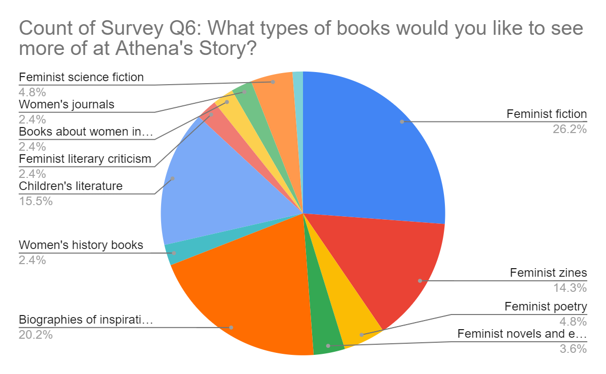

# Course 2 challenge

## 1.Scenario 1, questions 1-5

You’ve just started a job as a data analyst at a small software company that provides data analytics and business intelligence solutions. Your supervisor asks you to kick off a project with a new client, Athena’s Story, a feminist bookstore. They have four existing locations, and the fifth shop has just opened in your community.

Athena’s Story wants to produce a campaign to generate excitement for an upcoming celebration and introduce the bookstore to the community. They share some data with your team to help make the event as successful as possible.

Your task is to review the assignment and the available data, then present your approach to your supervisor. Click the link below to access the email from your supervisor: [Course-2-Scenario-1-Email-from-Supervisor.pdf](./resources/Course-2-Scenario-1-Email-from-Supervisor.pdf)

```email
From: Rosa <Manager@Analytics_Company.com>
Date: Mon, 1/9/2021 2:14 PM
Subject: Athena’s Story March campaign
To: Data Analyst <You@Analytics_Company.com>
Good afternoon!
See below for an exciting opportunity from our newest client, Athena’s Story, a feminist
bookstore that just opened in our city. They’re looking for us to help them make their March
campaign a success. I know you’ll do a great job supporting the launch of their new bookstore.
Looking forward to hearing how you might tackle this challenge -- please reach out with any
questions.
Rosa
---------- Forwarded message ---------
Hello, Rosa:
Thanks for the call yesterday! We’re looking forward to partnering with you on our upcoming
WHM campaign. We’ve been excited to open our newest location in your community and are
hoping that you can help us make this campaign a success.
We’ve gathered results from a recent customer survey. The survey includes data about whether
people plan to celebrate WHM. It also asks if they might celebrate by purchasing feminist books
as a gift for a friend or just to enjoy themselves. And we surveyed customers to find out what
they like most about Athena's Story and what types of books they’d like us to carry in the future.
We also have a dataset of historical data of internal sales records from our other four stores.
We’ve included information on our two most profitable genres: feminist fiction and biographies of
inspiring women. And we’ve included information on two new genres: children’s literature and
feminist zines. We’ve only started carrying children’s literature and feminist zines in the past 12
months, but our customer survey does seem to indicate that people would enjoy seeing more of
these kinds of titles.
As you know, we don’t have our own analytics or insights team, so we’re hoping you can help us
make sense of it all. Let us know if we can answer any questions for you or your analytics team.
Thanks!
Emmeline, on behalf of Athena’s Story
```

Then, review the email, and the Customer Survey and Historical Sales datasets.
To use the templates for the datasets, click the links below and select “Use Template.”
Links to templates: [Customer Survey](https://docs.google.com/spreadsheets/d/1HbBfNTuHCmQyY0GJrsdj6OCOkmeA5sUAQ-jXx8bMdpY/template/preview) and [Historical Sales](https://docs.google.com/spreadsheets/d/1HO8B-svc3Mmm3hlWycvX61Boxl9RQv6nKKWnkRig83E/template/preview)
OR
If you don't have a Google account, you can download the CSV files directly from the attachments: [CustomerSurvey.csv](./resources/CustomerSurvey.csv) and [HistoricalSales.csv](./resources/HistoricalSales.csv)

After reading the email, you notice that the acronym WHM appears in multiple places. You look it up online, and the most common result is web host manager. That doesn’t seem right to you, as it doesn’t fit the context of a feminist bookstore. You email your supervisor to ask. **When writing your email, what do you do to ensure it sounds professional? Select all that apply.**

- `Use a polite greeting and closing.`
- `Read your email aloud before sending to catch any typos or grammatical errors and to ensure the communication is clear.`
- `Respect your supervisor’s time by writing an email that’s short and to the point.`
- Write a clear subject line that gets a fast response so you can keep working: “WHM? NEED TO KNOW WHAT THAT IS RIGHT AWAY.”

## 2. Scenario 1 continued

Now that you know WHM stands for Women’s History Month, you continue reviewing the datasets. You notice that the Customer Survey dataset contains both qualitative and quantitative data.

To use the template for the dataset, click the link below and select “Use Template.”
Link to template: [Customer Survey]
OR If you don't have a Google account, you can download the CSV file directly from the attachment .

The quantitative data includes information from which columns? Select all that apply.

- `Column C (Survey Q3: Do you purchase feminist books in honor of WHM, either for yourself or as a gift for someone else?)`
- `Column A (Survey Q1: Do you plan to celebrate WHM?)`
- `Column D (Survey Q4: If answered "Yes" to Q3, how many books do you typically purchase during March?)`
- Column E (Survey Q5: What do you like most about Athena's Story?)

## 3. Scenario 1 continued

Next, you review the customer feedback in column F of the [Customer Survey] dataset.
To use the template for the dataset, click the link below and select “Use Template.”
Link to template: [Customer Survey](https://docs.google.com/spreadsheets/d/1HbBfNTuHCmQyY0GJrsdj6OCOkmeA5sUAQ-jXx8bMdpY/template/preview)
OR If you don't have a Google account, you can download the CSV file directly from the attachment [CustomerSurvey.csv](./resources/CustomerSurvey.csv)

The attribute of column F is, “Survey Q6: What types of books would you like to see more of at Athena's Story?” In order to verify that children’s literature and feminist zines are among the most popular genres, you create a visualization. This will help you clearly identify which genres are most likely to sell well during the Women’s History Month campaign.
Your visualization looks like this:


- **Pie chart categories:**
  - Feminist science fiction 4.8%
  - Books about women 2.4%
  - Women's journals 2.4%
  - Feminist literary criticism 2.4%
  - Children's literature 15.5%
  - Women's history books 2.4%
  - Biographies of inspiration 20.2%
  - Feminist fiction 26.2%
  - Feminist zines 14.3%
  - Feminist poetry 4.6%
  - Feminist novels 3.6%

- What is a pie chart effective for demonstrating?
  - Trends over time
  - Where things are located on a map
  - Relationships between variables
  - `Percentages that make up a whole`

## 4. Question 4: Now that you’ve confirmed that children’s literature and feminist zines are among the most requested book genres, you review the Historical Sales dataset

To use the template for the dataset, click the link below and select “Use Template.”
Link to template: [Historical Sales](https://d3c33hcgiwev3.cloudfront.net/ta9P5mnbRZevT-Zp2wWXMw_dbd2edcd01804aa49f17fef80cc70f95_HistoricalSales---HistoricalSales.csv?Expires=1701475200&Signature=GUib9qnhD1s5FE4CyyJWNH53W-6xOkkrZkuIXz2QwB2F3YCeFJ6RxTnq7tTgV3w-9DsU3JpqXj8k~-0zBqQj8j2Wh7UgN4D6VD6jdVPJKMKEwpLP50~HfdBIgBNmAFEpoRwoM5qskFdZtyq5SUmek-Ub0RajePNNkDYqBGV3m2s_&Key-Pair-Id=APKAJLTNE6QMUY6HBC5A)
OR If you don't have a Google account, you can download the CSV file directly from the attachment [HistoricalSales.csv](./resources/HistoricalSales.csv).

You’re pleased to see that the dataset contains data that’s specific to children’s literature and feminist zines. This will provide you with the information you need to make data-inspired decisions. In addition, the children’s literature and feminist zines metrics will help you organize and analyze the data about each genre in order to determine if they’re likely to be profitable.

Next, you calculate the total sales over 52 weeks for children’s literature. What is the correct syntax?

- =MAX(D2:D53)
- `=SUM(D2:D53)`
- =COUNT(D2:D53)
- =CALCULATE(D2:D53)

## 5. Scenario 1 continued

After familiarizing yourself with the project and available data, you present your approach to your supervisor. You provide a scope of work, which includes important details, a schedule, and information on how you plan to prepare and validate the data. You also share some of your initial results and the pie chart you created.

In addition, you identify the problem type, or domain, for the data analysis project. You decide that the historical sales data can be used to provide insights into the types of books that will sell best during Women’s History Month this coming year. This will also enable you to determine if Athena’s Story should begin selling more children’s literature and feminist zines.

**Using historical data to make informed decisions about how things may be in the future is an example of spotting something unusual.**

- True
- `False`

## 6. Scenario 2, questions 6-10

You’ve completed this program and are now interviewing for your first junior data analyst position. You’re hoping to be hired by an event planning company, Patel Events Plus. Access the job description below: [Junior-Data-Analyst-Job-Description.pdf](./resources/Junior-Data-Analyst-Job-Description.pdf)

```jd
Junior Data Analyst
Patel Events Plus
Madison, WI
Patel
Events
Plus
Apply Now
2 days ago Full-time
The Madison, Wisconsin, analytics team is responsible for providing analysis and insights that address the business needs of our award-winning
event planners. The analysis and insights serve as the basis for discussions with the events team, providing actionable recommendations that
address strategies, initiatives, and objectives.
This position reports to the director of data and strategy.
Responsibilities
● Develop mastery of Patel Events Plus tools and metrics, which you will use to answer question sand solve problems
● Determine the effort and resources required to meet objectives
● Plan, coordinate, and manage resources effectively
● Evaluate performance and customer satisfaction using analytic methods
● Present analytic insights and recommendations in a clear and compelling manner
● Demonstrate effective team behaviors, including conflict-resolution and communication skills
● Know when to escalate and follow up on potential problems
● Achieve high-quality results through effective data integrity
A bit about you
You have strong analytical and problem-solving skills. Curiosity, communication, and logic drive your work. You are organized and know how to
balance speed with accuracy. And you effectively manage relationships and expectations in order to define what's urgent and always be
accountable for excellent outcomes.
A bit about us
This is corporate event planning at its best. Patel Events Plus offers more than just a network of vendors. We provide creativity and thoughtful
logistics in order to transform ordinary events into unparalleled experiences. Our event planning experts design a uniquely memorable experience
for clients, a refreshing new experience for donors, and buzzworthy promotional materials that demand attention. And we do all of this while 
```

So far, you’ve successfully completed the first round of interviews with the human resources manager and director of data and strategy. Now, the vice president of data and strategy wants to learn more about your approach to managing projects and clients. Access the email you receive from the human resources director below: [Human-Resources-Director-Email.pdf](./resources/Human-Resources-Director-Email.pdf)

```email
From: Jay Jelani <jjelani@pateleventsplus.com>
Date: Fri, 3/27/2021 6:14 PM
Subject: Second interview
To: You <You@gmail.com>
Good afternoon:
Congratulations on reaching the final stage of the interview process! My colleagues and I at
Patel Events Plus have enjoyed getting to know you and are impressed with your
qualifications.
The next step is your behavioral interview Thursday at 2 PM with Mila Aronowicz, our vice
president of data and strategy. A behavioral interview first involves being presented with some
scenarios typically encountered by junior data analysts. Then, we’ll ask you to consider how
you would respond if faced with these situations in real life. Don't worry if you haven't had
these experiences in a professional role; we’re simply interested in understanding how you
would handle them if you did encounter these kinds of scenarios.
To help you prepare, take a look at the following topic areas:
● Identifying relevant stakeholders
● Understanding client partners and their goals
● Asking effective questions
● Setting stakeholder expectations
● Responding to requests
● Balancing speed and accuracy
● Dealing with conflict in a professional manner
Again, congratulations, and we look forward to seeing you Thursday!
Best regards,
Jay
-----
Jay Jelani
Human Resources Director
Patel Events Plus
8430 Bryn Mawr Road, Suite 500
Madison, Wisconsin 53774 USA
```

You arrive Thursday at 1:45 p.m. for your 2:00 p.m. interview. Soon, you’re taken into the office of Mila Aronowicz, vice president of data and strategy. After welcoming you, she begins the behavioral interview.

First, she hands you a copy of Patel Events Plus’s organizational chart. Access the chart below: 


        Chief Executve Officer
                |
                |-------------Excutive Assistant to the CEO
                |
        Vice President, Data and Strategy
            |                       |
    Director, Strategy      Director, Data analytics
        |                   |          |          |
    Project manager         |          |      Project manager
        Strategy            |          |          analytics
                            |          |
                    Data Analytics  Junior Data Analyst
                    Coordinator             (vacant)

As you’ve learned in this course, stakeholders are people who invest time, interest, and resources into the projects you’ll be working on as a data analyst. Secondary stakeholders are also typically responsible for managing the data.

- `Based on what you find in the organizational chart, which of the stakeholders are responsible for managing the data? Select all that apply.`
  - Chief executive officer
  - `Director, data analytics`
  - `Vice president, data and strategy`
  - Junior data analyst

## 7. Scenario 2 continued

Next, the vice president wants to understand your knowledge about asking effective questions. Consider and respond to the following question. Select all that apply.

`Let’s say we just completed a big event for a client and wanted to find out if they were satisfied with their experience. Provide some examples of measurable questions that you could include in the customer feedback survey. Select all that apply.`

- `On a scale from 1 to 5, with 1 being not at all likely and 5 being very likely, how likely are you to recommend Patel Events Plus?`
- What did you most love about your event experience?
- What problems did you experience with our events team?
- `How satisfied were you with our event planning service — dissatisfied, neutral, or satisfied?`

## 8. Scenario 2 continued

Now, the vice president presents a situation having to do with resolving challenges and meeting stakeholder expectations. Consider and respond to the following question.

**You’re working with a dataset that the data analytics coordinator should have cleaned, but it turns out that it wasn’t. Your supervisor thought the dataset was ready for use, but you discover nulls, redundant data, and other issues. The project is due in less than two weeks. How would you handle that situation?**

- Email your supervisor to let them know the associate data analyst did not complete their assigned task.
- `Communicate with the data analytics coordinator about the issue and offer to work together to clean the data so the project doesn’t fall behind.`
- Call a formal meeting with the data analytics team to solve the problem. Do not invite the associate data analyst, as they clearly don’t have time to help.
- Contact the data analytics coordinator and insist they clean the dataset immediately so you don’t miss your project deadline.

## 9. Scenario 2 continued

Your next interview question deals with sharing information with stakeholders. Consider and respond to the following question. Select all that apply.

`Let’s say you’ve created a report to present stakeholders with information about an upcoming event. Describe the benefits of using a report. Select all that apply.`

- Reports enable stakeholders to interact with the data.
- Reports offer live monitoring of incoming data.
- Reports reflect data that’s already been cleaned and sorted.
- `Reports provide a snapshot of high-level, historical data.`

## 10.Question 10 Scenario 2 continued

Your final behavioral interview question involves using metrics to answer business questions. Your interviewer hands you a copy of a Patel Events dataset.

To use the template for this dataset, click the link below and select “Use Template.”
Link to template: [Patel Events Data](https://docs.google.com/spreadsheets/d/1q2opRSUOWoK5KxPHFpqupOyDpJyob9t_kf-GOf90szE/template/preview)
OR If you don't have a Google account, you can download the CSV file directly from the attachment [Patel Events Data](./resources/Patel-Events-Plus-dataset.csv).  

Then, she asks: Recently, Patel Events Plus purchased a new venue for our events. `If we asked you to calculate the return on investment of this purchase, the metrics to consider would be the cost of the investment and what else?`

- Purchase date
- 2019 events held at new venue
- `Net profit in 2019`
- Average event revenues
