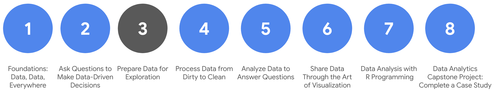

# Course syllabus

1. Foundations: Data, Data, Everywhere
2. Ask Questions to Make Data-Driven Decisions
3. **Prepare Data for Exploration** *(this course)*
4. Process Data from Dirty to Clean
5. Analyze Data to Answer Questions
6. Share Data Through the Art of Visualization
7. Data Analysis with R Programming
8. Google Data Analytics Capstone: Complete a Case Study

Welcome to the third course in the Google Data Analytics Certificate! So far, you have been introduced to the field of data analytics and discovered how data analysts can use their skills to answer business questions.

As a data analyst, you need to be an expert at structuring, extracting, and making sure the data you are working with is reliable. To do this, it is always best to develop a general idea of how all data is generated and collected, since every organization structures data differently. Then, no matter what data structure you are faced with in your new role, you will feel confident working with it.  

You will soon discover that when data is extracted, it isn’t perfect. It might be biased instead of credible, or dirty instead of clean. Your goal is to learn how to analyze data for bias and credibility and to understand what clean data means. You will also get up close and personal with databases and even get to extract your own data from a database using spreadsheets and SQL. The last topics covered are the basics of data organization and the process of protecting your data.

And you will learn how to identify different types of data that can be used to understand and respond to a business problem. In this part of the program, you will explore different types of data and data structures. And best of all, you will keep adding to your data analyst tool box! From extracting and using data, to organizing and protecting it, these key skills will come in handy no matter what you are doing in your career as a data analyst.

## Course content

Course 3 – Prepare Data for Exploration

1. **Understanding data types and structures**: We all generate lots of data in our daily lives. In this part of the course, you will check out how we generate data and how analysts decide which data to collect for analysis. You’ll also learn about structured and unstructured data, data types, and data formats as you start thinking about how to prepare your data for exploration.
2. **Understanding bias, credibility, privacy, ethics, and access**: When data analysts work with data, they always check that the data is unbiased and credible. In this part of the course, you will learn how to identify different types of bias in data and how to ensure credibility in your data. You will also explore open data and the relationship between and importance of data ethics and data privacy.
3. **Databases: Where data lives**: When you are analyzing data, you will access much of the data from a database. It’s where data lives. In this part of the course, you will learn all about databases, including how to access them and extract, filter, and sort the data they contain. You will also check out metadata to discover the different types and how analysts use them.
4. **Organizing and protecting your data**: Good organization skills are a big part of most types of work, and data analytics is no different. In this part of the course, you will learn the best practices for organizing data and keeping it secure. You will also learn how analysts use file naming conventions to help them keep their work organized.
5. **Engaging in the data community (optional):** Having a strong online presence can be a big help for job seekers of all kinds. In this part of the course, you will explore how to manage your online presence. You will also discover the benefits of networking with other data analytics professionals.
6. **Completing the Course Challenge:** At the end of this course, you will be able to apply what you have learned in the Course Challenge. The Course Challenge will ask you questions about the key concepts and then will give you an opportunity to put them into practice as you go through two scenarios.

## What to expect

This part of the program is designed to get you familiar with different data structures and show you how to collect, apply, organize, and protect data. All of these skills will be part of your daily tasks as an entry-level data analyst. You will work on a wide range of activities that are similar to real-life tasks that data analysts come across on a daily basis.

- This course has five modules or weeks, and each has several lessons included. Within each lesson, you will find content such as:
  - **Videos** of instructors teaching new concepts and demonstrating the use of tools
  - **In-video questions** that pop up during or at the end of a video to check your learning
  - **Readings** to introduce new ideas and build on the concepts from the videos
  - [**Discussion forums**](https://www.coursera.org/learn/data-preparation/discussions): to discuss, explore, and reinforce new ideas for better learning
  - **Discussion prompts** to promote thinking and engagement in the discussion forums
  - **Hands-on activities** to introduce real-world, on-the-job situations, and the tools and tasks to complete assignments
  - **Practice quizzes** to prepare you for graded quizzes
  - **Graded quizzes** to measure your progress and give you valuable feedback

Hands-on activities promote additional opportunities to build your skills. Try to get as much out of them as possible. Assessments are based on the approach taken by the course to offer a wide variety of learning materials and activities that reinforce important skills. Graded and ungraded quizzes will  help the content sink in. Ungraded practice quizzes are a chance for you to prepare for the graded quizzes. Both types of quizzes can be taken more than one time.

As a quick reminder, this course is designed for all types of learners, with no degree or prior experience required. Everyone learns differently, so the Google Data Analytics Certificate has been designed with that in mind. Personalized deadlines are just a guide, so feel free to work at your own pace. There is no penalty for late assignments. If you prefer, you can extend your deadlines by returning to **Overview** in the navigation pane and clicking **Switch Sessions**. If you already missed previous deadlines, click **Reset my deadlines** instead.

If you would like to review previous content or get a sneak peek of upcoming content, you can use the navigation links at the top of this page to go to another course in the program. When you pass all required assignments, you will be on track to earn your certificate.

Optional speed track for those experienced in data analytics
The Google Data Analytics Certificate provides instruction and feedback for learners hoping to earn a position as an entry-level data analyst. While many learners will be brand new to the world of data analytics, others may be familiar with the field and simply wanting to brush up on certain skills.

If you believe this course will be primarily a refresher for you, we recommend taking the practice diagnostic quiz offered this week. It will enable you to determine if you should follow the speed track, which is an opportunity to proceed to Course 4 after having taken each of the Course 3 Weekly Challenges and the overall Course Challenge. Learners who earn 100% on the diagnostic quiz can treat Course 3 videos, readings, and activities as optional. Learners following the speed track are still able to earn the certificate.

## **Tips**

- Do your best to complete all items in order. All new information builds on earlier learning.
- Treat every task as if it is real-world experience. Have a mindset that you are working at a company or in an organization as a data analyst. This will help you apply what you learn in this program to the real world.
- Even though they aren’t graded, it is important to complete all practice items. They will help you build a strong foundation as a data analyst and better prepare you for the graded assessments.
- Take advantage of all additional resources provided.
- When you encounter useful links in the course, remember to bookmark them so you can refer to the information later for study or review.
