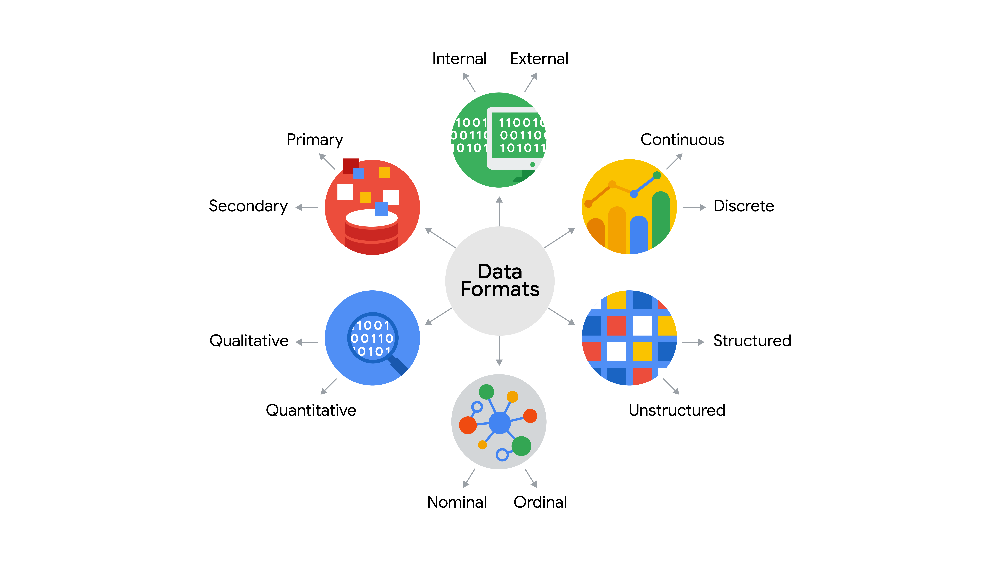

# Data formats in practice

When you think about the word "format," a lot of things might come to mind. Think of an advertisement for your favorite store. You might find it in the form of a print ad, a billboard, or even a commercial. The information is presented in the format that works best for you to take it in. The format of a dataset is a lot like that, and choosing the right format will help you manage and use your data in the best way possible.

## Data format examples

As with most things, it is easier for definitions to click when we can pair them with real life examples. Review each definition first and then use the examples to lock in your understanding of each data format.

- Primary vs. Secondary

|Data Format Classification|Definition|Examples|
|-------------------------|---------|--------|
| Primary data|Collected by a researcher from first-hand sources|- Data from an interview you conducted   - Data from a survey returned from 20 participants   - Data from questionnaires you got back from a group of workers|
|Secondary data|Gathered by other people or from other research|- Data you bought from a local data analytics firm’s customer profiles   - Demographic data collected by a university    - Census data gathered by the federal government|

- Internal vs. External

|Data Format Classification|Definition|Examples|
|-------------------------|---------|--------|
| Internal data |Data that lives inside a company’s own systems|- Wages of employees across different business units tracked by HR   - Sales data by store location    - Product inventory levels across distribution centers|
|External data|Data that lives outside of a company or organization|- National average wages for the various positions throughout your organization   - Credit reports for customers of an auto dealership|

- Continuous vs. Discrete

|Data Format Classification|Definition|Examples|
|-------------------------|---------|--------|
| Continuous data |Data that is measured and can have almost any numeric value|- Height of kids in third grade classes (52.5 inches, 65.7 inches)   - Runtime markers in a video    - Temperature|
|Discrete data|Data that is counted and has a limited number of values|- Number of people who visit a hospital on a daily basis (10, 20, 200)   - Room’s maximum capacity allowed   - Tickets sold in the current month|

- Quanlitative vs. Quantitative

|Data Format Classification|Definition|Examples|
|-------------------------|---------|--------|
|Qualitative|Subjective and explanatory measures of qualities and characteristics|- Exercise activity most enjoyed   - Favorite brands of most loyal customers   - Fashion preferences of young adults|
|Quantitative|Specific and objective measures of numerical facts|- Percentage of board certified doctors who are women  - Population of elephants in Africa   - Distance from Earth to Mars|

- Nominal vs. Ordinal

|Data Format Classification|Definition|Examples|
|-------------------------|---------|--------|
|Nominal|A type of qualitative data that isn’t categorized with a set order|- First time customer, returning customer, regular customer  - New job applicant, existing applicant, internal applicant  - New listing, reduced price listing, foreclosure|
|Ordinal| A type of qualitative data with a set order or scale|- Movie ratings (number of stars: 1 star, 2 stars, 3 stars)  - Ranked-choice voting selections (1st, 2nd, 3rd)   - Income level (low income, middle income, high income)|

- Structured vs. Unstructured

|Data Format Classification|Definition|Examples|
|-------------------------|---------|--------|
|Structured data|Data organized in a certain format, like rows and columns|- Expense reports - Tax returns - Store inventory|
|Unstructured data| Data that isn’t organized in any easily identifiable manner| Social media posts - Emails - Videos|
