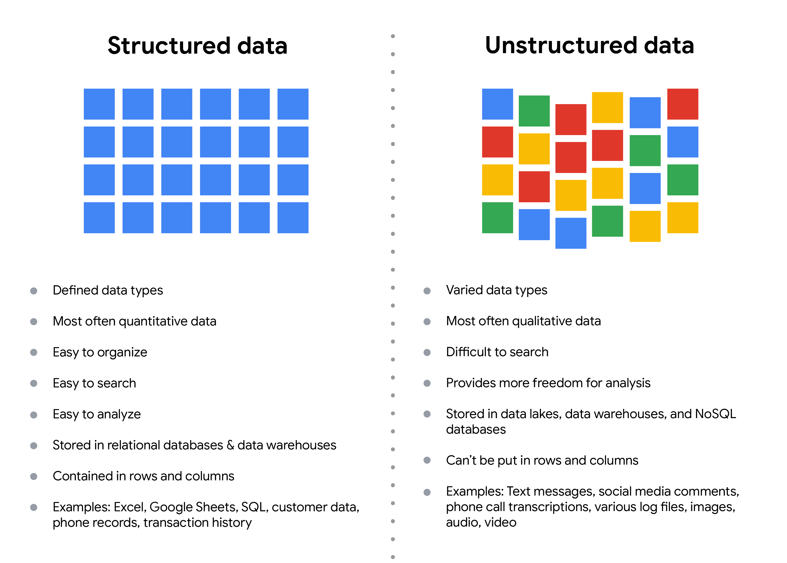

# The structure of data

Data is everywhere and it can be stored in lots of ways. Two general categories of data are:

- Structured data: Organized in a certain format, such as rows and columns.
- Unstructured data: Not organized in any easy-to-identify way.

For example, when you rate your favorite restaurant online, you're creating structured data. But when you use Google Earth to check out a satellite image of a restaurant location, you're using unstructured data.
Here's a refresher on the characteristics of structured and unstructured data:

## Structured data

As we described earlier, **structured data** is organized in a certain format. This makes it easier to store and query for business needs. If the data is exported, the structure goes along with the data.

## Unstructured data

**Unstructured data** can’t be organized in any easily identifiable manner. And there is much more unstructured than structured data in the world. Video and audio files, text files, social media content, satellite imagery, presentations, PDF files, open-ended survey responses, and websites all qualify as types of unstructured data.

## The fairness issue

The lack of structure makes unstructured data difficult to search, manage, and analyze. But recent advancements in artificial intelligence and machine learning algorithms are beginning to change that. Now, the new challenge facing data scientists is making sure these tools are inclusive and unbiased. Otherwise, certain elements of a dataset will be more heavily weighted and/or represented than others. And as you're learning, an unfair dataset does not accurately represent the population, causing skewed outcomes, low accuracy levels, and unreliable analysis.

## Keypoints

- Structured vs. Unstructured Data:
  - Data falls into two broad categories: structured and unstructured.
  - Structured Data: Organized in rows and columns, facilitating storage and business queries.
  - Unstructured Data: Lacks easy organization, includes video, audio files, text, social media content, etc.
- Characteristics of Structured Data:
  - Organized format for ease of storage and retrieval.
  - Structure accompanies data even when exported.
- Characteristics of Unstructured Data:
  - Lacks easily identifiable organization.
  - Prevalent in various forms: video, audio, text, social media content, etc.
- Fairness Challenges with Unstructured Data:
  - Unstructured data is challenging to search, manage, and analyze due to its lack of organization.
  - Advances in AI and machine learning are addressing these challenges.
  - Ensuring inclusivity and unbiased use of these tools is crucial to avoid skewed outcomes and unreliable analysis.
- Impact of Unfair Datasets:
  - Unfair datasets lead to skewed outcomes, low accuracy, and unreliable analysis.
  - Inclusion and fairness in using AI and machine learning are critical to accurate representation.
