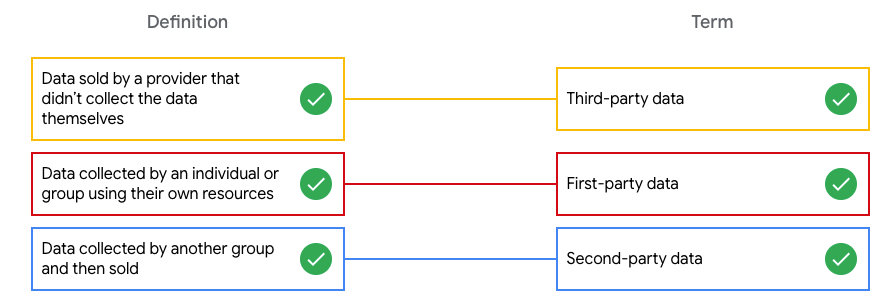
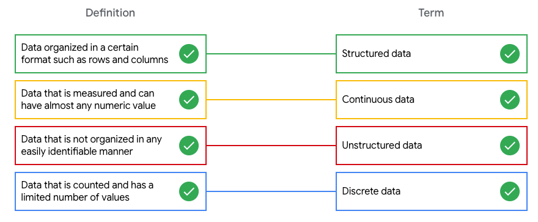
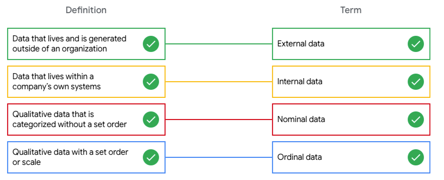

# Differentiating Data Types

## Data type definitions

Matching exercise

> Know your data types: In this matching exercise, match each data type definition to the correct term.

### First, select a definition. Then, select a term to find out if it’s a match

|                                       Definition                  |   Term           |
|------------------------------------------------------------------|------------------|
|Data sold by a provider that didn’t collect the data themselves   |First-party data  |
|Data collected by an individual or group using their own resources|Second-party data |
|Data collected by another group and then sold                     |Third-party data  |

