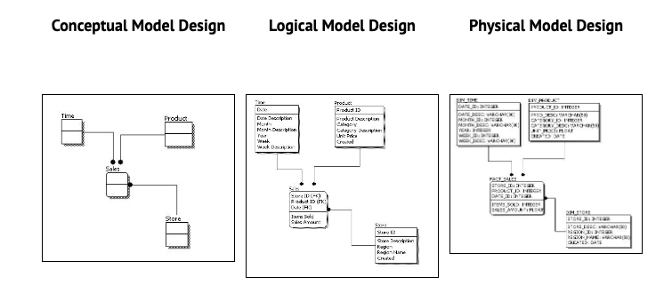
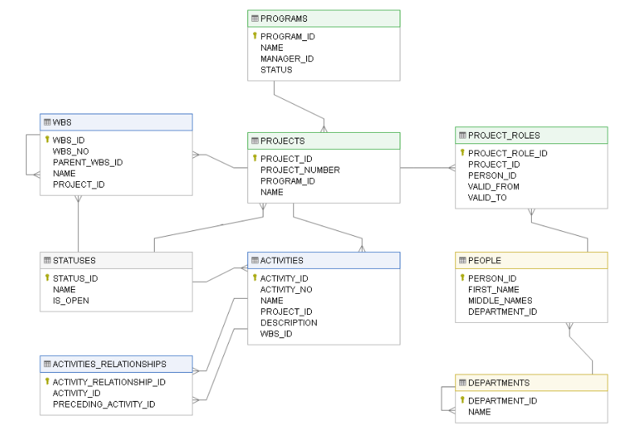
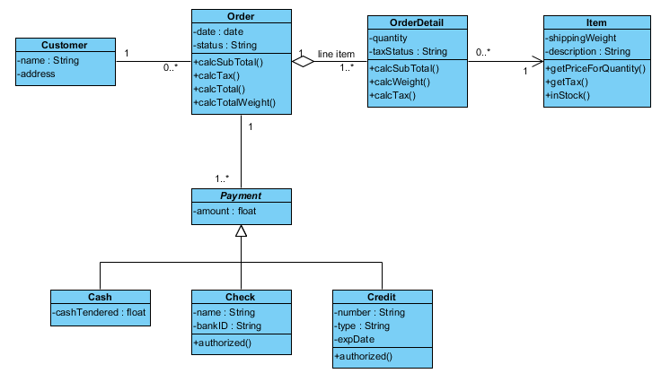
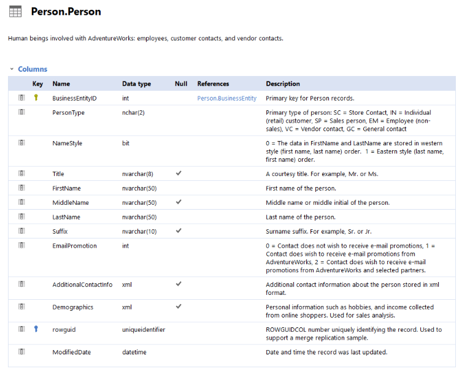

# Data modeling levels and techniques

This reading introduces you to data modeling and different types of data models. Data models help keep data consistent and enable people to map out how data is organized. A basic understanding makes it easier for analysts and other stakeholders to make sense of their data and use it in the right ways.

**Important note:** As a junior data analyst, you won't be asked to design a data model. But you might come across existing data models your organization already has in place.

## What is data modeling?

**Data modeling** is the process of creating diagrams that visually represent how data is organized and structured.  These visual representations are called **data models**. You can think of data modeling as a blueprint of a house. At any point, there might be electricians, carpenters, and plumbers using that blueprint. Each one of these builders has a different relationship to the blueprint, but they all need it to understand the overall structure of the house. Data models are similar; different users might have different data needs, but the data model gives them an understanding of the structure as a whole.

## Levels of data modeling

Each level of data modeling has a different level of detail.

1. **Conceptual data modeling** gives a high-level view of the data structure, such as how data interacts across an organization. For example, a conceptual data model may be used to define the business requirements for a new database. A conceptual data model doesn't contain technical details.
2. **Logical data modeling** focuses on the technical details of a database such as relationships, attributes, and entities. For example, a logical data model defines how individual records are uniquely identified in a database. But it doesn't spell out actual names of database tables. That's the job of a physical data model.
3. **Physical data modeling** depicts how a database operates. A physical data model defines all entities and attributes used; for example, it includes table names, column names, and data types for the database.

More information can be found in this [comparison of data models](https://www.1keydata.com/datawarehousing/data-modeling-levels.html).

## Data-modeling techniques

There are a lot of approaches when it comes to developing data models, but two common methods are the **Entity Relationship Diagram (ERD)** and the **Unified Modeling Language (UML)** diagram. ERDs are a visual way to understand the relationship between entities in the data model. UML diagrams are very detailed diagrams that describe the structure of a system by showing the system's entities, attributes, operations, and their relationships. As a junior data analyst, you will need to understand that there are different data modeling techniques, but in practice, you will probably be using your organization’s existing technique.

You can read more about ERD, UML, and data dictionaries in this  [data modeling techniques article](https://dataedo.com/blog/basic-data-modeling-techniques).

- **Entity Relationship Diagram (ERD)**: Entity-Relationship modeling is a default technique for modeling and the design of relational (traditional) databases. In this notation architect identifies:
  - Entities representing objects (or tables in relational database),
  - Attributes of entities including data type,
  - Relationships between entities/objects (or foreign keys in a database).

    

- **Unified Modeling Language (UML)**: is a standardized family of notations for modeling and design of information systems. It was derived from various existing notations to provide a standard for software engineering. It comprises of several different diagrams representing different aspect of the system, and one of them being a Class Diagram that can be used for data modeling. Class diagrams are equivalent of ERDs in relational world and are mostly used to design classes in object-oriented programming languages (such as Java or C#). In class diagrams architects define:
  - Classes (equivalent of entity in relational world),
  - Attributes of a class (same as in an ERD) including data type,
  - Methods associated to specific class, representing its behavior (in relational world those would be stored procedures),
  - Relationships grouped into two categories:
  - Relationships between objects (instances of Classes) differentiated into Dependency, Association, Aggregation and Composition (equivalent to relationships in an ERD),
  - Relationships between classes of two kinds Generalization/Inheritance and Realization/Implementation (this has no equivalent in relational world).

    

- **Data Dictionary**:data dictionaries are a tabular definition/representation of data assets. Data dictionary is an inventory of data sets/tables with the list of their attributes/columns. Data dictionary is suitable as detailed specification of data assets and can be supplemented with ER diagrams, as both serve slightly different purpose.
  - Core data dictionary elements:
    - List of data sets/tables,
    - List of attributes/columns of each table with data type.
  - Optional data dictionary elements:
    - Item descriptions,
    - Relationships between tables/columns,
    - Additional constraints, such as uniqueness, default values, value constraints or calculated columns.
  - Read also: [ER Diagram vs Data Dictionary – Which is Better for Documenting Data Models](https://dataedo.com/blog/er-diagram-vs-data-dictionary-documenting-data-models)

    

## Data analysis and data modeling

Data modeling can help you explore the high-level details of your data and how it is related across the organization’s information systems. Data modeling sometimes requires data analysis to understand how the data is put together; that way, you know how to map the data. And finally, data models make it easier for everyone in your organization to understand and collaborate with you on your data. This is important for you and everyone on your team!
