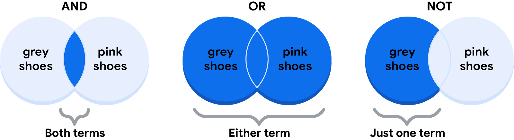

# Understanding Boolean logic

In this reading, you will explore the basics of Boolean logic and learn how to use multiple conditions in a Boolean statement. These conditions are created with Boolean operators, including AND, OR, and NOT. These operators are similar to mathematical operators and can be used to create logical statements that filter your results. Data analysts use Boolean statements to do a wide range of data analysis tasks, such as creating queries for searches and checking for conditions when writing programming code.

## Boolean logic example

- Imagine you are shopping for shoes, and are considering certain preferences:
  - You will buy the shoes only if they are pink and grey
  - You will buy the shoes if they are entirely pink or entirely grey, or if they are pink and grey
  - You will buy the shoes if they are grey, but not if they have any pink

Below are Venn diagrams that illustrate these preferences. AND is the center of the Venn diagram, where two conditions overlap. OR includes either condition. NOT includes only the part of the Venn diagram that doesn't contain the exception.  

### The AND operator

Your condition is “If the color of the shoe has any combination of grey and pink, you will buy them.” The Boolean statement would break down the logic of that statement to filter your results by both colors. It would say “IF (Color=”Grey”) AND (Color=”Pink”) then buy them.” The AND operator lets you stack multiple conditions.

Below is a simple truth table that outlines the Boolean logic at work in this statement. In the **Color is Grey** column, there are two pairs of shoes that meet the color condition. And in the **Color is Pink** column, there are two pairs that meet that condition. But in the **If Grey AND Pink** column, there is only one pair of shoes that meets both conditions. So, according to the Boolean logic of the statement, there is only one pair marked true. In other words, there is one pair of shoes that you can buy.

|Color is Grey|Color is Pink|If Grey AND Pink, then Buy|Boolean Logic|
|-------------|-------------|--------------------------|-------------|
|Grey/True|Pink/True|True/Buy|True AND True = True|
|Grey/True|Black/False|False/Don't buy|True AND False = False|
|Red/False|Pink/True|False/Don't buy|False AND True = False|
|Red/False|Green/False|False/Don't buy|False AND False = False|

### The OR operator

The OR operator lets you move forward if either one of your two conditions is met. Your condition is “If the shoes are grey or pink, you will buy them.” The Boolean statement would be “IF (Color=”Grey”) OR (Color=”Pink”) then buy them.” Notice that any shoe that meets either the Color is Grey or the Color is Pink condition is marked as true by the Boolean logic. According to the truth table below, there are three pairs of shoes that you can buy.
|Color is Grey|Color is Pink|If Grey OR Pink, then Buy|Boolean Logic|
|-------------|-------------|--------------------------|-------------|
|Red/False|Black/False|False/Don't buy|False OR False = False|
|Black/False|Pink/True|True/Buy|False OR True = True|
|Grey/True|Green/False|True/Buy|True OR False = True|
|Grey/True|Pink/True|True/Buy|True OR True = True|

### The NOT operator

Finally, the NOT operator lets you filter by subtracting specific conditions from the results. Your condition is "You will buy any grey shoe except for those with any traces of pink in them." Your Boolean statement would be “IF (Color="Grey") AND (Color=NOT “Pink”) then buy them.” Now, all of the grey shoes that aren't pink are marked true by the Boolean logic for the NOT Pink condition. The pink shoes are marked false by the Boolean logic for the NOT Pink condition. Only one pair of shoes is excluded in the truth table below.
|Color is Grey|Color is Pink|Boolean Logic for NOT Pink|If Grey AND (NOT Pink), then Buy|Boolean Logic|
|-------------|-------------|--------------------------|--------------------------------|-------------|
|Grey/True|Red/False|Not False = True|True/Buy|True AND True = True|
|Grey/True|Black/False|Not False = True|True/Buy|True AND True = True|
|Grey/True|Green/False|Not False = True|True/Buy|True AND True = True|
|Grey/True|Pink/True|Not True = False|False/Don't buy|True AND False = False|

## The power of multiple conditions

For data analysts, the real power of Boolean logic comes from being able to combine multiple conditions in a single statement. For example, if you wanted to filter for shoes that were grey or pink, and waterproof, you could construct a Boolean statement such as: “IF ((Color = “Grey”) OR (Color = “Pink”)) AND (Waterproof=“True”).”  Notice that you can use parentheses to group your conditions together.

Whether you are doing a search for new shoes or applying this logic to your database queries, Boolean logic lets you create multiple conditions to filter your results. And now that you know a little more about how Boolean logic is used, you can start using it!

## Additional Reading/Resources

Learn about who pioneered Boolean logic in this historical article: [Origins of Boolean Algebra in the Logic of Classes](https://www.maa.org/press/periodicals/convergence/origins-of-boolean-algebra-in-the-logic-of-classes-george-boole-john-venn-and-c-s-peirce).

Find more information about using AND, OR, and NOT from these [tips for searching with Boolean operators](https://libguides.mit.edu/c.php?g=175963&p=1158594).
