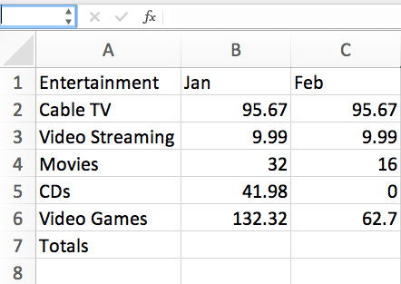
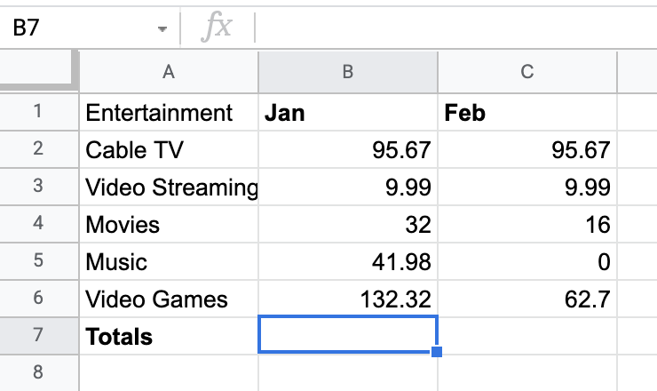
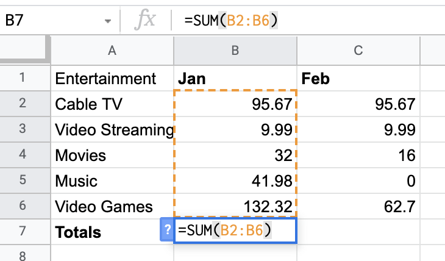
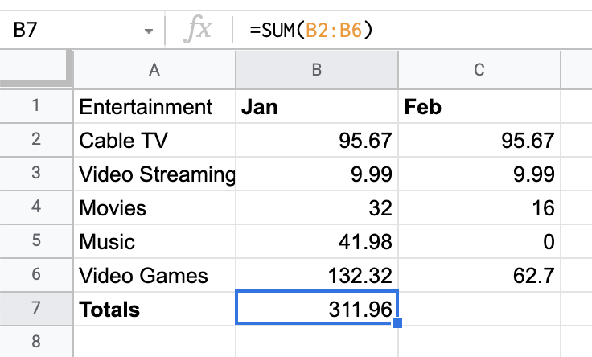
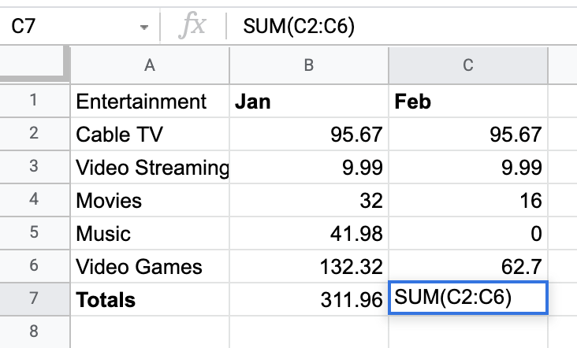
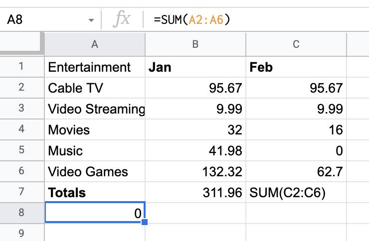

# Hands-On Activity: Applying a function

## Activity overview

In previous lessons, you got familiar with spreadsheets and data structures. In this activity, you will write functions in spreadsheets.

As a reminder, a function is a preset command that automatically performs a specified process or task using the data in a spreadsheet.

By the time you complete this activity, you will be able to apply the SUM function in spreadsheet software such as Google Sheets and Microsoft Excel. This will enable you to create dynamic spreadsheets, which are important for organizing and understanding data in your career as a data analyst.

### What you will need

To get started, first access the example spreadsheet of someone tracking their entertainment expenses.
To use the spreadsheet for this course item, click the link below and select Use Template.
Link to example spreadsheet: [Entertainment Expenses]([./resources/Entertainment-Expenses.xlsx](https://docs.google.com/spreadsheets/d/1IJbiEEA2XIhkPctssmblodZkPWLzUgxzmjh0s1P6pv8/template/preview))
OR If you don’t have a Google account, you can download the spreadsheet directly from the attachment below.
[Entertainment-Expenses.xlsx](./resources/Entertainment-Expenses.xlsx)

## Apply the SUM function

First, open the example spreadsheet. You will find the table below that contains data on the monthly entertainment expenses for January and February:

Now, working in the example spreadsheet, you will write functions in cells to carry out certain tasks.

Your first goal is to fill in the cells B7 and C7. Each of these cells is supposed to be the sum of the numbers in the cells above it. For example, B7 should be the sum total of the numbers in the cells B2 to B6. To achieve this result:

1. Click on cell B7. The cell should have its border highlighted.

2. With that cell selected, type =SUM(B2:B6) like in the figure below.
Notice that this function both shows up in the cell and the field above the table. This field is called the formula bar. Once you’ve clicked on a cell, typing in the formula bar is the same thing as typing directly into the cell.

The argument of the SUM function is the expression B2:B6. This expression represents a range of values starting from the first cell in the range (B2) to the last cell in the range (B6).  The word SUM instructs the spreadsheet to add up the values in that range of cells. This works similarly if you wish to add across the rows instead.
3. Press Enter (Windows) or Return (Mac OS). The result below is what you should get.

You will find that the SUM function in B7 is replaced by the numerical value (311.96) that is the sum of the numbers in cells B2 through B6. If the value in cell B7 is not equal to 311.96, check the function to ensure you have the correct range. The formula bar, however, still contains the SUM function. This is to inform people reading the spreadsheet how the value in cell B7 was determined.

## Find errors in functions

Syntax is very important for making proper functions in spreadsheets. Next, you can explore what happens when you leave out a character or make an error.

1. Click on cell C7. Enter the SUM function SUM(C2:C6) either in the cell itself or the formula bar. Do NOT include the =. Press Enter or Return. It should display the following:

The equal sign in the SUM command is not optional. Without it, the spreadsheet will interpret the input as a string. A string is text data. For the formula to work, it needs numeric data. This is why the command is uncalculated in C7. When the equal sign is included, the spreadsheet knows to carry out the sum calculation and return the result in the cell.
2. Spreadsheets handle string data quite differently than numerical data. Column A of this table is populated entirely by string data—the labels for each row. Try to input the SUM function on this column. In cell A8, type =SUM(A2:A6) and press Enter or Return.

You will find the spreadsheet calculated zero for the sum. This is because the program was asked to sum strings. When a given cell contains a string, the program considers the numerical value of the cell as zero.

That's how the SUM function in Excel works. There are many other functions available to you beyond SUM. If you know them, you can enter them just like how you entered the SUM function. There are many different spreadsheet programs, and they all have functionality similar to, if not exactly, like this.

## Confirmation and reflection

### How would you write a function to calculate February’s entertainment expenses for Cable TV, Video Streaming, and Movies in the example spreadsheet?

- =SUM(B2:C4)
- `=SUM(C2:C4)`
- SUM(C2:C6)
- SUM(B2:C6)

## During this activity, you explored spreadsheet functions and practiced writing them. In the text box below, write a 2-3 sentence (40-60 words) response to each of the following questions

- When you wrote incorrect functions, what did you learn about spreadsheet data?
- How do you think this knowledge of the SUM spreadsheet function will help you write other kinds of functions?

- When we input incorrect functions, we will get the wrong or unexpected result. While writing incorrect functions, I learned that syntax is crucial in spreadsheet functions. Omitting essential elements like the equal sign or including non-numeric data can lead to errors and impact the calculation of results.
- Understanding the SUM function provides a foundation for working with other spreadsheet functions. It helps me grasp the importance of syntax, input format, and how to properly structure functions, which is applicable to various functions beyond SUM in spreadsheet software.