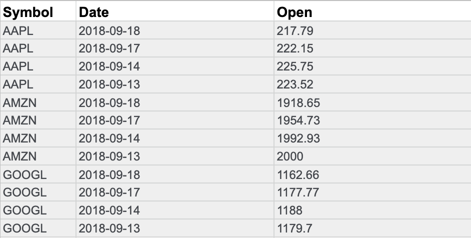
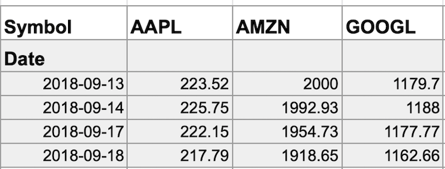

# Transforming data

## What is data transformation?

In this reading, you will explore how data is transformed and the differences between wide and long data. **Data transformation** is the process of changing the data’s format, structure, or values. As a data analyst, there is a good chance you will need to transform data at some point to make it easier for you to analyze it.

- Data transformation usually involves:
  - Adding, copying, or replicating data
  - Deleting fields or records
  - Standardizing the names of variables
  - Renaming, moving, or combining columns in a database
  - Joining one set of data with another
  - Saving a file in a different format. For example, saving a spreadsheet as a comma separated values (CSV) file.

## Why transform data?

- Goals for data transformation might be:
  - Data organization: better organized data is easier to use
  - Data compatibility: different applications or systems can then use the same data
  - Data migration: data with matching formats can be moved from one system to another
  - Data merging: data with the same organization can be merged together
  - Data enhancement: data can be displayed with more detailed fields
  - Data comparison: apples-to-apples comparisons of the data can then be made

## Data transformation example: data merging

Mario is a plumber who owns a plumbing company. After years in the business, he buys another plumbing company. Mario wants to merge the customer information from his newly acquired company with his own, but the other company uses a different database. So, Mario needs to make the data compatible. To do this, he has to transform the format of the acquired company’s data. Then, he must remove duplicate rows for customers they had in common. When the data is compatible and together, Mario’s plumbing company will have a complete and merged customer database.

## Data transformation example: data organization (long to wide)

To make it easier to create charts, you may also need to transform long data to wide data. Consider the following example of transforming stock prices (collected as long data) to wide data.

**Long data** is data where **each row contains a single data point** for a particular item. In the long data example below, individual stock prices (data points) have been collected for Apple (AAPL), Amazon (AMZN), and Google (GOOGL) (particular items) on the given dates.

- **Long data example: Stock prices**

**Wide data** is data where each row contains multiple data points for the particular items identified in the columns.

- **Wide data example: Stock prices**

With data transformed to wide data, you can create a chart comparing how each company's stock changed over the same period of time.  

You might notice that all the data included in the long format is also in the wide format. But wide data is easier to read and understand. That is why data analysts typically transform long data to wide data more often than they transform wide data to long data. The following table summarizes when each format is preferred:
|Wide data is preferred when|Long data is preferred when|
|---------------------------|---------------------------|
|Creating tables and charts with a few variables about each subject|Storing a lot of variables about each subject. For example, 60 years worth of interest rates for each bank|
|Comparing straightforward line graphs|Performing advanced statistical analysis or graphing|
