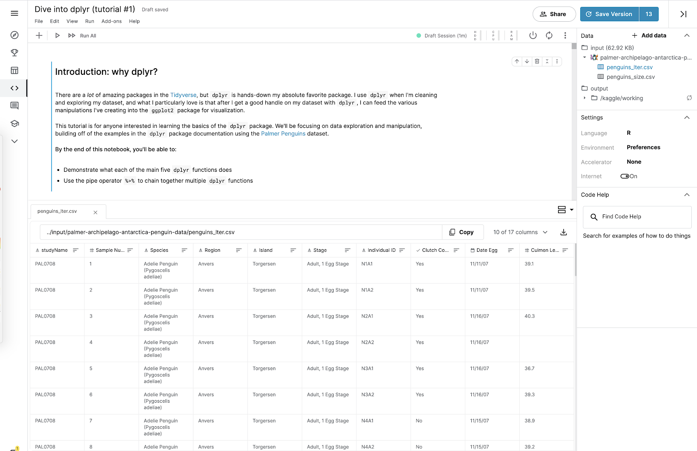

# Hands-on Activity: Introduction to Kaggle

## Activity overview

By now, you’ve learned a lot about different data types and data structures. In this activity, you will work with datasets from Kaggle, an online community of people passionate about data. To start this activity, you’ll create a Kaggle account, set up a profile, and explore Kaggle notebooks.

Every data analyst has a data community that they rely on for help, support, and inspiration. Kaggle can help you build your own data community.

Kaggle has millions of users in all stages of their data career, from beginners to data scientists with decades of experience. The Kaggle community brings people together to develop their data analysis skills, share datasets and interactive notebooks, and collaborate on solving real-life data problems.

Check out this [brief introductory video](https://www.youtube.com/watch?v=TNzDMOg_zsw) to learn more about Kaggle.

By the time you complete this activity, you will be able to use many of Kaggle’s key features. This will enable you to create notebooks and browse data, which is important for completing and sharing data projects in your career as a data analyst.

### Create a Kaggle account

To get started, follow these steps to create a Kaggle account.

> **Note**: Kaggle frequently updates its user interface. The latest changes may not be reflected in the screenshots, but the principles in this activity remain the same. Adapting to changes in software updates is an essential skill for data analysts, and we encourage you to practice troubleshooting. You can also reach out to your community of learners on the discussion forum for help.

1. Go to [kaggle.com](https://www.kaggle.com/)
2. Click on the `Register` button at the top-right of the Kaggle homepage. You can register with your Google credentials or your personal email address.
3. Once you’re registered and logged in to Kaggle, click on the Account icon at the top-right of your screen. In the menu that opens, click the Your Profile button.
4. On your profile page, click on the Edit Profile button. Enter any information you’d like to share with the Kaggle community. Your profile will be public, so only enter the information you’re comfortable sharing.
5. If you want some inspiration, check out the profile of [Kaggle’s Community Advocate, Jesse Mostipak](https://www.kaggle.com/jessemostipak)!

## Explore Kaggle notebooks

Now that you’ve created an account and set up your profile, you can check out some notebooks on Kaggle. Kagglers use notebooks to share datasets and data analyses.

### Step 1: Go to the Code home page

First, go to the **Navigation** bar on the left side of your screen. Then, click on the **Code** icon. This takes you to the Code home page.

### Step 2: Review Kaggler contributions  

On the Code home page, you’ll notice links to notebooks created by other Kagglers.
To begin, feel free to scroll through the list and click on notebooks that interest you. As you explore, you may come across unfamiliar terms and new information: That’s fine! Kagglers come from diverse backgrounds and focus on different areas of data analysis, data science, machine learning, and deep learning. 

### Step 3: Narrow your search

Once you’re familiar with the Code home page, you can narrow your search results by typing a word in the search bar or by using the filter feature. 
For example, type Beginner in the search bar to show notebooks tagged as beginner-friendly. Or, click on the Filter icon, the triangle shape on the right side of the search bar. You can filter results by tags, programming language, output, and other options. Filter to Datasets to show notebooks that use one of the tens of thousands of public datasets available on Kaggle.

### Step 4: Review suggested notebooks

If you’re looking for specific suggestions, check out the following notebooks:

- [gganimate by Meg Risdal](https://www.kaggle.com/mrisdal/gganimate)
- [Getting staRted in R](https://www.kaggle.com/rtatman/getting-started-in-r-first-steps) by Rachael Tatman
- [Writing Hamilton Lyrics with TensorFlow/R](https://www.kaggle.com/anasofiauzsoy/writing-hamilton-lyrics-with-tensorflow-r) by Ana Sofia Uzsoy
- [Dive into dplyr (tutorial #1)](https://www.kaggle.com/jessemostipak/dive-into-dplyr-tutorial-1) by Jesse Mostipak

Spend some time checking out a couple of notebooks to get an idea of the work that Kagglers share online—and that you’ll be able to create by the time you’ve finished this course!

## Edit a notebook

Now, take a look at a specific notebook:[Dive into dplyr (tutorial #1)](https://www.kaggle.com/jessemostipak/dive-into-dplyr-tutorial-1) by Jesse Mostipak Follow these steps to learn how to edit notebooks:

1. Click on the link to open up the notebook. It contains the dataset you’ll work with later on.

2. Click on the Copy and Edit button at the top-right to make a copy of the notebook in your account. Now, the notebook appears in Edit mode. Edit mode lets you make changes to the notebook if you want.
This notebook is private. If you want to share your work, you can choose to make it public. When you copy and edit another Kaggler’s work, always make meaningful changes to the notebook before publishing it. That way, you’re not misrepresenting someone else’s work as your own.

3. Take a moment to explore the Edit mode of the notebook.

Some of this may seem unfamiliar—and that’s just fine. By the end of this course, you’ll know how to create a notebook like this from scratch!

## Working with datasets in notebooks

Now, you can check out the data!

In this notebook, you’ll find the data in a box labeled **Data** at the top-right of your screen. In the box, there’s an input folder with the title: **palmer-archipelago-antarctica-penguin-data**. Follow these instructions to explore the datasets and learn more about the data within them:

1. Click on this title. Two .csv files appear: **penguins_lter.csv** and **penguins_size.csv**. Click on one of them. At the bottom of the notebook, you’ll now find an interactive data table with all the information from the dataset.

2. Click on the other .csv file. This opens a second tab with the second dataset.
3. Take a moment to check out each dataset.
4. Change the range of the quantitative data in the rows by clicking on the horizontal bars to the right of the column name and changing the position of the sliders.
5. Click on the button that says 10 of 17 columns to change the columns that are visible in the table.

In the dropdown menu, there’s a checkmark next to the name of each column that appears in the table. Checking or unchecking one of these boxes will change what data is presented.

Congratulations! You’ve explored several ways to interact with the dataset. This will help you get familiar with the Kaggle interface. You can save the notebook you worked in for future reference. Coming up, you’ll learn more about other ways you can use Kaggle.

## Confirmation and reflection

### Question 1: Which statements are true about the two penguin datasets in the **Dive into dplyr (tutorial #1)** notebook? Select all that apply

- `In penguins_lter.csv, the highest value in the column Sample Number is 152.`
- `penguins_size.csv has 7 columns.`
- In penguins_lter.csv, the column Individual ID cannot be sorted.
- In both datasets, the number of columns is the same.

### Question 2: In this activity, you’ve learned a lot about data types and data structures. Using what you’ve learned so far, consider your experience with datasets and the two penguins datasets. In the text box below, write 2-3 sentences (40-60 words) in response to each of the following questions

- Using all of the information you learned while exploring in Kaggle, how would you thoroughly describe these datasets to someone else?
  - Based on the exploration, we can describe the datasets by specifying their structure, key columns, and noteworthy features. For example, in penguins_lter.csv, the highest Sample Number is 152, and penguins_size.csv has interactive features for data exploration.
- How do you think sharing interactive notebooks online can help you develop your data analysis skills?
  - Sharing interactive notebooks on platforms like Kaggle enhances data analysis skills by allowing collaboration, showcasing techniques, and providing a dynamic environment for learning. It fosters a community where individuals can learn from each other's analyses and approaches.
  - Sharing interactive notebooks online, as demonstrated on Kaggle, allows for a dynamic presentation of data analyses. Others can explore datasets, understand methodologies, and interact with visualizations, fostering collaborative learning. It not only enhances one's ability to communicate findings effectively but also provides a platform for receiving constructive feedback, further refining data analysis skills.