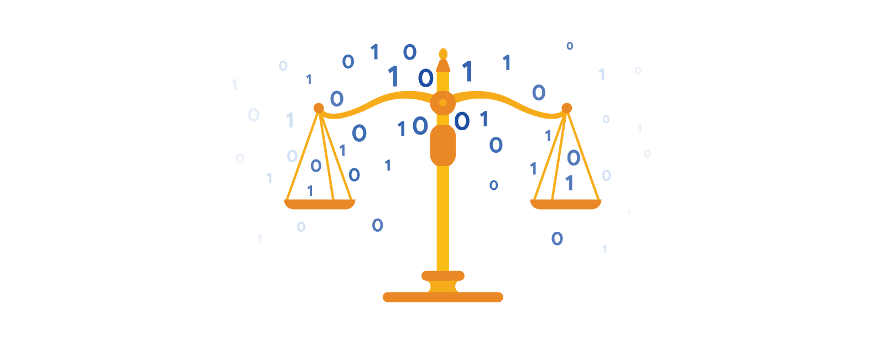

# The open-data debate

Just like data privacy, open data is a widely debated topic in today’s world. Data analysts think a lot about open data, and as a future data analyst, you need to understand the basics to be successful in your new role.

## What is open data?

In data analytics, open data is part of data ethics, which has to do with using data ethically. Openness refers to free access, usage, and sharing of data. But for data to be considered open, it has to:

- Be available and accessible to the public as a complete dataset
- Be provided under terms that allow it to be reused and redistributed
- Allow universal participation so that anyone can use, reuse, and redistribute the data

Data can only be considered open when it meets all three of these standards.

## The open data debate: What data should be publicly available?

One of the biggest benefits of open data is that credible databases can be used more widely. Basically, this means that all of that good data can be leveraged, shared, and combined with other data. This could have a huge impact on scientific collaboration, research advances, analytical capacity, and decision-making. But it is important to think about the individuals being represented by the public, open data, too.

Third-party data is collected by an entity that doesn’t have a direct relationship with the data. You might remember learning about this type of data earlier. For example, third parties might collect information about visitors to a certain website. Doing this lets these third parties create audience profiles, which helps them better understand user behavior and target them with more effective advertising.

Personal identifiable information (PII) is data that is reasonably likely to identify a person and make information known about them. It is important to keep this data safe. PII can include a person’s address, credit card information, social security number, medical records, and more.

Everyone wants to keep personal information about themselves private. Because third-party data is readily available, it is important to balance the openness of data with the privacy of individuals.

## Keypoints

- Open data is part of data ethics and involves free access, usage, and sharing of data.
- For data to be considered open, it must be available as a complete dataset, provided under terms allowing reuse and redistribution, and allow universal participation.
- The open data debate centers on determining what data should be publicly available.
- The benefits of open data include wider usage, leveraging, sharing, and combining with other datasets, impacting scientific collaboration, research, analysis, and decision-making.
- Third-party data is collected by entities without a direct relationship with the data, creating audience profiles for targeted advertising.
- Personally Identifiable Information (PII) includes data likely to identify a person (e.g., address, credit card info, social security number, medical records).
- Balancing openness of data with the privacy of individuals is crucial, especially when dealing with readily available third-party data.
