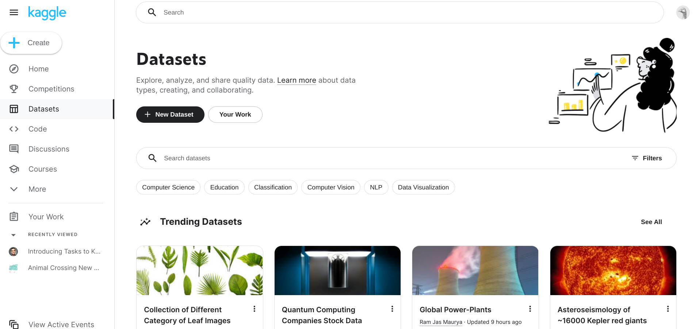
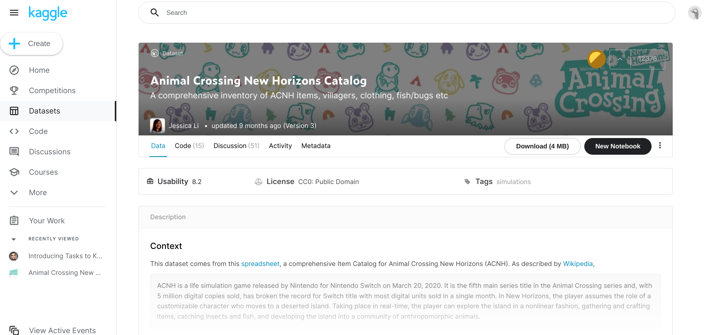
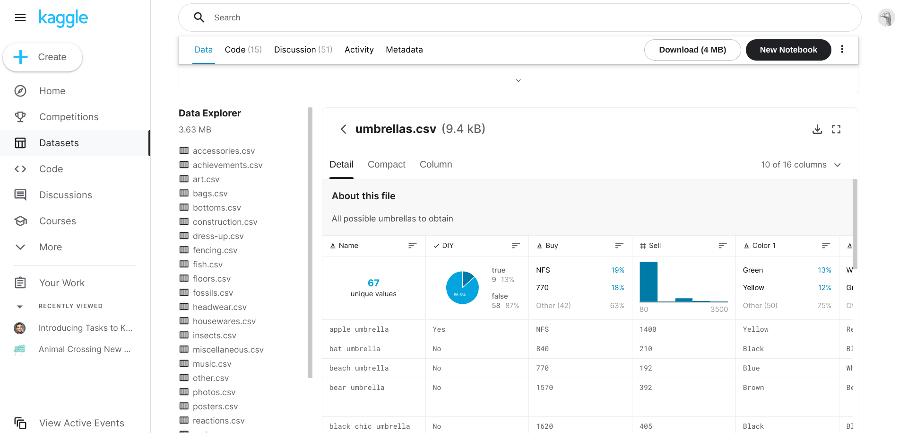

# Practice Quiz: Hands-on Activity: Kaggle datasets

## Activity overview

In the last activity, you got set up on Kaggle and explored the Notebooks feature. In this activity, we will work with a different feature of the Kaggle platform: datasets.

Kaggle has tens of thousands of datasets that are available for public use. Anyone can upload a dataset to Kaggle. If they choose to make it public, other Kagglers can use that dataset to create their own projects.

First, you’ll take a tour of a specific dataset. Then, you’ll have a chance to choose your own datasets to work with. Finally, you’ll use what you’ve learned in this module to determine the kind of data in your datasets, and whether the data is biased or unbiased.

By the time you complete this activity, you will be able to use many of the helpful features Kaggle has to offer. This will enable you to find data for projects and engage with the data community, which is important for developing skills and networking in your career as a data analyst.

## Explore Kaggle datasets

Let’s explore the datasets feature!

### Find a dataset

1. To start, log in to your Kaggle account.

**Note**: Kaggle frequently updates its user interface. The latest changes may not be reflected in the screenshots, but the principles in this activity remain the same. Adapting to changes in software updates is an essential skill for data analysts, and we encourage you to practice troubleshooting. You can also reach out to your community of learners on the discussion forum for help.

2. Then, click on the Datasets icon in the vertical Navigation bar on the left. This takes you to the Datasets home page. From here, you can create a new dataset or search for datasets created by other Kagglers.

3. Now, check out a specific dataset. Type Animal Crossing in the search bar to find datasets related to the Nintendo video game Animal Crossing.

4. There’s more than one option, so click on the Animal Crossing New Horizons Catalog. This takes you to the landing page for this dataset.

### Tour a dataset landing page

- `Header`: The header at the top of the page contains the following information about the dataset:
  - Its title
  - A brief description of its contents
  - The name of its creator
  - When it was last updated
  - Its current version
- `Badge`:  In the top-right corner of the header, you’ll find three more items:
  - A badge in the shape of a circle
  - An icon in the shape of a caret symbol ( ^ )
  - A number

The badge is related to Kaggle’s progression system. If you want, you can read more about it [here](https://www.kaggle.com/progression/).

**Upvotes**: Clicking on the caret lets you “upvote” the dataset. The number shows the number of times this dataset has been upvoted by the Kaggle community.

**Tabs**: Beneath the header is a bar with three tabs: Data Card, Code, and Discussion. Take a moment to click on each of these tabs and explore their contents. Afterwards, navigate back to the Datasets tab!

Now, you can move down the page. You’ll find a box that contains three terms: Usability, License, and Tags.

**Usability** shows how complete the dataset webpage is (and not the dataset itself). Kaggle encourages the community to add information to the dataset webpage to make the dataset itself easier to understand. For example, a brief description or a column header. Hover your cursor over the Usability score to discover what the dataset page contains.

**Licenses** govern how a dataset can be used. Click on the license name to learn more about that specific license.

**Expected update frequency** will report when the data set was updated with new attributes, amendments, or expansions of the data. You may also see when any expected future dates are scheduled for a data set update. In this case, there will never be an update scheduled.

The next box down contains a detailed description of the dataset. Kagglers often include information on where the dataset came from and how the dataset was prepared.

And last—but certainly not least—is the Data Explorer!

## Use the data explorer

The **Data Explorer** menu shows that the Animal Crossing dataset contains 30 .csv files. If you click on a file name, the window to the right will display information from that specific file. Try clicking on **umbrellas.csv** to check it out!

### Tour the dataset explorer

Notice that the Data Explorer has three viewing options: Detail, Compact, and Column. For now, we’ll focus on the Detail tab.

The description at the top of the Detail tab shows that the umbrellas.csv file contains data on all the umbrellas in the video game. Let’s check out the columns. Each column header has three items:

- A small icon on the left that shows the data type
- The name of the column
- An icon with three bars that lets you sort the data if you click on it

Below each column header is a box that contains a summary of the data. This lets you quickly get an idea of what’s in the dataset. For example, the summary for the **Name** column shows there are 67 unique values for the umbrella names. The summary for the **DIY** column shows that 9 of the umbrella recipes are DIY, or “do it yourself.” Take a moment to explore the summaries for the other columns.

And that completes our tour! That’s a lot of information. Feel free to go back and review.

## Access a dataset

After you’ve explored a dataset, you can link it to a Kaggle notebook or download it to access it for your own use. Linking a dataset to a Kaggle notebook means you create a new notebook from the existing dataset so that it is available for you to use.

### Find your own datasets

Now, you’ll get a chance to choose your own datasets to work with! Use the following steps to find datasets that interest you:

1. When you’re ready, click on the **Data** icon on the left to return to the Datasets landing page.

2. Note that datasets can exist in a variety of formats. If you want to make sure your dataset is in a .csv format, click on the **Filter** button on the right side of the Datasets search bar. Then, choose **CSV** from the menu.

3. Find 2-3 datasets that you’re interested in exploring further.

4. Create notebooks from them, download them, or check them out in the Data Explorer. Keep these datasets in mind for your upcoming reflection.

### Link or download a dataset

Here are the options to create a notebook or download the dataset:

- Create a Kaggle notebook: To link a dataset to a Kaggle notebook, you click on the New Notebook button in the dataset header. This will create a notebook in your Kaggle account that links to the dataset.
- Download the dataset: To download a copy of the dataset to your computer, click on the Download button in the dataset header at the top of the page.
- Open the file in Google Sheets: To open a Google Sheets view of the file, click on the download icon at the top-right of the Data Explorer. You can then download the file.

## Confirmation and reflection

### Question:Kaggle's datasets and Data Explorer allow you to do which tasks?

- Search for datasets
- Create visualizations from datasets
- Upload your own datasets
- Access datasets

>Kaggle’s datasets and Data Explorer allow you to search for, access, and upload your own datasets. You can use Kaggle to conduct research, complete data projects, and share your accomplishments with other members of the data science community.

### So far, you’ve learned a lot about how to use Kaggle to explore datasets. During this activity, you used this knowledge to find datasets you’re interested in. Keep those datasets in mind and in the text box below, write 2-3 sentences (40-60 words) in response to each of the following questions

- What type(s) of data are in this dataset? Is this dataset biased or unbiased? How do you know?
  - The data type of this dataset is .csv
  - I believe the dataset is unbiased since it covers a specific size of sample data, consisting of a large number of files containing codes from various programming languages such as Java, C#, Markdown, etc.
- Based on what you’ve explored so far, how might you use Kaggle’s Datasets feature to help develop your data analysis skills?
  - I'm very interested in this new finding, Kaggle has a lot of dataset that including many free information for us to explore. Base on that, we can research, practice
  - I'm intrigued by the diverse datasets available on Kaggle, including valuable free information for exploration. This resource provides an excellent opportunity to conduct research, practice data analysis techniques, and enhance my skills in working with real-world datasets.
