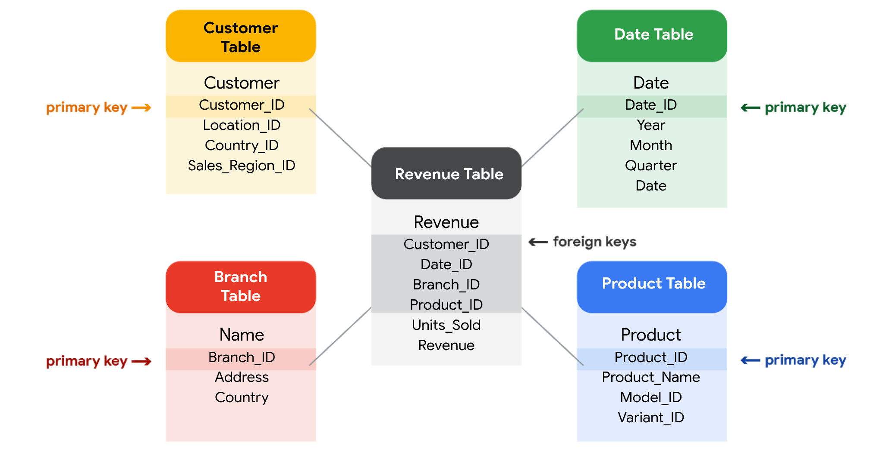

# Databases in data analytics

Databases enable analysts to manipulate, store, and process data. This helps them search through data a lot more efficiently to get the best insights.

## Relational databases

A **relational database** is a database that contains a series of tables that can be connected to show relationships. Basically, they allow data analysts to organize and link data based on what the data has in common.  

In a non-relational table, you will find all of the possible variables you might be interested in analyzing all grouped together. This can make it really hard to sort through. This is one reason why relational databases are so common in data analysis: they simplify a lot of analysis processes and make data easier to find and use across an entire database.

### Database Normalization

Normalization is a process of organizing data in a relational database. For example, creating tables and establishing relationships between those tables. It is applied to eliminate data redundancy, increase data integrity, and reduce complexity in a database.

### The key to relational databases

Tables in a relational database are connected by the fields they have in common. You might remember learning about primary and foreign keys before. As a quick refresher, a **primary key** is an identifier that references a column in which each value is unique. In other words, it's a column of a table that is used to uniquely identify each record within that table. The value assigned to the primary key in a particular row must be unique within the entire table. For example, if customer_id is the primary key for the customer table, no two customers will ever have the same customer_id.

By contrast, a **foreign key** is a field within a table that is a primary key in another table. A table can have only one primary key, but it can have multiple foreign keys. These keys are what create the relationships between tables in a relational database, which helps organize and connect data across multiple tables in the database.

Some tables don't require a primary key. For example, a revenue table can have multiple foreign keys and not have a primary key. A primary key may also be constructed using multiple columns of a table. This type of primary key is called a **composite key**. For example, if customer_id and location_id are two columns of a composite key for a customer table, the values assigned to those fields in any given row must be unique within the entire table.

## SQL? You’re speaking my language

Databases use a special language to communicate called a query language. Structured Query Language (SQL) is a type of query language that lets data analysts communicate with a database. So, a data analyst will use SQL to create a query to view the specific data that they want from within the larger set. In a relational database, data analysts can write queries to get data from the related tables. SQL is a powerful tool for working with databases — which is why you are going to learn more about it coming up! 
