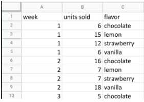
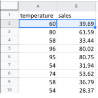
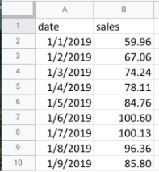

# Inspecting a dataset: A guided, hands-on tour

As a data analyst, you'll use data to answer questions and solve problems. When you analyze data and draw conclusions, you are generating insights that can influence business decisions, drive positive change, and help your stakeholders meet their goals.

Before you begin an analysis, it’s important to inspect your data to determine if it contains the specific information you need to answer your stakeholders’ questions. In any given dataset, it may be the case that:

- The data is not there (you have sandwich data, but you need pizza data)
- The data is insufficient (you have pizza data for June 1-7, but you need data for the entire month of June)
- The data is incorrect (your pizza data lists the cost of a slice as $250, which makes you question the validity of the dataset)

Inspecting your dataset will help you pinpoint what questions are answerable and what data is still missing. You may be able to recover this data from an external source or at least recommend to your stakeholders that another data source be used.

In this reading, imagine you’re a data analyst inspecting spreadsheet data to determine if it’s possible to answer your stakeholders’ questions.

## The scenario

You are a data analyst working for an ice cream company. Management is interested in improving the company's ice cream sales.

The company has been collecting data about its sales—but not a lot. The available data is from an internal data source and is based on sales for 2019. You’ve been asked to review the data and provide some insight into the company’s ice cream sales. Ideally, management would like answers to the following questions:

- What is the most popular flavor of ice cream?
- How does temperature affect sales?
- How do weekends and holidays affect sales?
- How does profitability differ for new versus returning customers?

## Download the data

You can download the data to follow along with this reading. To use the template for the sales data, click the link below and select “Use Template.” Link to template: [Ice Cream Sales](https://docs.google.com/spreadsheets/d/1NgiKb8wCnJbUTuUkDUiNRpx9NhwncEmoKuPvgfYfOIY/template/preview?resourcekey=0-X3e7NzehG2Y74MIBhOaqeQ#gid=653912415)

- [SalesByDay.xlsx](./resources/SalesByDay.xlsx)
- [SalesByFlavor.xlsx](./resources/SalesByFlavor.xlsx)
- [SalesByTemp.xlsx](./resources/SalesByTemp.xlsx)

## Inspect the data

### Question 1: What is the most popular flavor of ice cream?

To discover the most popular flavor, you first need to define what is meant by "popular." Is the most popular flavor the one that generated the most revenue in 2019? Or is it the flavor that had the largest number of units sold in 2019? Sometimes your measurement choices are limited by what data you have—you can review your spreadsheet to find out if either of these definitions of “popular” make sense based on the available data.  

Click the flavors tab on your spreadsheet to view the relevant data. The flavors sheet has three columns and 209 rows of data. The column headers are week, units sold, and flavor. This dataset did not come with a data description, so you have to figure out the significance of the columns on your own. Based on the data, you deduce that these columns provide information about the number of units sold for each ice cream flavor, by week, in 2019

In this case, you can discover what the most popular flavor is by using units sold as your measure. In particular, you can use the units sold column to calculate the total number of units sold during the year for each flavor. Unfortunately, the dataset does not provide the annual sales amount by flavor. In this case, your next step would be to ask your stakeholders if the annual sales per flavor data is available from another source. If not, you can add a statement about the current data’s limitations to your analysis.

### Question 2: How does temperature affect sales?

To explore your second question, you click the temperatures tab and check out the data. The temperatures sheet has two columns and 366 rows of data. The column headers are temperature and sales. The data may show total 2019 sales per temperature (for instance, the first entry might sum up $39.69 in sales for three separate days that each had a high of 60 degrees). Or, the data may show  a snapshot of sales and temperature for each day in 2019 (for instance, the first entry might refer to a single day with a high of 60 degrees and $39.69 in sales).

So, which is it? It’s probably a daily snapshot because there are 365 entries for temperature, and multiple rows with the same temperature and different sales values. This implies that each entry is for a single day and not a summary of multiple days. However, without more information, you can’t be certain. Plus, you don’t know if the current data is listed in consecutive order by date or in a different order. Your next step would be to contact the owner of the dataset for clarification.

If it turns out that temperature does affect sales, you’ll be able to offer your stakeholders an insight such as the following: “When daily highs are above X degrees, average ice cream sales increase by Y amount. So the business should plan on increasing inventory during these times to maximize sales.”

### Question 3: How do weekends and holidays affect sales?

Next, you click on the sales tab to view the data about dates of sale. The sales sheet has two columns and 366 rows of data. The column headers are date and sales. This data is most likely total daily sales in 2019, as sales are recorded for each date in 2019.

You can use this data to determine whether a specific date falls on a weekend or holiday and add a column to your sheet that reflects this information. Then, you can find out whether sales on the weekends and holidays are greater than sales on other days. This will be useful to know for inventory planning and marketing purposes.

### Question 4: How does profitability differ for new customers versus returning customers?

Your dataset does not contain sales data related to new customers. Without this data, you won’t be able to answer your final question. However, it may be the case that the company collects customer data and stores it in a different data table.

If so, your next step would be to find out how to access the company’s customer data. You can then join the revenue sales data to the customer data table to categorize each sale as from a new or returning customer and analyze the difference in profitability between the two sets of customers. This information will help your stakeholders develop marketing campaigns for specific types of customers to increase brand loyalty and overall profitability.

## Conclusion

When working on analytics projects, you won’t always have all the necessary or relevant data at your disposal.  In many of these cases, you can turn to other data sources to fill in the gaps.

Despite the limitations of your dataset, it’s still possible to offer your stakeholders some valuable insights. For next steps, your best plan of action will be to take the initiative to ask questions, identify other relevant datasets, or do some research on your own.  No matter what data you’re working with, carefully inspecting your data makes a big impact on the overall quality of your analysis.
