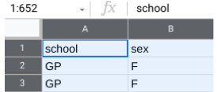
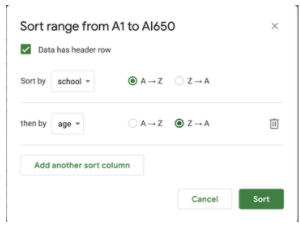
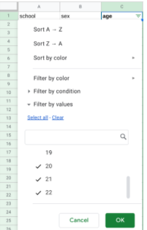
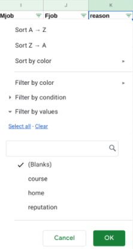
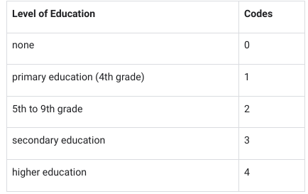
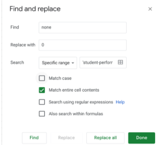

# Hands-On Activity: Clean data in spreadsheets with sorting and filtering

## Activity overview

By now, you have been introduced to cleaning data in spreadsheets, as well as core spreadsheet skills such as sorting and filtering. In this activity, you will use sorting and filtering to clean up a dirty dataset.
Data cleaning corrects or removes incorrect, missing, and faulty data. Cleaning data is of critical importance because an analysis based on dirty data can lead to wrong conclusions and bad decisions. The cleaner your data, the better your results.
For this activity, imagine you are a data analyst working for the superintendent of a large public school district in Portugal. The superintendent wants to know what factors affect student grades in core subjects and what changes can be made to improve student performance. Your team is going to analyze performance data on high school student achievement in two Portuguese public schools, Gabriel Pereira (GP) and Mouzinho da Silveira (MS). The data was collected by the school district by means of academic reports and student surveys. The data includes information such as:

- Student grades
- Student background information
- Student study time
- Student participation in extracurricular activities

However, before analyzing the data, it’s important to make sure the data is clean. Analyzing bad or dirty data could cause the school district to reach the wrong conclusions and implement ineffective changes. Your assignment is to help clean the data.
By the time you complete this activity, you will be able to sort data in different ways, apply filters to remove incorrect data and fill in missing data, and convert text data to number format. Cleaning data is a critical phase of the data analysis process. Sorting and filtering are useful techniques for data cleaning, and are also key skills that you will draw on throughout your career as a data analyst.

### What you will need

To get started, access the spreadsheet that contains the data. Click the link and make a copy of the [spreadsheet](https://docs.google.com/spreadsheets/d/1lekmvxJDglmqUKxSxSk7TiA8Sfurqc9pTyKXIgUvNm4/template/preview?resourcekey=0-O8LBUyc6VTc9sYPH6hdsmw#gid=1019073941).
Or, if you don’t have a Google account, you may download the dataset directly from the attachment [Student-performance-data](./resources/Student-performance-data.csv)

## Clean your data

It’s important to make sure your data is clean so that your eventual analysis will be correct. The first thing to do is check the values in the columns most relevant to your analysis and find out if there is anything for you to clean. In this example, the superintendent’s main objective is to determine what factors drive student performance. To begin answering this question, the columns you want to focus on first are school, age, reason, Medu, Fedu. You can use sorting and filtering to clean the data in each of these columns.

### Sorting data

Because you have data from two schools, Gabriel Pereira (GP) and Mouzinho da Silveira (MS), you can start by sorting the data by school. Then, you can also sort by age to discover the age ranges of the students for each school. Sorting involves arranging data into a meaningful order to make it easier to understand, analyze, and visualize.

1. To start, rename your spreadsheet. In the upper left corner, click Untitled Spreadsheet and enter a new name. You can use the name student_performance_data or a similar name that describes the data your spreadsheet contains.
2. Now, sort by school. Because you want to sort on multiple columns, you need to select all the data in your spreadsheet. Click the blank rectangle above row 1 and to the left of column A. This lets you select all the data on your sheet.

3. Next, from the menu bar, select Data, then Sort range. (Note: For some versions of Google Sheets, the selection Advanced range sorting options may appear on the Data drop-down menu instead of Sort range).
4. In the pop-up window, select Data has header row. Now you can choose specific column headers to sort by.
5. In the Sort by dropdown, choose the header school. Then, click A → Z to sort in ascending order.
6. You also want to sort for age. Before you can sort by age, you need to click Add another sort column to choose a second column header.im
7. In the Sort by dropdown, choose the header age. This time, click Z → A to sort in descending order. This way, the oldest students will be listed first.
Your popup window should appear like this:

8. Once both selections have been made, click **Sort**.

Now, If you scroll through the data, you’ll notice that the age range of the students at Gabriel Pereira (GP) is 15-22 years, and the age range of the students at Mouzinho da Silveira (MS) is 15-20 years. It appears that both schools have similar age ranges, but the GP school has students that are a little older.
By sorting the data, you’ve discovered a potential problem with the data. Because this dataset represents high school student achievement, any age older than 18 may indicate that a mistake was made when entering that student's age. You now know what age data may need to be researched and corrected. Your next step is to ask the superintendent about the legitimate age range for students in public high school. Then, you’ll know what age data is incorrect and should be removed.

### Removing incorrect data

The superintendent tells you that the maximum age limit for which public education is provided is 19 years old and that the age range should be 15-19 for both schools. Any student outside this age range should be deleted from the dataset.
To clean your data, you need to remove the ages 20, 21, and 22 from your dataset. You can start by applying a filter to the age column. Filtering is the process of showing only the data that meets a specified criteria while hiding the rest. Filtering makes it easier to find data that you need.

1. First, apply a filter to the age column. Select the age column by clicking the letter at the top of the column (C).
2. Then, from the menu bar, select Data, then Create a filter.
3. You can now inspect the values in the age column by going to the top of the column and clicking the Filter icon ().
4. In Google Sheets, there are nine possible values for the field (15, 16, 17, 18, 19, 20, 21, and 22). You may notice that all the values have check marks. Filter this column for the values you want to select by unchecking all the other values (15, 16, 17, 18, and 19).

5. Then, click OK. This will single out the rows that contain the ages 20, 21, and 22. After you apply the filter, there should be nine such rows (seven for the GP school and two for the MS school).

6. To delete the nine rows, first select them by clicking their row numbers.
7. Then, from the menu bar, select Edit and Delete selected rows.
8. Click the Filter icon at the top of the age column to inspect the values once again. Now that you’ve removed the three incorrect ages (20, 21, and 22), there are five ages remaining (15, 16, 17, 18, and 19). The remaining ages are legitimate and can be used for analysis.
9. Finally, turn off the filter. From the menu bar, select Data and Turn off filter.

## Filling in missing data

Filling in missing data is an important part of data cleaning. It’s your job to fill in these blank spaces in your data with accurate values.

The superintendent wants to know what factors influence student performance, and a student’s reason for choosing a specific school will be important to know for analysis. The reason column shows the main reason a student chose to enroll in a specific school, according to their survey response: for example, because of the school’s reputation, or because it offers certain courses,  etc. So, you need to make sure the reason column is complete and without blanks.

1. Start by applying a filter across the entire spreadsheet. Click on any cell in the sheet. Then, from the menu bar, select Data and Create a filter.
2. All the cells are now highlighted, and there are filters at the top of every column containing data. Click the Filter icon on the reason column (K).
3. You may notice that the data values in the reason column include blanks. Filter this column for blanks by unchecking all the other values (course, home, reputation).
A screenshot of a spreadsheet for student performance data that shows the pop-up menu to filter the reason column for Blanks
4. Then, click OK. Now, your sheet shows all the blank rows in the reason column.

5. To clean your data, you need to find a good way to fill in these missing values. In this case, you cannot know what each missing value should be (that is, without a new survey, you can’t discover each student’s reason for choosing a specific school). So, you can replace the missing values with the value `none_given`. To do this while the column is still filtered for blanks, type none_given in the first empty cell (K38). Then, press Enter.
6. Select cell K38 again. A small blue square, known as the fill handle, appears in the bottom-right corner of the cell. Double click the fill handle to fill all the other blank cells with the value none_given.
7. Finally, turn off the filter. From the menu bar, select Data and Turn off filter. If you scroll down the reason column, you should find that the value none_given has replaced all the blanks in the reason column.

### Converting data

During the data analysis process, it's sometimes necessary to change text data (words) to numeric data (numbers). For example, some statistical packages like those used to perform machine learning will only accept numeric data values as input.
In this case, the superintendent wants to know if a parent’s education level is a significant factor in student performance. The relevant data is in the Medu and Fedu columns--which, respectively, refer to the level of education of a student’s mother and father. Currently, the data is in text format. For the purposes of analysis, it will be useful to know the average education level of each student’s parents. To make this calculation, you first need to convert the data in the Medu and Fedu columns to number format.

To do this, you can match specific number values to the text data in each column. Start with the Medu column. If you click on the Filter icon at the top of the Medu column (G), you’ll notice the column contains the text data shown in the table below. You can use the following numeric codes for each piece of text data:

1. To start, remove the filter from the **Medu** column.
2. Next, select the unfiltered **Medu** column data by clicking its column letter (G).
3. Then, from the menu bar, select **Edit**, then **Find and replace**.
4. Fill in the popup window for the none value. Next to Find, type none. Next to Replace with, type 0. Check the box next to Match entire cell contents.

5. Then, click **Replace all**.
6. While still in the popup window, repeat this process (steps 4-5) for the other four educational levels: **primary education (4th grade)**, **5th to 9th grade**, **secondary education**, and **higher education**.
7. After replacing all five educational levels with numeric values, click Done to close the pop-up window.
8. Check out your spreadsheet. All the cells in the Medu column now display numeric values.
9. Change the text data in the **Fedu** column (H) in the same way.

## Confirmation and reflection

### Question 1: What is the process of showing only the data that meets a specified criteria while hiding the rest?

- `Filtering`
- Inspecting
- Sorting
- Converting

### Question 2: In the text box below, write 2-3 sentences (40-60 words) in response to each of the following questions

- Why is cleaning data such an important part of the data analysis process?
  - The analysis based on dirty data can lead to wrong conclusions and bad decisions. Cleaning data include actions that corrects or removes incorrect, missing, and faulty data, after that analysis with good input data can produce the good result.
- How can sorting and filtering help you clean data more effectively?
  - We use filtering to correct, remove incorrect, missing, faulty data
  - Sorting make see everythings in alphabetical or numerical order that can help us to understand, analyze
  - Filtering shows only the data that meets specific criteria, hiding the rest.
  - Filters simplify a spreadsheet by displaying only the necessary information.
  - Filtering allows for isolating specific pieces of information based on set conditions.

- Importance of Data Cleaning:
  - Data cleaning is vital to prevent incorrect conclusions and decisions.
  - Accurate analysis requires a clean dataset.
- Role of Sorting and Filtering:
  - Sorting organizes data for better understanding, analysis, and visualization.
  - Filtering helps in showing only data that meets specific criteria, making it easier to find necessary information.
