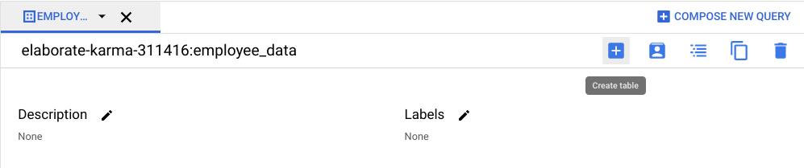

# How to use BigQuery

[VIDEO](./resources/3_VIDEO_How-to-use-BigQuery.mp4) and [transcript](./resources/3_VIDEO_How-to-use-BigQuery.txt)

- Hey there.
- In this video, we're going to learn about each part of the BigQuery SQL workspace so you can use it during this course and throughout your career as a data analyst.
- It's an extremely valuable and widely popular tool, so understanding how it works is super helpful.
- Feel free to follow along on your screen as we explore BigQuery.
- You may notice that my screen appears a little different than yours, since BigQuery is constantly updating its interface.
- Don't worry if this happens as minor differences won't stop you from understanding the basics.
- To begin, go to the BigQuery landing page, then login to the account you created earlier.
- To navigate to the SQL workspace, select the menu on the left side of the screen and scroll down to the Big Data header.
- Then hover over the BigQuery label and click ''SQL workspace'' from the drop-down.
- Now that we're in the SQL workspace, we're going to search for public datasets, select a dataset through the Data Explorer, run a query, and upload our own data for querying.
- First, we'll search for a public dataset to use.
- To select a public dataset, navigate to the Explorer menu on the left side of the screen.
- Click the "Add Data" button in the upper right of the menu.
- Then in the drop-down menu, select "Explore public datasets." This will open the marketplace and show you available public datasets.
- Let's go to the search marketplace bar and search for noaa_lightning, a dataset we'll use in an upcoming activity.
- Click on the ''Cloud-to-Ground Lightning Strikes'' dataset.
- This will give us a description and preview of the dataset which captures observations about lightning activity and weather patterns in the United States.
- Click "View dataset." This will bring you back to the SQL workspace and create a tab for the dataset.
- We can then move back to the Editor tab we have opened, or click "Compose new query" to begin writing with SQL.
- On the left, notice that the BigQuery public data drop-down list is in the Explorer menu.
- We can click the arrow to expand the BigQuery data list and pick out a new dataset.
- Let's select the first dataset in the drop-down list, austin_311.
- When we do, it expands to show the table within the dataset.
- We can open the dataset for a preview.
- The Schema tab contains the names of each column in the dataset.
- The Details tab contains additional metadata, such as the creation date of the dataset.
- The Preview tab contains the first rows from the dataset.
- On this page, we can click "Query" to automatically create a new editor window with the template for a query already populated.
- From here, put an asterisk after Select, where our cursor pops up, then run the query.
- Congratulations, you ran a SQL query in BigQuery.
- The query you ran returned rows from the dataset which populate in a window beneath the editor interface.
- Results from any query you run will also display here.
- Now let's say you have the results of a survey that you want to upload to BigQuery and analyze using SQL.
- To add your own data to BigQuery, choose the ID of the project you want to add to.
- Select the three vertical dots icon to open options for the project then choose "Create dataset." Name the dataset something that will help you identify it later, such as upload_test_dataset.
- Then click "Create dataset." Next, go to the Explorer menu and choose the three vertical dots next to the dataset under the Projects drop down.
- Now we'll select the icon for create table, which opens a pop-up window.
- Under Source and create table from, select "Upload" or whichever method you prefer to upload your data.
- Here, we can upload any data file, such as a CSV file.
- Let's give our table a helpful name such as test_table.
- Make sure that the schema is set to auto detect and select "Create table." There's more to come with BigQuery.
- Feel free to re-watch this video anytime and keep practicing.
- See you soon.
​

## Question

Follow these steps to find and pin the bigquery-public-data.

1. Navigate to the Explorer menu in BigQuery.
2. Type the word public in the search box and enter.
3  Click "Broaden search to all projects"
4. Find the bigquery-public-data and pin it.

- The NOAA Lighting Strike dataset is no longer available to all users. You will not need this specific dataset for future activities or quizzes. However, the same process for finding and using a public dataset still applies.

- BigQuery has updated its interface. Instead of clicking the three-dot menu, open the dataset and select the Create Table icon.

