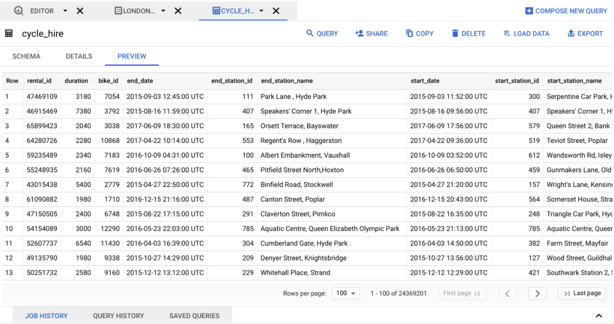

# Hands-On Activity: Introduction to BigQuery

## Activity overview

By now, you have been introduced to BigQuery, a data warehouse on Google Cloud that data analysts can use to query, filter large datasets, aggregate results, and perform complex operations. In this activity, you will explore the BigQuery interface; upload public data to your console; and write some simple SQL queries using SELECT, FROM, and WHERE.

By the time you complete this activity, you will be more familiar with writing queries in the BigQuery interface. This will enable you to practice SQL, which is important for working with databases in your career as a data analyst.

## Explore BigQuery

For this activity, you will need a BigQuery account. If you haven’t made one already, you can follow the instructions from the [Using BigQuery reading](https://www.coursera.org/learn/data-preparation/supplement/DYOQK/using-bigquery). Once you have your account, you can start exploring!

### Open your console

1. Log in to [BigQuery](https://cloud.google.com/bigquery).
2. Then, click the **Go to console** button on the BigQuery homepage. This will open a new tab with your console.
3. Take a moment to explore your console. On the left side, you will find the **Explorer** menu; this includes a search bar you can use to find resources, pinned projects, and the **+ ADD** button. On the right side, you will find the **Query Editor**. This is where you will input queries and view datasets. You can also find your Job History, Query History, and Saved Queries here.


### Access public data in BigQuery

In order to actually start writing queries, you will need some data to work with. Once you’re familiar with the BigQuery interface, you can access a public dataset directly from your console.

1. In the upper left corner of the screen locate the Explorer tab.


2. Click on the **+ ADD** button in the **Explorer menu** and navigate down the list in the Add window and select **Public Datasets**.
This will open a new menu where you can search public datasets that are already available through Google Cloud.


3. In the Marketplace menu you just opened, type **london bicycle** in the search box at the top; this will return the London Bicycle Hires dataset from the Greater London Authority. **Click the dataset** for more details.


From the dataset information page, click the blue **VIEW DATASET** button. This will open your console in a new tab with this dataset loaded.

You'll notice that **bigquery-public-data** is now starred in your Explorer menu. You can now explore and query these public datasets.
Follow these steps to find and star the bigquery-public-data if you do not have it starred.

   1. Navigate to the **Explorer** menu in BigQuery.
   2. Type the word **public** in the search box and enter.
   3. Click "Broaden search to all projects".
   4. Find the **bigquery-public-data** and click on the star to pin it.
4. Click on the **drop-down arrow** to the left of **bigquery-public-data** and scroll down the list of public datasets until you find the **london_bicycles** data (You may also type **london_bicycles** in the Explorer search bar to quickly locate the dataset). Once located, click on the **drop-down arrow** next to the dataset, it will list two tables. Click on **cycle_hire**.
This will pull up a new tab in your Query Editor with information about the table schema.
5. After checking out the table schema, you can take a peek into what data the cycle_hire table contains by clicking on the Preview tab. This will give you a better idea of what kind of data you’ll be working with.



Once you have finished previewing the data, you can write a query!

## Query your data

So far, you’ve learned three basic parts of a query: SELECT, FROM, and WHERE. As a refresher, here are what those basic parts represent in the query:

- SELECT is the section of a query that indicates what data you want SQL to return to you
- FROM is the section of a query that indicates which table the desired data comes from.
- WHERE is the section of a query that indicates any filters you’d like to apply to your dataset

### Write a basic query

Now, construct a simple command using the basic parts of a query you have already learned! For example, you can select a specific column from the cycle_hire table, such as the end_station_name column.  

1. Click the Blue + button or QUERY - In new tab to start a new query.

2. Start your query with a SELECT clause and indicate which column you want to select from the table; in this case, you’ll input end_station_name. 

3. After you have indicated which column you are selecting, write your FROM clause. You will need to specify the table you are querying from by inputting the following location: `bigquery-public-data.london_bicycles.cycle_hire`;

The completed query should appear like this:

```sql
SELECT 
   end_station_name 
FROM 
   `bigquery-public-data.london_bicycles.cycle_hire`;
```

Run your completed query by clicking on the blue **RUN** button.

This query may take a few seconds to execute. Once it has finished, you will find the list of station names you requested under the Query Results console pane.

### Write a query to answer a question

After running the first basic query, try answering a specific question about the data. For example, how many bike trips lasted for 20 minutes or longer?

1. Click the **Blue** + button or **QUERY - In new tab** to start a new query. Start with your **SELECT** statement again. This time, you will want to include all of the columns in the table for this query. You can use an asterisk to indicate that you are selecting all of the data like this: SELECT COUNT(*) AS num_of_trips

2. Then you will add your **FROM** statement. You will be using the same dataset as the previous query: FROM `bigquery-public-data.london_bicycles.cycle_hire`.

3. Finally, you’ll add a **WHERE** statement to specify that you want to filter for only bike rides 20 minutes or longer. If you check the preview of this data, you might notice that the duration is recorded in seconds, so you’ll specify 1200 seconds in your query.  You can write that as WHERE duration>=1200;
4. Run your completed query by clicking on the blue RUN button.

This query may take a few seconds to execute. Once it has finished, you will find a list of rides from this table that fit your criteria. There are more than 7 million rows with bike trips that are 20 minutes or longer!

### Up for a challenge?

If you’re comfortable using queries to answer questions, try creating and running queries to answer any of the questions below: 

What are the names of the stations that bike_id 1710 started from?
How many bike_ids have ended at "Moor Street, Soho"?
What is the station_id for "Canton Street, Poplar"?
What is the name of the station whose ID is 111?
How many distinct bike_ids had trip durations greater than 2400 seconds (or 40 minutes)?
You can use the solutions doc to check your work:  
Intro to [BigQuery Solutions](https://docs.google.com/document/d/1Rw8gXT0E4Smo4huoOcahX5ZQqV_pV8zgES8Oltatr-Y/template/preview)
Or download the file directly [here](./resources/Intro-to-BigQuery-solutions.docx):

## Confirmation and reflection

Run another query on your table:

```sql
SELECT
     end_station_name
FROM
    `bigquery-public-data.london_bicycles.cycle_hire` 
WHERE
     rental_id = 57635395;
```

1. At what station did the bike trip with rental_id 57635395 end?
   - `East Village, Queen Elizabeth Olympic Park`
   - Southwark Street, Bankside
   - Notting Hill Gate Station, Notting Hill
   - Tower Gardens, Tower
2. In this activity, you had an opportunity to get more familiar with BigQuery and writing SQL queries. In the text box below, write 2-3 sentences (40-60 words) in response to each of the following questions:

- How do you think you can use public datasets on BigQuery to help develop your data analysis skills?
  - We can explore the public datasets on BigQuery to practice SQL writing skills that can help us find insight from the data to answer the questions of business
- How do you think understanding basic query syntax will help you write more complicated queries in the future?
  - Having a fundamental knowledge of anything along with practice can help us develop skills from basic to advanced.
