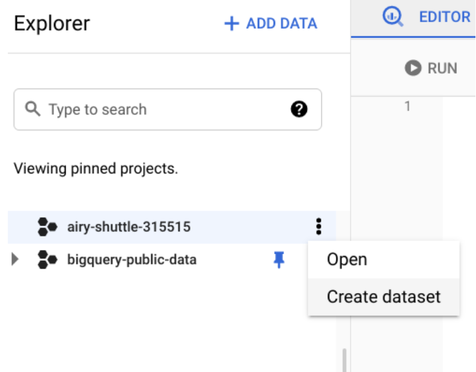
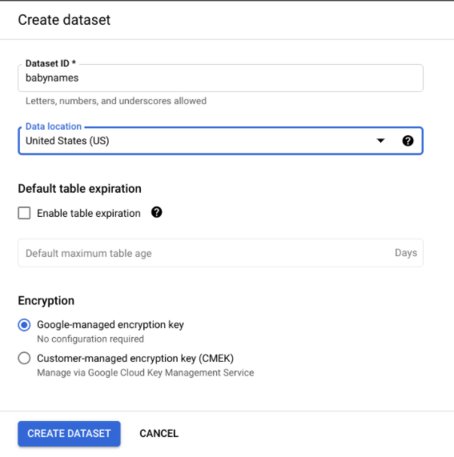
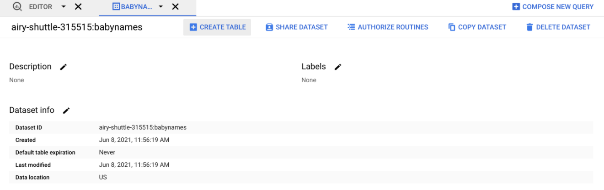
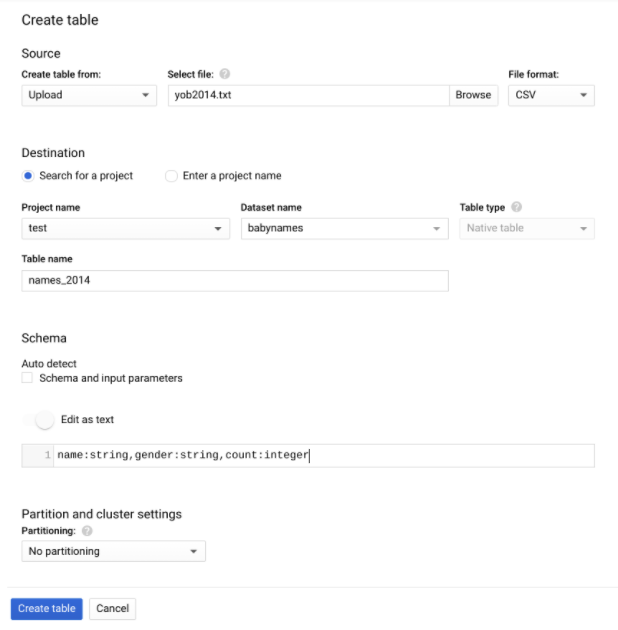
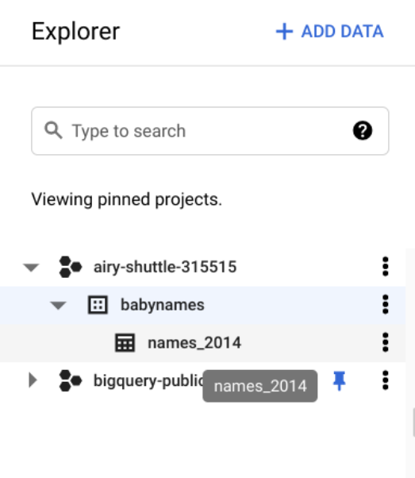
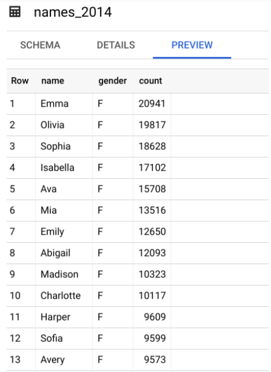

# Hands-On Activity: Create a custom table in BigQuery

## Activity overview

Recently, you’ve been thinking about identifying good data sources that would be useful for analysis. You also spent some time in a previous activity exploring a public dataset in BigQuery and writing some basic SQL queries. In addition to using public data on BigQuery, you will need to be able to import data from other sources. In this activity, you will create a custom table and dataset, which you’ll load into a new table and query.

By the time you complete this activity, you will be able to load your own data into BigQuery for analysis. This will enable you to import your own data sources into BigQuery, which is a skill you will need in order to analyze data from different sources.

What you will need

To get started, download the baby names data zip file. This file contains about 7 MB of data about popular baby names from the US Social Security Administration website.

Click the link to the baby names data zip file to download it.

Link to baby names data: [names.zip](./resources/names.zip)

## Create a custom table

Once you have the zip file downloaded, you can import it into BigQuery to query and analyze. In order to do that, you will need to create a new dataset and a custom table.

**Step 1: Unzip the file**
You will need to **unzip the file you downloaded** onto your computer in order to access it on BigQuery. Once you have unzipped the file, you will find a .pdf file titled NationalReadMe that contains more information about the dataset. This dataset tracks the popularity of baby names for each year; you can find text files labelled by the year they contain. Open **yob2014.txt** to preview the data. You will notice that it’s a .csv file with three columns. **Remember where you saved this folder** so you can reference it later.
**Step 2: Create a dataset**
Before you can upload your txt file and create a table to query, you will need to create a dataset to upload your data into and store your tables.

1. Go to the Explorer pane in your workspace and click the three dots next to your pinned project to open a menu. From here, select Create dataset.


2. This will open the Create dataset menu on the right side of your console. This is where you will fill out some information about the dataset. You will input the Dataset ID as **babynames** and set the Data location to **United States (US)**. Once you have finished filling out this information, you can click the blue **CREATE DATASET** button at the bottom of the menu.


**Step 3: Create table**
Now that you have a custom dataset stored in your project space, this is where you will add your table.

1. From the babynames dataset, click the **CREATE TABLE** button. This will open another menu on the right side of your console.


2. In the Source section, you will select the **Upload** option under **Create table from**. Then you will click the **Browse** button to open your files. Find and open the **yob2014.txt** file. Set the file format to **.csv**. In the Destination section, name your table as **names_2014**. Under **Schema**, select **Edit** as text and input the following code: `name:string,gender:string,count:integer`. This will establish the data types of the three columns in the table. Leave the other parameters as they are, and select **Create table**.


3. Once you have created your table, it will appear in your Explorer pane under the dataset you created earlier.


Click on the table to open it in your workspace. Here, you can check the table schema. Then, go to the **Preview** tab to explore your data. The table should have three columns: name, gender, and count.


## Query your custom table

Now that your table is set up, you’re ready to start writing queries and answering questions about this data. For example, let’s say you were interested in the top five baby names for boys in the United States in 2014.

Click **COMPOSE NEW QUERY** to start a new query for this table. Then copy and paste this code:

```sql
SELECT
  name,
  count
FROM
  `babynames.names_2014`
WHERE
  gender = 'M'
ORDER BY
  count DESC
LIMIT
  5
```

This query SELECTs the name and count columns from the names_2014 table. Using the WHERE clause, you are filtering for a specific gender for your results. Then, you’re sorting how you want your results to appear with ORDER BY. Because you are ordering by the count in descending order, you will get names and the corresponding count from largest to smallest. And finally, LIMIT tells SQL to only return the top five most popular names and their counts.

Once you have input this in your console, select **RUN** to get your query results.

### Up for a challenge?

If you are comfortable creating your own custom tables, try uploading more files from the baby names dataset into tables you can query. For example, you could upload each of the files from 2015 to 2019 to find the top baby names for those years.

## Confirmation and reflection

### Question 1: After running the query on your new table, what was the third most popular baby name for boys in 2014?

- William
- Jacob
- Mason
- Noah

### Question 2: In this activity, you explored public data in BigQuery and used it to create a custom table. In the text box below, write 2-3 sentences (40-60 words) in response to each of the following questions

- Why is being able to use data from different sources useful as a data analyst?
  - As a data analyst, utilizing data from diverse sources provides a comprehensive view, enabling better insights and informed decision-making. It allows the analyst to draw connections, identify patterns, and derive meaningful conclusions.
- How can you use BigQuery custom tables and datasets in your future analysis projects?
  - BigQuery custom tables and datasets empower me to import and analyze my own data, enhancing the flexibility and scope of my analysis projects. I can structure, query, and derive valuable insights from datasets tailored to specific project requirements.
