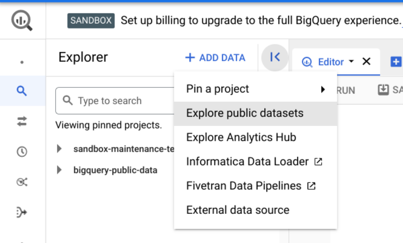
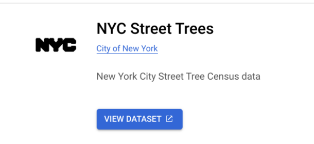
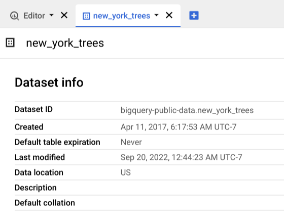
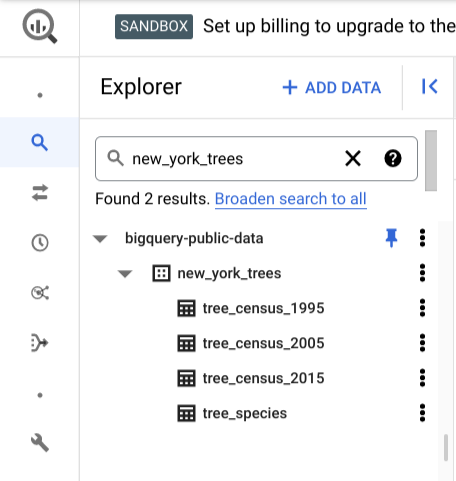
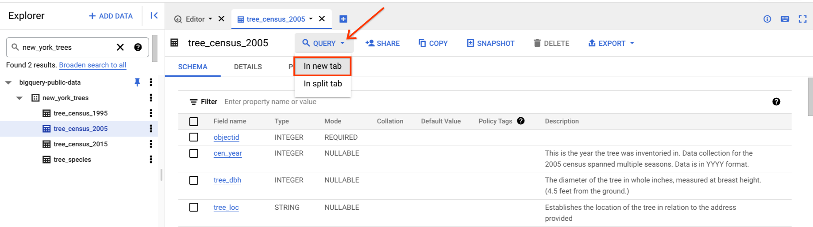
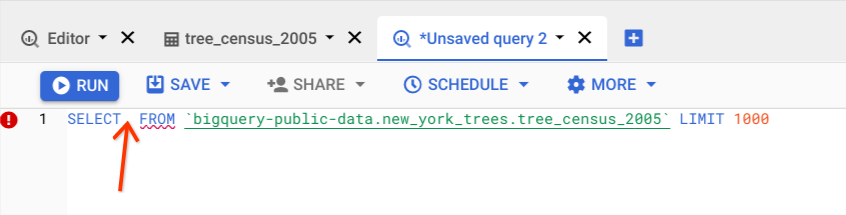
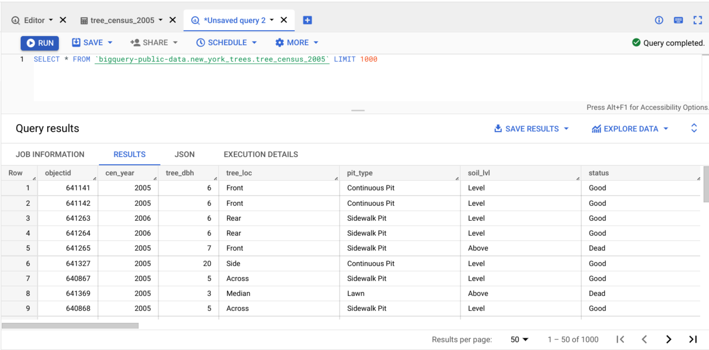
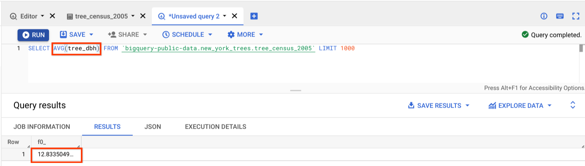

# Hands-On Activity: Applying SQL

## Question 1

Activity overview

In previous lessons, you learned how to apply formulas in spreadsheets. In this activity, we will practice using formulas with SQL queries.

By the time you complete this activity, you will be able to use SQL to write queries for datasets. This will enable you to explore public datasets in BigQuery, which is important for writing queries in your career as a data analyst.

## Set up your data

1. Log in to [BigQuery Sandbox](https://cloud.google.com/bigquery/docs/sandbox). If you have a free trial version of BigQuery, you can use that instead. On the BigQuery page, click the **Go to BigQuery** button.
   - **Note**: BigQuery Sandbox frequently updates its user interface. The latest changes may not be reflected in the screenshots presented in this activity, but the principles remain the same. Adapting to changes in software updates is an essential skill for data analysts, and it’s helpful for you to practice troubleshooting. You can also reach out to your community of learners on the discussion forum for help.
2. If you have never created a BigQuery project before, click **CREATE PROJECT** on the right side of the screen. If you have created a project before, you can use an existing one or create a new one by clicking the project dropdown in the blue header bar and selecting **NEW PROJECT**.
3. Name your project something that will help you identify it later. You can give it a unique project ID or use an auto-generated one. Don’t worry about selecting an organization if you don’t know what to put.
4. Now, you’ll see the **Editor** interface. In the middle of the screen is a window where you can type code, and to the left is the **Explorer** menu where you can search for datasets.

### Pick a dataset

Follow these steps to find and pick a dataset for this activity:

1. Locate the **Explorer** menu on the left side of your screen. Click on **+ ADD DATA** and then **Explore public datasets**.


2. In the **Search Marketplace** bar, search for “New York City Trees.” Click the result, then click **View Dataset**. This will bring you back to the BigQuery Sandbox interface in a new tab.  
   - **Note**: This may pin the **bigquery-public-data** dropdown to the **Explorer** menu. You can use this to browse datasets and tables.
   - 

3. In BigQuery, you’ll find information on the dataset you selected. Review the description of the dataset.
   - 

For instance, you can locate the Dataset ID. You will  need this in order to write an SQL query, so that you can tell what database, dataset, and table you’re targeting. In this case, the database connection is “bigquery-public-data” and the Dataset ID is “new_york_trees”. You'll still need to identify what table you want to query, so begin with a close review of  the dataset.

### Choose a table

1. Enter the Dataset ID, “new_york_trees,” in the search bar of the **Explorer menu**.
   - If this doesn’t pull anything up, you can find it manually by deleting the text from the search bar, clicking on the arrow next to **bigquery-public-data**, and scrolling until you find the right dataset.
2. Once you’ve found the “new_york_trees” dataset, click on the arrow next to it to expand the dataset to examine the tables it contains.
   - 
These are all tables contained in the dataset. You can check out the data for all trees cataloged in New York City for three specific years.

3. Click on the **tree_census_2005** table. This will bring up information for the table.
4. On the right side of the information window, click **Query** and then select “In new tab.”
   - 
This will populate the query window with a query. Notice that the query doesn’t contain anything in between “SELECT” and “FROM”.
   - 

## Write a query

### Query the data

You’ll still need to complete the query by adding what you want.

1. Insert an asterisk `*` after the select, so that your query reads `SELECT * FROM` followed by your table location.
2. Run the query. In the example provided, your result should be something like this:
   - 
This query returns all columns for the first 1,000 rows from the table.
3. Write a query to find out  the average diameter of all NYC trees in 2005. Instead of an asterisk, type `AVG(tree_dbh)`.
   - 
This returns your answer, 12.833 (which means the average diameter of NYC trees in 2005 was 12.833 inches).

### Write your own queries

Now, come up with some questions and answer them with your own SQL queries. For instance, in the same dataset as the example, try exploring the same data for 1995 and 2015.

You are also free to choose another publicly available dataset in BigQuery and write your own queries for extra practice—there are a lot of interesting choices!

## Confirmation and reflection

### Question 1:According to the dataset you used in this activity, what was the average diameter of NYC trees in 2015?

- `11.279`:

    ```sql
    SELECT
    AVG(tree_dbh)
    FROM
    `bigquery-public-data.new_york_trees.tree_census_2015`
    ```

- 12.981
- 12.334
- 11.439

### Question 2:During this activity, you practiced writing SQL queries to return information from datasets. In the text box below, write 2-3 sentences (40-60 words) in response to each of the following questions

- What do you think might happen if you wrote each component of a query correctly, but rearranged the order?
  - We will get a SQL query syntax error.
  - Potential Impact of Component Rearrangement: Rearranging correctly written components may result in errors or unexpected outcomes, as SQL queries are sensitive to syntax and structure.
- How can you use SQL queries to grow as a data analyst?
  - SQL queries are a powerful tool for data analysts to extract, analyze, and derive insights from datasets. Learning and mastering SQL allows data analysts to perform complex data manipulations, generate valuable reports, and uncover patterns, enhancing their analytical skills and decision-making capabilities. Regular practice with SQL queries on various datasets contributes to continuous skill development.
  - Using SQL Queries to Grow as a Data Analyst: SQL queries empower data analysts to extract insights from datasets, facilitating skills development in data exploration, analysis, and reporting. Regular practice with real-world datasets enhances proficiency and problem-solving abilities.
