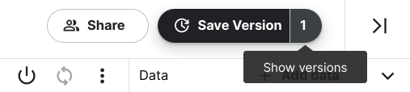
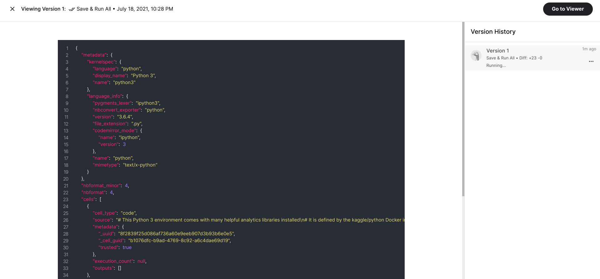
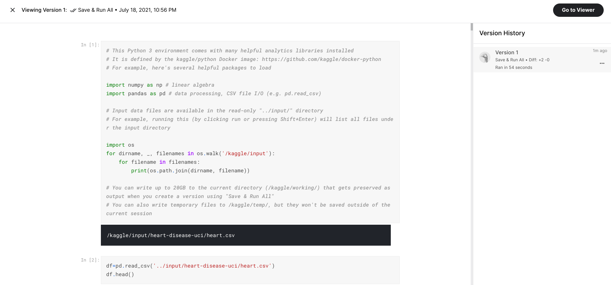

# Self-Reflection: Protecting your resources

## Overview

Now that you have learned about the importance of data security, you can pause for a moment and think about what you are learning. In this self-reflection, you will consider your thoughts about data privacy, collaboration, and version control, then respond to brief questions.

This self-reflection will help you develop insights into your own learning and prepare you to apply your knowledge of data privacy to your experience with Kaggle. As you answer questions—and come up with questions of your own—you will consider concepts, practices, and principles to help refine your understanding and reinforce your learning. You’ve done the hard work, so make sure to get the most out of it: This reflection will help your knowledge stick!

## Privacy

On Kaggle, you can upload your own datasets and keep them private. This means that they are visible and accessible by only you. You also have the option to add collaborators to your dataset, whom you can add as viewers or editors. Viewers are able to see your private dataset and editors are able to make changes to your private dataset.

You can share the link to your private dataset so anyone with the link is able to view it. If you don’t want this feature, you can disable it in the [Settings tab of your dataset](https://www.kaggle.com/product-feedback/120243).

Note: If you have a private dataset on Kaggle and you choose to make it public, you will not be able to make the dataset private again. The only option you would have is to delete the dataset from Kaggle completely.

## Collaboration

Any notebooks that you create on Kaggle are private by default. Like in datasets, you can add collaborators as viewers or editors. You can also make a notebook public, which will share it with the entire Kaggle community.

If you add collaborators to your Kaggle notebook, they can make changes to it. You want to make sure you communicate and coordinate with your collaborators because the last person who saves the notebook will overwrite all of the previous work. If you’d like more fine-grained control of changes to your code, a system like GitHub provides more version control.

## Version control

As for version control, Kaggle has its own style of letting you keep records of your progress. You can read all of the details in [this post](https://www.kaggle.com/product-feedback/139884), but think back to when you’ve done some work in a Kaggle notebook and clicked on the Save Version button.

When you clicked this button then clicked Save, you did it without changing anything. But you also have the option to add a short descriptive note about what changes you’ve made.

This can be helpful when you’ve made changes to your notebook but want to go back to an earlier version. To do this, go to **Edit** mode and click on the number next to the **Save Version** text at the top of your notebook.

This will open a navigation bar on the right side of the screen and list out all of the versions of your notebook. When you click on different versions of your notebook, the left side of the screen will populate with the code and text from that version.

Then, once the version has run, your screen will appear like this:

From this screen you can also open the version in Viewer mode, pin a version as the default, or even change the version name. Pinning a version as the default can be helpful when you have a working version of your notebook available to the Kaggle community, but want to make changes and updates that might not work the first time you implement them. This allows you to safely make changes behind the scenes while sharing with the Kaggle community the most recent working version of your notebook.

## Reflection

Consider what you learned about data security in Kaggle:
Now, write 2-3 sentences (40-60 words) in response to each of these questions. Type your response in the text box below.

- What are some cases in which you should use the privacy, collaboration, and version control features on Kaggle?
  - You should use privacy settings when working on sensitive datasets that should only be accessible to you or specific collaborators. Collaboration features are essential for coordinated work on Kaggle notebooks, ensuring effective communication among contributors. Version control is valuable to track and revert changes, especially when experimenting with different approaches in analysis or code.
- What other scenarios can you think of where you might want to pin a different version of your notebook other than the most recent version?
  - Pinning a different version of a notebook on Kaggle is useful when you want to share a stable working version with the community while simultaneously experimenting with updates or changes in another version. It provides a safe way to showcase a reliable version publicly while actively working on improvements behind the scenes.
