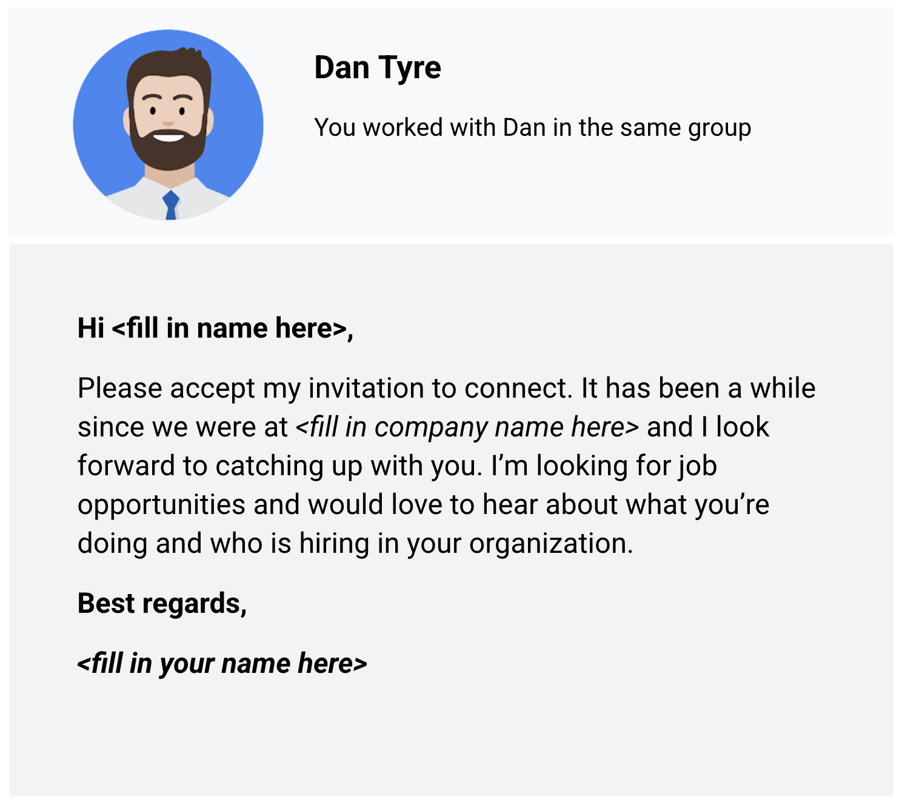
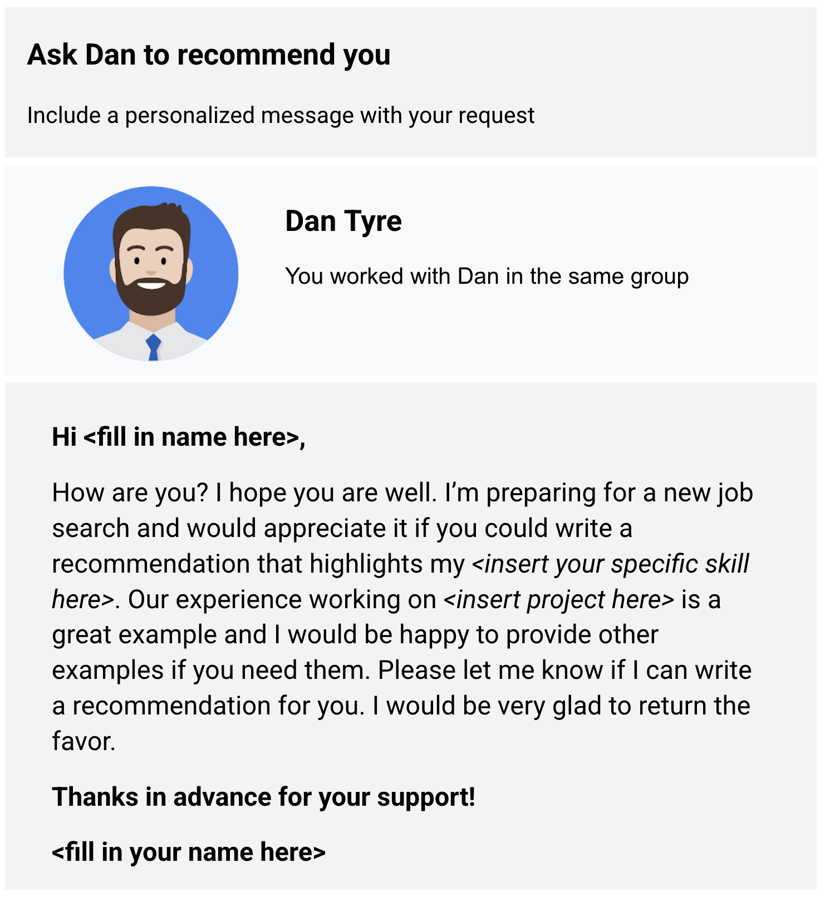

## Building connections on LinkedIn

## Using LinkedIn to connect

A **connection** is someone you know and trust on a personal or professional basis. Your connections are who make up your network. And when it comes to your network, it is important to remember quality over quantity. So don’t focus on how many connections you have. Instead, make sure that everyone you connect with adds value to your network, and vice versa.  

## Inviting those you know versus making cold requests

Adding connections on LinkedIn is easy. You invite people to join your network, and they accept your invitation. When you send an invitation, you can attach a personal note. Personal notes are highly recommended.

A great way to increase the number of your connections is to invite classmates, friends, teachers, or even members of a club or organization you are in. LinkedIn also gives suggestions for connections based on your profile information. Here's an example (template) that you can use to connect with a former co-worker:
Cold requests on LinkedIn are invitations to connect with people you don’t know personally or professionally. When you start to build your network, it is best to connect with people you already know. But cold requests might be the only way to connect with people who work at companies you are interested in. You can learn a lot about a company’s culture and job openings from current employees. As a best practice, send cold requests rarely and only when there is no other way to connect.

## Asking for recommendations (references)

Recommendations on LinkedIn are a great way to have others vouch for you. Ask people to comment on your past performance, how you handled a challenging project, or your strengths as a data analyst. You can choose to accept, reject, show, or hide recommendations in your profile.

- Here are some tips for asking for a recommendation:
- Reach out to a variety of people for a 360-degree view: supervisors, co-workers, direct reports, partners, and clients
- Personalize the recommendation request with a custom message
- Suggest strengths and capabilities they can highlight as part of your request
- Be willing to write a recommendation in return
- Read the recommendation carefully before you accept it into your profile

Sometimes the hardest part of getting a recommendation is creating the right request message. Here's an example (template) that you can use to ask for a recommendation:

Ask a few connections to recommend you and highlight why you should be hired. Recommendations help prospective employers get a better idea of who you are and the quality of your work.

## Summing it up

When you write thoughtful posts and respond to others genuinely, people in and even outside your network will be open and ready to help you during your job search.
