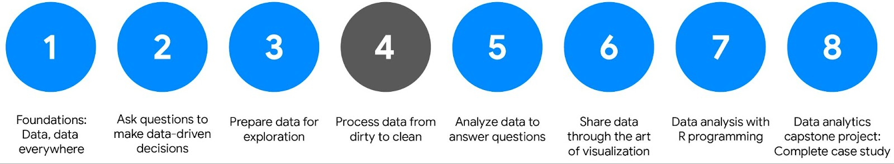

# Course 4 overview: Set your expectations

Welcome to the fourth course in the program! As you make your way through the certificate, this course and others that follow will begin to focus more on practical, skills-based assignments and projects.

In this course, you’ll learn to clean data by checking it for completeness and correctness. You’ll review a variety of approaches to clean data in spreadsheets and databases. Then, you’ll gain essential troubleshooting skills that will enable you to fix any errors. An important step in cleaning data is creating reports to communicate the changes you’ve made to others. You’ll understand how to do that in order to ensure the accuracy and reliability of data. Together, these skills will help ensure your data analysis is successful.

## Course Overview

- Foundations: Data, Data, Everywhere
- Ask Questions to Make Data-Driven Decisions
- Prepare Data for Exploration
- `Process Data from Dirty to Clean` (this course)
- Analyze Data to Answer Questions
- Share Data Through the Art of Visualization
- Data Analysis with R Programming
- Google Data Analytics Capstone: Complete a Case Study

## Course 4 content

Each course is broken into modules. Here’s a quick overview of the skills you’ll gain in each of the five Course 4 modules.

- **Module 1**: The importance of integrity
  - Data integrity is critical to successful analysis. In this part of the course, you’ll explore methods and steps that analysts take to check their data for integrity. This includes knowing what to do when you don’t have enough data. You’ll also learn about random samples and understand how to avoid sampling bias. All of these methods will also help you ensure your analysis is successful.  
- **Module 2**: Clean data for more accurate insights
  - Every data analyst wants to analyze clean data. In this part of the course, you’ll learn the difference between clean and dirty data. Then, you’ll practice cleaning data in - spreadsheets and other tools.
- **Module 3**: Data cleaning with SQL
  - Knowing a variety of ways to clean data can make a data analyst’s job much easier. In this part of the course, you’ll use SQL to clean data from databases. In particular, you’ll - explore how SQL queries and functions can be used to clean and transform your data before an analysis.
- **Module 4**: Verify and report cleaning results
  - When you clean data, you make changes to the original dataset. It’s important to verify the changes you make are accurate and to let your teammates know about the changes. In this - part of the course, you’ll learn to verify that data is clean and report your data cleaning results. With verified clean data, you’re ready to begin analyzing!
- **Module 5**: Optional: Add data to your resume
  - Creating an effective resume will help you in your data analytics career. In this part of the course, you’ll learn all about the job application process. Your focus will be on - building a resume that highlights your strengths and relevant experience.
- **Module 6**: Course wrap-up
  - Review the course glossary and prepare for the next course in the Google Data Analytics Certificate program.

## What to expect

Each module includes a series of lessons with many types of learning opportunities. These include:

- **Videos** for instructors to teach new concepts and demonstrate the use of tools
- **In-video questions** that pop up from time to time to help you to check your understanding of key concepts and skills
- **Step-by-step guides** you can use to follow along with instructors as they demonstrate tools
- **Readings** to explore topics more in-depth and build on the concepts from the videos
- **Discussion forums** to share, explore, and reinforce lesson topics
- **Discussion prompts** to promote thinking and engagement in the discussion forums
- **Practice quizzes** to prepare you for graded quizzes
- **Graded quizzes** to measure your progress and give you valuable feedback

This program was designed to let you work at your own pace—your personalized deadlines are just a guide. There is no penalty for late assignments. To earn your certificate, you simply need to complete all of the work.

If you miss two assessment deadlines in a row, or if you miss an assessment deadline by two weeks, you'll see a Reset deadlines option on the Grades page. Click it to switch to a new course schedule with updated deadlines. You can use this option as many times as you need—it won’t remove any progress you’ve already made in the course, but you may find new course content if the instructor updated the course after you started. If you cancel a subscription and then reactivate it, your deadlines will automatically reset.

In this course, you'll be assessed with graded quizzes and activities. Both are based on the wide variety of learning materials and activities that reinforce the important skills you’ll develop. And both can be taken more than once.

## Tips for success

It is strongly recommended that you go through the items in each lesson in the order they appear because new information and concepts build on previous knowledge.
Participate in all learning opportunities to gain as much knowledge and experience as possible.
If something is confusing, don’t hesitate to replay a video, review a reading, or repeat a self-review activity.
Use the additional resources that are referenced in this course. They are designed to support your learning. You can find all of these resources in the [Resources](https://www.coursera.org/learn/ask-questions-make-decisions/resources/xW7lI) tab.

When you encounter useful links in this course, bookmark them so you can refer to the information later for study or review.

Understand and follow the  [Coursera Code of Conduct](https://www.coursera.support/s/article/208280036-Coursera-Code-of-Conduct?) to ensure that the learning community remains a welcoming, friendly, and supportive place for all members.

Updates to the course

As you complete this course, you may notice updates to the content, like new practice materials and additional examples. These updates ensure the program provides up-to-date skills and guidance that will help you in your data analytics career. If you previously completed a graded activity, you may need to repeat the assessment in order to complete this course.  For more information, check out 
the course discussion forum.
