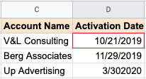
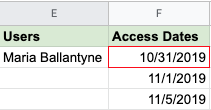
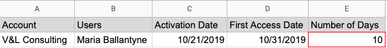

# Well-aligned objectives and data

You can gain powerful insights and make accurate conclusions when data is well-aligned to business objectives. As a data analyst, alignment is something you will need to judge. Good alignment means that the data is relevant and can help you solve a business problem or determine a course of action to achieve a given business objective.

In this reading, you will review the business objectives associated with three scenarios. You will explore how clean data and well-aligned business objectives can help you come up with accurate conclusions. On top of that, you will learn how new variables discovered during data analysis can cause you to set up data constraints so you can keep the data aligned to a business objective.  

## Clean data + alignment to business objective = accurate conclusions

### Business objective of [Clean data + alignment]

Account managers at Impress Me, an online content subscription service, want to know how soon users view content after their subscriptions are activated.

Image of a web video player and image of an analog clock set to 3:03

To start off, the data analyst verifies that the data exported to spreadsheets is clean and confirms that the data needed (when users access content) is available. Knowing this, the analyst decides there is good alignment of the data to the business objective. All that is missing is figuring out exactly how long it takes each user to view content after their subscription has been activated.

Here are the data processing steps the analyst takes for a user from an account called V&L Consulting. (These steps would be repeated for each subscribing account, and for each user associated with that account.)

### **Step 1**

| Data-processing step | Source of data |
|--------------------|--------------|
|Look up the activation date for V&L Consulting|Account spreadsheet|

Relevant data in spreadsheet:

**Result**: October 21, 2019

### **Step 2**

|Data-processing step|Source of data|
|--------------------|--------------|
|Look up the name of a user belonging to the V&L Consulting account|Account spreadsheet (users tab)|

**Relevant data in spreadsheet**:

**Result**: Maria Ballantyne

### **Step 3**

|Data-processing step|Source of data|
|--------------------|--------------|
|Find the first content access date for Maria B.|Content usage spreadsheet|

**Relevant data in spreadsheet:**

**Result**: October 31, 2019

### Step 4

|Data-processing step|Source of data|
|--------------------|--------------|
|Calculate the time between activation and first content usage for Maria B.|New spreadsheet calculation|

**Relevant data in spreadsheet:**

**Result**: 10 days

### Pro tip 1

In the above process, the analyst could use `VLOOKUP` to look up the data in Steps 1, 2, and 3 to populate the values in the spreadsheet in Step 4. [VLOOKUP](https://support.microsoft.com/en-us/office/vlookup-function-0bbc8083-26fe-4963-8ab8-93a18ad188a1) is a spreadsheet function that searches for a certain value in a column to return a related piece of information. Using `VLOOKUP` can save a lot of time; without it, you have to look up dates and names manually.

Refer to the [VLOOKUP](https://support.google.com/docs/answer/3093318?hl=en) page in the Google Help Center for how to use the function in Google Sheets.

### Pro tip 2

In Step 4 of the above process, the analyst could use the `DATEDIF` function to automatically calculate the difference between the dates in column C and column D. The function can calculate the number of days between two dates.

Refer to the Microsoft Support [DATEDIF](https://support.microsoft.com/en-us/office/datedif-function-25dba1a4-2812-480b-84dd-8b32a451b35c) page for how to use the function in Excel. The [DAYS360](https://support.microsoft.com/en-us/office/days360-function-b9a509fd-49ef-407e-94df-0cbda5718c2a) function does the same thing in  accounting spreadsheets that use a 360-day year (twelve 30-day months).

Refer to the [DATEDIF](https://support.google.com/docs/answer/6055612?hl=en) page in the Google Help Center for how to use the function in Google Sheets.

## Alignment to business objective + additional data cleaning = accurate conclusions

### Business objective of [Alignment to business objective + additional data cleaning]

Cloud Gate, a software company, recently hosted a series of public webinars as free product introductions. The data analyst and webinar program manager want to identify companies that had five or more people attend these sessions. They want to give this list of companies to sales managers who can follow up for potential sales.  

The webinar attendance data includes the fields and data shown below.

|Name|<First name> <Last name>|This was required information attendees had to submit|
|----|------------------------|-----------------------------------------------------|
|Email Address|<xxxxx@company.com>|This was required information attendees had to submit
|Company|<Company name>|his was optional information attendees could provide|

### Data cleaning

The webinar attendance data seems to align with the business objective. But the data analyst and program manager decide that some data cleaning is needed before the analysis. They think data cleaning is required because:

- The company name wasn’t a mandatory field. If the company name is blank, it might be found from the email address. For example, if the email address is <username@google.com>, the company field could be filled in with Google for the data analysis. This data cleaning step assumes that people with company-assigned email addresses attended a webinar for business purposes.
- Attendees could enter any name. Since attendance across a series of webinars is being looked at, they need to validate names against unique email addresses. For example, if Joe Cox attended two webinars but signed in as Joe Cox for one and Joseph Cox for the other, he would be counted as two different people. To prevent this, they need to check his unique email address to determine that he was the same person. After the validation, Joseph Cox could be changed to Joe Cox to match the other instance.

## Alignment to business objective + newly discovered variables + constraints = accurate conclusions

### Business objective [Alignment to business objective + newly discovered variables + constraints]

An after-school tutoring company, A+ Education,  wants to know if there is a minimum number of tutoring hours needed before students have at least a 10% improvement in their assessment scores.

The data analyst thinks there is good alignment between the data available and the business objective because:

- Students log in and out of a system for each tutoring session, and the number of hours is tracked
- Assessment scores are regularly recorded  

### Data constraints for new variables

After looking at the data, the data analyst discovers that there are other variables to consider. Some students had consistent weekly sessions while other students had scheduled sessions more randomly even though their total number of tutoring hours was the same. The data doesn’t align as well with the original business objective as first thought, so the analyst adds a data constraint to focus only on the students with consistent weekly sessions. This modification helps to get a more accurate picture about the enrollment time needed to achieve a 10% improvement in assessment scores.

## Key takeaways

Hopefully these examples give you a sense of what to look for to know if your data aligns with your business objective.

- When there is clean data and good alignment, you can get accurate insights and make conclusions the data supports.
- If there is good alignment but the data needs to be cleaned, clean the data before you perform your analysis.
- If the data only partially aligns with an objective, think about how you could modify the objective, or use data constraints to make sure that the subset of data better aligns with the business objective.

### Key Concepts

- Clean Data + Alignment to Business Objective = Accurate Conclusions:
  - The reading underscores the importance of aligning data with business objectives for accurate conclusions.
  - An example from Impress Me, an online content subscription service, illustrates how an analyst determines the time users take to view content after subscription activation.
  - The data processing steps involve looking up activation dates, user names, first content access dates, and calculating the time between activation and first content usage.
- Pro Tips for Data Processing:
  - Pro Tip 1 suggests using VLOOKUP to streamline data lookup processes.
  - Pro Tip 2 introduces the DATEDIF function for calculating date differences in data processing.
- Alignment to Business Objective + Additional Data Cleaning = Accurate Conclusions:
  - The Cloud Gate scenario involves identifying companies with five or more attendees at webinars for potential sales.
  - Data cleaning is deemed necessary to address issues such as blank company names and variations in attendee names.
- Alignment to Business Objective + Newly Discovered Variables + Constraints = Accurate Conclusions:
  - A+ Education aims to determine the minimum tutoring hours needed for a 10% improvement in assessment scores.
  - The analyst discovers variables like consistent weekly sessions and adds data constraints for a more accurate analysis.
- Key Takeaways:
  - Alignment Importance: Well-aligned data to business objectives is crucial for deriving meaningful insights and making accurate conclusions.
  - Data Processing Steps: Understanding the data processing steps, including looking up relevant information and calculating derived variables, is fundamental for accurate analysis.
  - Pro Tips for Efficiency: Pro tips highlight the use of spreadsheet functions like VLOOKUP and DATEDIF for efficient data processing in tools like Excel and Google Sheets.
  - Data Cleaning Significance: Even when data aligns with objectives, the necessity of data cleaning is acknowledged to ensure accurate analysis.
  - New Variables and Constraints: The introduction of new variables may require additional constraints for better alignment with business objectives.
  - Adaptation for Better Alignment: In cases where data only partially aligns with objectives, the reading suggests modifying the objective or using data constraints to improve alignment.
  - Holistic Understanding: These examples provide insights into the nuanced considerations necessary for ensuring data aligns with business goals, from initial processing to adapting objectives based on newly discovered variables.