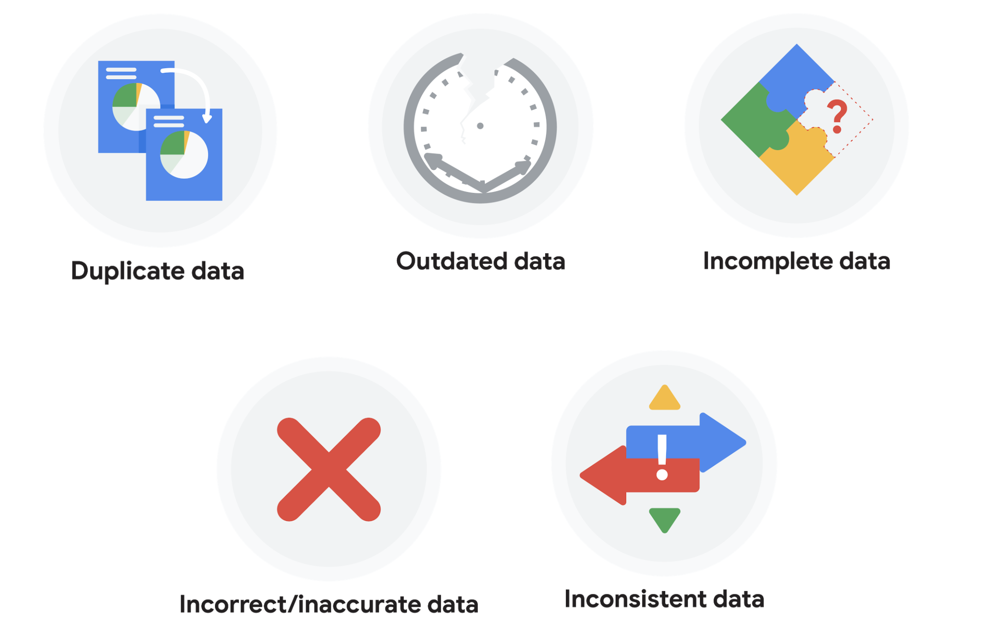

# What is dirty data?

Earlier, we discussed that **dirty data** is data that is incomplete, incorrect, or irrelevant to the problem you are trying to solve.  This reading summarizes:

- Types of dirty data you may encounter
- What may have caused the data to become dirty
- How dirty data is harmful to businesses

## Types of dirty data

### Duplicate data

|Description|Possible causes|Potential harm to businesses|
|-----------|---------------|----------------------------|
|Any data record that shows up more than once|Manual data entry, batch data imports, or data migration|Skewed metrics or analyses, inflated or inaccurate counts or predictions, or confusion during data retrieval|

### Outdated data

|Description|Possible causes|Potential harm to businesses|
|-----------|---------------|----------------------------|
|Any data that is old which should be replaced with newer and more accurate information|People changing roles or companies, or software and systems becoming obsolete|Inaccurate insights, decision-making, and analytics|

### Incomplete data

|Description|Possible causes|Potential harm to businesses|
|-----------|---------------|----------------------------|
|Any data that is missing important fields|Improper data collection or incorrect data entry|Decreased productivity, inaccurate insights, or inability to complete essential services|

### Incorrect/inaccurate data

|Description|Possible causes|Potential harm to businesses|
|-----------|---------------|----------------------------|
|Any data that is complete but inaccurate|Human error inserted during data input, fake information, or mock data|Inaccurate insights or decision-making based on bad information resulting in revenue loss|

### Inconsistent data

|Description|Possible causes|Potential harm to businesses|
|-----------|---------------|----------------------------|
|Any data that uses different formats to represent the same thing|Data stored incorrectly or errors inserted during data transfer|Contradictory data points leading to confusion or inability to classify or segment customers|

### Business impact of dirty data

For further reading on the business impact of dirty data, enter the term “dirty data” into your preferred browser’s search bar to bring up numerous articles on the topic. Here are a few impacts cited for certain industries from a previous search:

- Banking: Inaccuracies cost companies between 15% and 25% of revenue ([source](https://sloanreview.mit.edu/article/seizing-opportunity-in-data-quality/)).
- Digital commerce: Up to 25% of B2B database contacts contain inaccuracies ([source](https://www.demandgen.com/dirty-data-what-is-it-costing-you/)).
- Marketing and sales: 99% of companies are actively tackling data quality in some way ([source](https://www.dqglobal.com/blog/why-bad-data-is-wasting-your-marketing-efforts/)).
- Healthcare: Duplicate records can be 10% and even up to 20% of a hospital’s electronic health records ([source](https://searchhealthit.techtarget.com/feature/Hospitals-battle-duplicate-medical-records-with-technology)).

## Key takeaways

Dirty data includes duplicate data, outdated data, incomplete data, incorrect or inaccurate data, and inconsistent data. Each type of dirty data can have a significant impact on analyses, leading to inaccurate insights, poor decision-making, and revenue loss. There are a number of causes of dirty data, including manual data entry errors, batch data imports, data migration, software obsolescence, improper data collection, and human errors during data input. As a data professional, you can take steps to mitigate the impact of dirty data by implementing effective data quality processes.

- Each type of dirty data can significantly impact analyses, leading to inaccurate insights and revenue loss.
- Causes of dirty data include manual data entry errors, batch imports, data migration, software obsolescence, improper data collection, and human errors.
- Data professionals can mitigate the impact of dirty data by implementing effective data quality processes.
