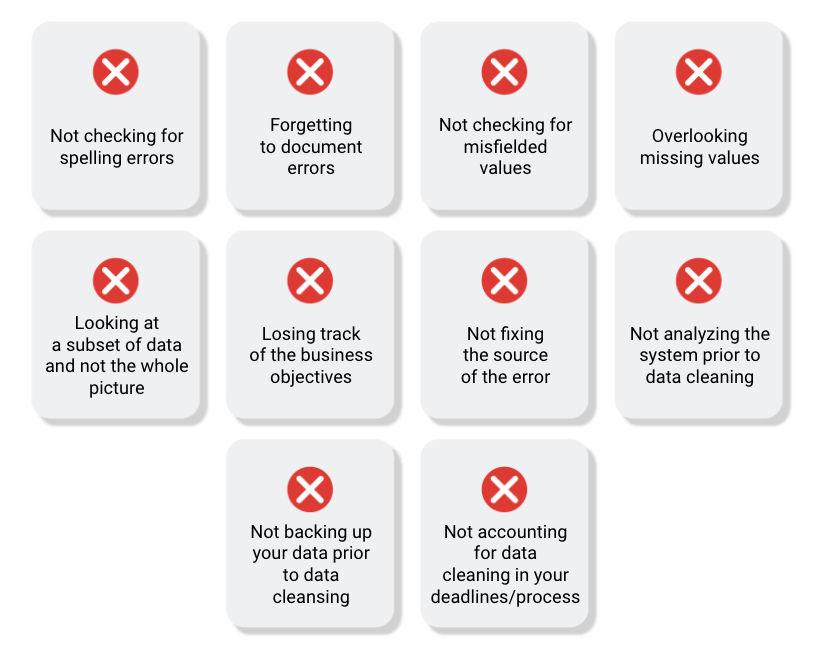

# Common data-cleaning pitfalls

In this reading, you will learn the importance of data cleaning and how to identify common mistakes. Some of the errors you might come across while cleaning your data could include:

## Common mistakes to avoid

- **Not checking for spelling errors**: Misspellings can be as simple as typing or input errors. Most of the time the wrong spelling or common grammatical errors can be detected, but it gets harder with things like names or addresses. For example, if you are working with a spreadsheet table of customer data, you might come across a customer named “John” whose name has been input incorrectly as “Jon” in some places. The spreadsheet’s spellcheck probably won’t flag this, so if you don’t double-check for spelling errors and catch this, your analysis will have mistakes in it. 
- **Forgetting to document errors**: Documenting your errors can be a big time saver, as it helps you avoid those errors in the future by showing you how you resolved them. For example, you might find an error in a formula in your spreadsheet. You discover that some of the dates in one of your columns haven’t been formatted correctly. If you make a note of this fix, you can reference it the next time your formula is broken, and get a head start on troubleshooting. Documenting your errors also helps you keep track of changes in your work, so that you can backtrack if a fix didn’t work. 
- **Not checking for misfielded values**: A misfielded value happens when the values are entered into the wrong field. These values might still be formatted correctly, which makes them harder to catch if you aren’t careful. For example, you might have a dataset with columns for cities and countries. These are the same type of data, so they are easy to mix up. But if you were trying to find all of the instances of Spain in the country column, and Spain had mistakenly been entered into the city column, you would miss key data points. Making sure your data has been entered correctly is key to accurate, complete analysis. 
- **Overlooking missing values**: Missing values in your dataset can create errors and give you inaccurate conclusions. For example, if you were trying to get the total number of sales from the last three months, but a week of transactions were missing, your calculations would be inaccurate.  As a best practice, try to keep your data as clean as possible by maintaining completeness and consistency.
- **Only looking at a subset of the data**: It is important to think about all of the relevant data when you are cleaning. This helps make sure you understand the whole story the data is telling, and that you are paying attention to all possible errors. For example, if you are working with data about bird migration patterns from different sources, but you only clean one source, you might not realize that some of the data is being repeated. This will cause problems in your analysis later on. If you want to avoid common errors like duplicates, each field of your data requires equal attention.
- **Losing track of business objectives**: When you are cleaning data, you might make new and interesting discoveries about your dataset-- but you don’t want those discoveries to distract you from the task at hand. For example, if you were working with weather data to find the average number of rainy days in your city, you might notice some interesting patterns about snowfall, too. That is really interesting, but it isn’t related to the question you are trying to answer right now. Being curious is great! But try not to let it distract you from the task at hand.  
- **Not fixing the source of the error**: Fixing the error itself is important. But if that error is actually part of a bigger problem, you need to find the source of the issue. Otherwise, you will have to keep fixing that same error over and over again. For example, imagine you have a team spreadsheet that tracks everyone’s progress. The table keeps breaking because different people are entering different values. You can keep fixing all of these problems one by one, or you can set up your table to streamline data entry so everyone is on the same page. Addressing the source of the errors in your data will save you a lot of time in the long run. 
- **Not analyzing the system prior to data cleaning**: If we want to clean our data and avoid future errors, we need to understand the root cause of your dirty data. Imagine you are an auto mechanic. You would find the cause of the problem before you started fixing the car, right? The same goes for data. First, you figure out where the errors come from. Maybe it is from a data entry error, not setting up a spell check, lack of formats, or from duplicates. Then, once you understand where bad data comes from, you can control it and keep your data clean.
- **Not backing up your data prior to data cleaning**: It is always good to be proactive and create your data backup before you start your data clean-up. If your program crashes, or if your changes cause a problem in your dataset, you can always go back to the saved version and restore it. The simple procedure of backing up your data can save you hours of work-- and most importantly, a headache. 
- **Not accounting for data cleaning in your deadlines/process**: All good things take time, and that includes data cleaning. It is important to keep that in mind when going through your process and looking at your deadlines. When you set aside time for data cleaning, it helps you get a more accurate estimate for ETAs(Extract, Transform, Analyze) for stakeholders, and can help you know when to request an adjusted ETA. 

## Key takeaways

Data cleaning is essential for accurate analysis and decision-making. Common mistakes to avoid when cleaning data include spelling errors, misfielded values, missing values, only looking at a subset of the data, losing track of business objectives, not fixing the source of the error, not analyzing the system prior to data cleaning, not backing up your data prior to data cleaning, and not accounting for data cleaning in your deadlines/process. By avoiding these mistakes, you can ensure that your data is clean and accurate, leading to better outcomes for your business.

Additional resources
Refer to these "top ten" lists for data cleaning in Microsoft Excel and Google Sheets to help you avoid the most common mistakes:

- [Top ten ways to clean your data](https://support.microsoft.com/en-us/office/top-ten-ways-to-clean-your-data-2844b620-677c-47a7-ac3e-c2e157d1db19): Review an orderly guide to data cleaning in Microsoft Excel.
- [10 Google Workspace tips to clean up data](https://support.google.com/a/users/answer/9604139?hl=en#zippy=): Learn best practices for data cleaning in Google Sheets.
