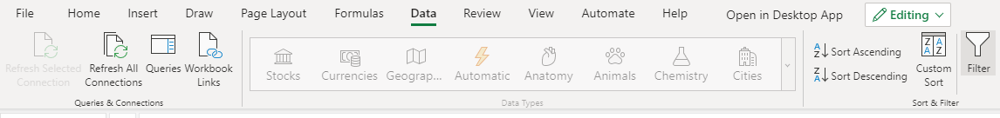
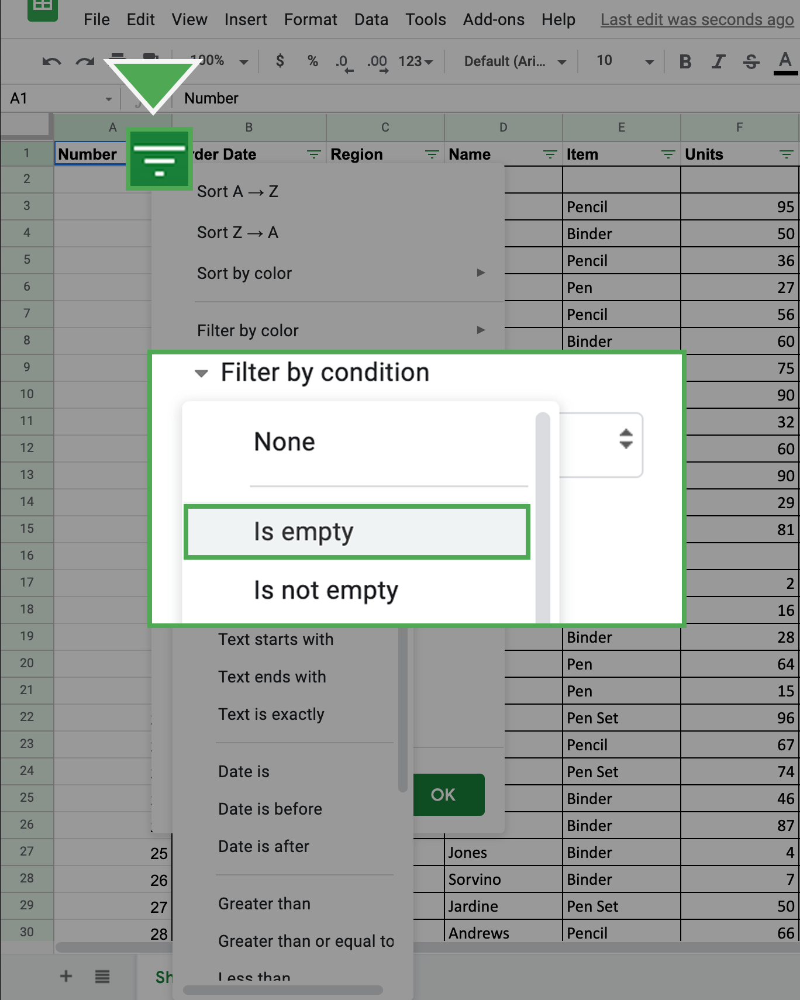
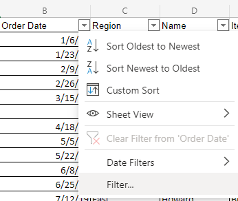
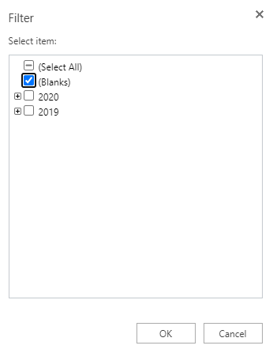
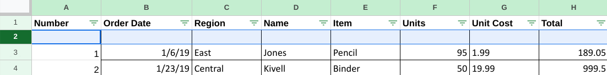
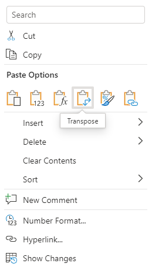
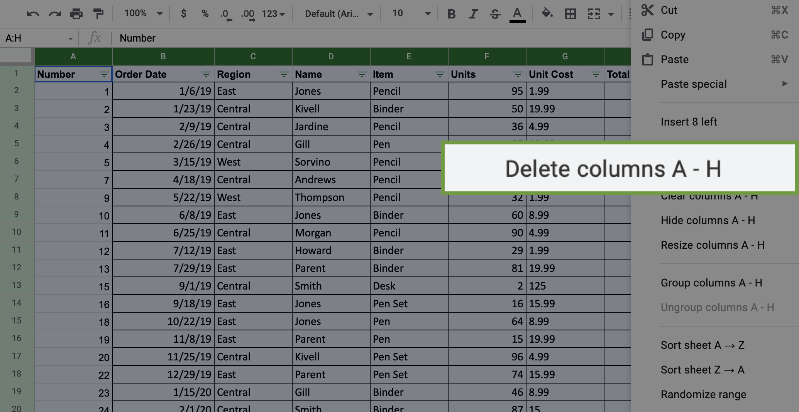
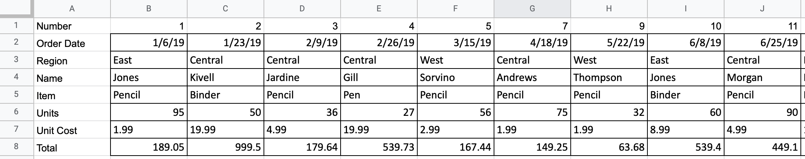
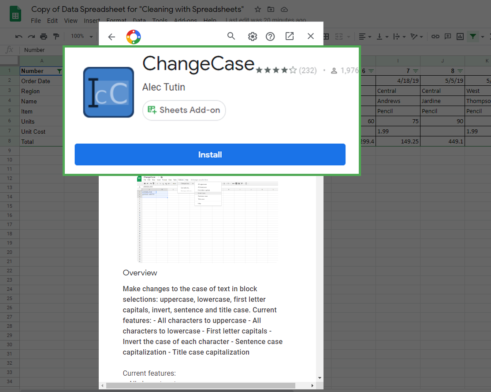

# Hands-On Activity: Cleaning data with spreadsheets

## Activity overview

You’ve learned about cleaning data and its importance in meeting good data science standards. In this activity, you’ll do some data cleaning with spreadsheets, then transpose the data.

By the time you complete this activity, you will be able to perform some basic cleaning methods in spreadsheets. This will enable you to clean and transpose data, which is important for making data more specific and accurate in your career as a data analyst.

## What you will need

To get started, first access the data spreadsheet.

To use the spreadsheet for this course item, click the link below and select “Use Template.”

Link to data spreadsheet: [Cleaning with spreadsheets](https://docs.google.com/spreadsheets/d/1PkAbgXC7C1g2dKzCCpaHBcAyPw-s1z7iUxIEJ0cCYWQ/template/preview)

OR If you don’t have a Google account, you can download the template directly from the attachment [data-spreadsheet-for-cleaning-with-spreadsheets.xlsx](./resources/data-spreadsheet-for-cleaning-with-spreadsheets.xlsx).

## Select and remove blank cells

The first technique we’ll use is to select and eliminate rows containing blank cells by using filters. To eliminate rows with blank cells:

1. Highlight all cells in the spreadsheet. You can highlight **Columns A-H** by clicking on the header of **Column A**, holding **Shift**, and clicking on the header of **Column H**.

2. Click on the **Data** tab and pick the **Create a filter** option. In Microsoft Excel, this is called **Filter**.
    

    
3. Every column now shows a green triangle in the first row next to the column title. Click the green triangle in **Column B** to access a new menu.

4. On that new menu, click **Filter by condition** and open the dropdown menu to select **Is empty**. Click **OK**.
    
In Excel, click the dropdown, then **Filter**... then make sure only (**Blanks**) is checked. Click **OK**.
    
    

    You can then review a list of all the rows with blank cells in that column.

5. Select all these cells and delete the rows except the row of column headers.
6. Return to the **Filter by condition** and return it to **None**. In Excel, click **Clear Filter from ‘Column’**.

    **Note**: You will now notice that any row that had an empty cell in **Column A** will be removed (including the extra empty rows after the data).

7. Repeat this for Columns B-H.

8. Note: If you simply deleted the data from the row by tapping the backspace button, you will need to go a step further and *delete the empty row entirely* by left-clicking the row number located on the furthest left side of the screen.
    
9. Next, right click on the highlighted row to call up the drop down window, and select the Delete row option. 
    
10. Continue to do this same operation for the remaining empty rows in the data set.

All the rows that had blank cells are now removed from the spreadsheet.

## Transpose the data

The second technique you will practice will help you convert the data from the current long format (more rows than columns) to the wide format (more columns than rows). This action is called **transposing**. To transpose your data:

1. Highlight and copy the data that you want to transpose including the column labels. You can do this by highlighting **Columns A-H**. In Excel, highlight only the relevant cells **(A1-H45)** instead of the headers.

2. Right-click on cell **I1**. This is where you want the transposed data to start.

3. Hover over **Paste Special** from the right-click menu. Select the **Transposed** option. In Excel, select the **Transpose** icon under the paste options.
    

    

    You should now find the data transformed into the new wide format. At this point, you should remove the original long data from the spreadsheet.

4. Delete the previous long data. The easiest way to do this is to click on **Column A**, so the entire column is highlighted. Then, hold down the **Shift** key and click on **Column H**. You should find these columns highlighted. Right-click on the highlighted area and select **Delete Columns A - H**.

    
    Your screen should now appear like this:
    

## Get rid of extra spaces in cells with string data

Now that you have transposed the data, eliminate the extra spaces in the values of the cells.

1. Highlight the data in the spreadsheet.

2. Click on the **Data** tab, then hover over **Data cleanup** and select **Trim whitespace**.
    

In Excel, you can use the `TRIM` command to get rid of white spaces. In any space beneath your data (such as cell **A10**), enter `=TRIM(A1)`. Then, drag the auto-fill square handle at the bottom right corner of the cell and pull it downward to call the rest of the data in the column without the white spaces.

**Note**: It's important to carry out the TRIM formula for each column individually, as it may affect certain types of cell values (like dates) undesirably. One option is right-clicking the "Order Date" column at the top, and selecting the **Format Cells** option to change the dates to string values before applying the **TRIM** formula.
    

For additional understanding of using the TRIM formula in Excel, please explore the [Microsoft Excel guide](https://support.microsoft.com/en-au/office/trim-function-50b6f593-4801-4f06-81c5-3345e7f80ddd) on using the formula correctly.

Now all the extra spaces in the cells have been removed.

## Change Text Lower/Uppercase/Proper Case

Next, you’ll process string data. The easiest way to clean up string data will depend on the spreadsheet program you are using. If you are using Excel, you’ll use a simple formula. If you are using Google Sheets, you can use an Add-on to do this with a few clicks. Follow the steps in the relevant section below.

### Microsoft Excel

If you are using Microsoft Excel, [this documentation](https://support.microsoft.com/en-us/office/change-the-case-of-text-in-excel-adc65f5b-958f-46a2-4d23-ab4d5faf48a8) explains how to use a formula to change the case of a text string. Follow these instructions to clean the string text and then move on to the confirmation and reflection section of this activity.

### Google sheets

If you’re completing this exercise using Google Sheets, you’ll need to install an add-in that will give you the functionality needed to easily clean string data and change cases.

*Google Sheets Add-on Instructions:*

1. Click on the **Add-Ons** option at the top of Google Sheets.
2. Click on **Get add-ons**.
3. Search for **ChangeCase**. It should appear like this:
        

4. Click on **Install** to install the dd-on. It may ask you to login or verify the installation permissions.

Once you have installed the add-on successfully, you can access it by clicking on the **Add-ons** menu again.

Now, you can change the case of text data that shows up. To change the text in Column C to all uppercase:

1. Click on **Column C**. Be sure to deselect the column header, unless you want to change the case of that as well (which you don't).

2. Click on the **Add-Ons** tab and select **ChangeCase**. Select the option         . Notice the other options that you could have chosen if needed.
    

## Delete all formatting

If you want to clear the formatting for any or all cells, you can find the command in the **Format** tab. To clear formatting:

1. Select the data for which you want to delete the formatting. In this case, highlight all the data in the spreadsheet by clicking and dragging over **Rows 1-8**.

2. Click the **Format** tab and select the **Clear Formatting** option.

In Excel, go to the **Home** tab, then hover over **Clear** and select **Clear Formats**.

You will notice that all the cells have had their formatting removed.

## Reflection

Review the final product of the spreadsheet you cleaned during this activity. Which of the following is the rightmost column?

- Column Z
- `Column AS`
- Column AA
- Column AZ

> In the final product of this activity, the rightmost column is Column AS. You are able to find this information after you properly transpose the data. Going forward, you can apply what you learned about data cleaning and transposing to work with data in the future.

### Question 2:In this activity, you practiced cleaning and transposing data. In the text box below, write 2-3 sentences (40-60 words) in response to each of the following questions

What was the most challenging part of cleaning the data?

Why is cleaning and transposing data important for data analysis?

If you had to clean this data again, what would you do differently? Why?

- I think the most challenging part of cleanning the data is removing the blank/empty value because it can take a lot of effort and time.
- Cleaning and transposing data are essential steps in data analysis. Clean data ensures accuracy in analysis, and transposing may be necessary for certain types of analyses or visualization. Consistent formatting, removal of errors, and proper organization enhance the reliability of insights drawn from the data.
- Cleaning and transposing data are crucial because they lay the foundation for accurate analysis. Clean data eliminates errors that could skew insights, while transposing can be vital for certain analytical methods. It ensures data is well-organized and ready for meaningful interpretation.
- In retrospect, I would pay extra attention to documenting errors during the cleaning process. While I made corrections effectively, having a record of the issues and solutions would streamline future data cleaning tasks. This documentation could serve as a reference, saving time and ensuring consistency in handling similar errors.
