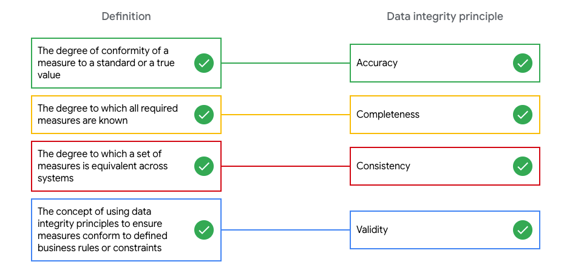
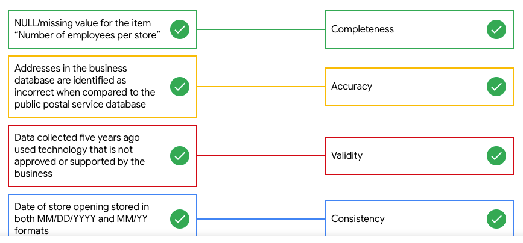

# Principles of data integrity

Principles of data integrity
Matching exercise

Data integrity: Keep it clean!
As a data analyst for a global retailer, you’re reviewing a new dataset for data integrity. Given a set of definitions and examples, identify the data integrity principle.

## What’s the problem with dirty data?

Match each definition or example with the correct data integrity principle. First, select a definition or example. Then, select a principle to find out if it's a match.

