# Practice Quiz: Hands-On Activity: Clean data with spreadsheet functions

## Activity Overview

By now, you’ve been introduced to some useful techniques for cleaning spreadsheet data, such as sorting and filtering. In this activity, you'll continue to develop your data-cleaning skills by using spreadsheet functions.  

Imagine you are a data analyst working for a marketing agency based in San Francisco. The marketing agency wants to contact local boba tea shops to inquire about a potential collaboration for a new marketing campaign. The agency plans to visit the top-rated shops within a 10-mile radius of the center of their target area. To assist with planning, the agency asks your team to review external data related to ratings and locations of boba tea shops in San Francisco. One of your teammates has created a spreadsheet from an online source. However, the data is not in the greatest shape.

Your assignment is to identify the dirty elements in the dataset and clean them up.

By the time you complete this activity, you will be able to identify dirty elements in a dataset, remove duplicate data, and use the `COUNTIF` and `SPLIT` functions to help clean data.

### What you will need

The dataset includes the following column headers:

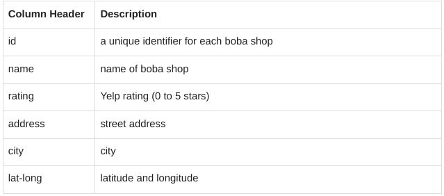

To get started, access the spreadsheet that contains the data. Click the link and make a copy of the [spreadsheet](https://docs.google.com/spreadsheets/d/1ETb45bbtIn-q3Z-eps9cw66GgS2Gye8cOfKIoFi65DU/template/preview).

Or, if you don’t have a Google account, you may download the dataset directly from the attachment [san-francisco-boba-tea-shop-location-info.csv](./resources/san-francisco-boba-tea-shop-location-info.csv)

## Identify the dirty elements in your data

As a data analyst, your job is to present data that is readable, accurate, and visually appealing. Cleaning your data helps you achieve this goal. The first step is to identify the dirty elements in your data.

1. Rename your spreadsheet. Click **Untitled Spreadsheet** and enter a new name. You can use the name **sf_boba_tea_shop_data** or a similar name that describes the data your spreadsheet contains.
2. If you want to get a better view of your data, you can make the columns wider by dragging the right boundary of the column heading. This may apply to the name (B), address (D), and lat-long (F) columns.
3. Now, review your data and consider any problems you may need to address. The following are examples of errors that you can quickly identify and fix. This is not a comprehensive list of every potential problem, but is a great starting point for data cleaning.

- First, there is at least one duplicate line (rows 20 and 21) in your dataset.
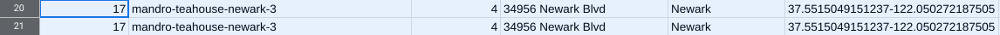

- Second, all Yelp ratings should fall between 0 and 5. However, at least one rating (in cell C8) falls outside of that range.  
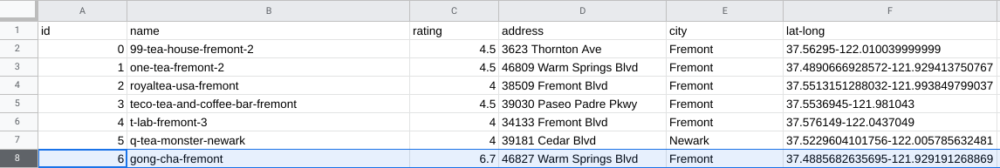

- Finally, the data for latitude and longitude is contained in a single column (F). In order for someone to be able to use this data for analysis, the two values should be in separate columns.
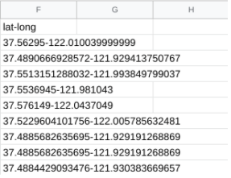

## Clean your data

Your goal is to fix these errors and help create a clean dataset for analysis. You can address each issue in turn.

### Remove duplicates

The first step is to eliminate any duplicate entries from your dataset. As a best practice, duplicates should be removed even if they are not readily apparent.

1. To start, select columns A through F.
2. Then, in the menu bar, choose **Data**, then **Data Cleanup**, and select **Remove duplicates**.
3. In the pop-up window, click **Data has header row**. You want to remove duplicate boba shop id's and boba shop names. In the **Columns to analyze** section, make sure the relevant columns **(id, name)** are selected.

    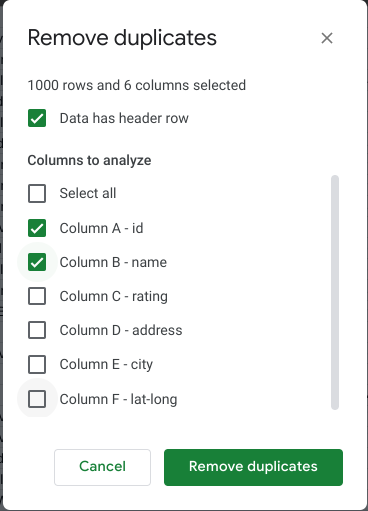

4. Once everything has been selected, click **Remove duplicates.**
5. If done correctly, 3 duplicate rows will be found and removed and 604 rows will remain.  

### Correct the ratings data

Next, clean up any data that does not make sense. Yelp ratings should be less than 5 and greater than 0. Now, you will determine how many entries are inaccurate and correct them. You can use the `COUNTIF` function to perform this task.

1. The `COUNTIF` function quickly counts how many items in a range of cells meet a given criterion. In cell I2, enter `=COUNTIF(C:C,">5")`. The first entry **(C:C)** refers to the range where you are counting the data. In this case, the range is the entire rating column (**C**), which contains the Yelp ratings. The second entry refers to the criterion `(>5)`, and tells the function to count all the values greater than 5.
2. Press Enter. You’ll notice that the function returns a value of 9. This tells you that your dataset contains 9 entries that have a rating greater than 5.
    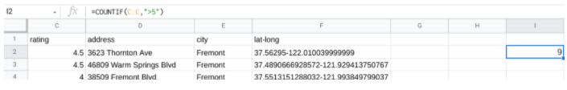
    As a data analyst, it's your job to decide what to do with incorrect values or to ask the dataset owner for advice if you’re unsure. In this case, one effective approach would be to search on Yelp for the actual ratings. For this activity, you can just replace the incorrect ratings with the number 5. An efficient way to replace the ratings is to sort the data numerically from largest to smallest rating.

3. Select columns A through F.
4. Then, from the menu bar, choose **Data**, then **Sort range**, and select A**dvanced range sorting options**.
5. In the pop-up window, check the box next to **Data has header row**. Sort by **rating** from **Z →A**. This way, the highest ratings will be listed first.
    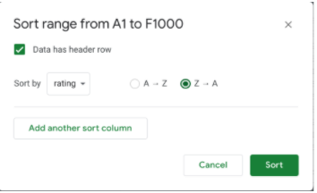
6. Click **Sort**. Check out your spreadsheet. At the start of the **rating** column, you should now find the 9 rows that have incorrect values (rating > 5).
    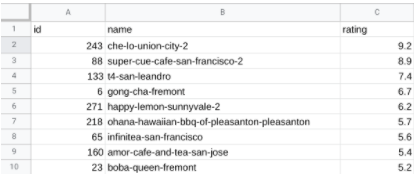
7. Next, select the range of cells **C2:C10**. Press **delete** to delete the values that are greater than 5.
8. Replace all the values with the number 5. In cell **C2**, enter `5`. Then, drag the fill handle down to cell C10 to fill the remaining cells with `5`.
9. After replacing the incorrect ratings with the number `5`, you may notice that the new value in cell I2 is 0. The output of the `COUNTIF` function now reflects the changes in your dataset. This confirms that the **rating** column no longer contains any values greater than `5`.

### Clean up the latitude and longitude data

Next, clean up the latitude and longitude data by placing each value in a separate column. You can use the `SPLIT` function to accomplish this task.  

1. The `SPLIT` function divides text around a specified character or string, and puts each fragment of text into a separate cell in the row. The `SPLIT` function will split the single lat-long column into two separate columns, one for latitude and the other for longitude. In cell **G2**, enter `=SPLIT(F2,"-")`. The first entry (F2) refers to the cell where the text is located. The second entry (“-”) refers to the fact that you are dividing the text based on the minus sign.
    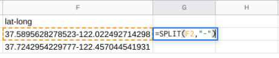
2. Press **Enter**. The result shows each fragment of text in a different cell.
3. Select cell G2 again. In cell G2, double-click on the fill handle to split all the remaining lat-long entries.
4. Now add column headers to the two new columns (G and H). In cell G1, enter **lat**. In cell **H1**, enter long.
5. Next, replace the original **lat-long** data in column F with the new split entries in columns G and H. Select columns G and H, right-click, and choose **Copy**.
    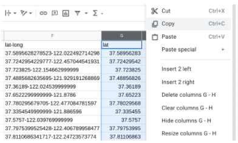
6. Then, select Column F, right-click, and choose **Paste special** and **Paste values only**.
    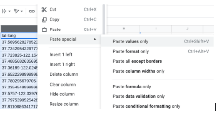
7. Now the new **lat** column is column **F**, and the new **long** column is column G. Adjust the width of the **lat** column (F) to fit the data by dragging the right boundary of the column heading.
    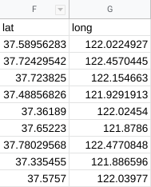
8. Next, select column H, right-click, and choose **Delete column**.

9. Finally, the longitude values should be negative so that they are accurate coordinates for mapping. To make the values in the **long** column negative, multiply them by **-1**. In cell **H2**, enter `=G2*-1`. The asterisk is the operator for multiplication. Press **Enter**.
10. Still in cell H2, double-click on the fill handle to fill in the rest of the values.
11. Next, add a column header. In cell H1, enter: **long**.
12. Now, replace the longitude data in column G with the new data in column H. Select column H, right-click, and choose **Copy**.
13. Select Column G, right-click, and choose **Paste special** and **Paste values only**.
14. Then, select column H, right-click, and choose **Delete column**.

    Columns F and G should look like this:

    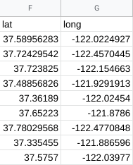

Now your data is cleaner, clearer, and easier to use.

## Reflection

Which of the following functions divides text around a specified character or string and puts each fragment of text into a separate cell in the row?

- The TRIM function
- The COUNTIF function
- The CONCATENATE function
- `The SPLIT function`

> The `SPLIT` function divides text around a specified character or string, and puts each fragment of text into a separate cell in the row. Spreadsheet functions are useful tools for data cleaning, and knowing how to use functions effectively is a key part of every data analyst’s skill set.

### Question 2:In the text box below, write 2-3 sentences (40-60 words) in response to each of the following questions

- As a data analyst, why is it important for the data you present to be readable, accurate, and visually appealing?
- How can spreadsheet functions help you clean data more efficiently and effectively?

As a data analyst, it's crucial for the data we present to be readable, accurate, and visually appealing to ensure that stakeholders can easily comprehend and trust the information, leading to informed decision-making. Spreadsheet functions can help clean data efficiently by automating tasks such as sorting, filtering, and removing duplicates, saving time and ensuring accuracy in the data cleaning process.

> Cleaning data is an important part of the data analysis process. If data analysis is based on bad or “dirty” data, it may be biased, erroneous, and uninformed. Knowing how to effectively use spreadsheet functions to work with data is an essential skill for every data analyst. In upcoming activities, you will continue to learn more about spreadsheet functions and how they can help you analyze your data.
