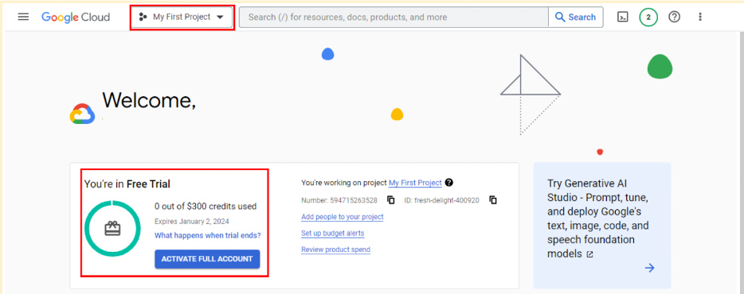

# Review: Set up your BigQuery account

**Note**: This reading is also in Courses 3 and 5 of this program. If you’re taking the courses in order, you may either review it or move on to the next new course item, [Hands-On Activity: Processing time with SQL](../p1_sql-for-sparkling-clean-data/s9_hands-on_processing-time-with-sql.md).

If you haven’t taken Courses 3,5 (refer: [1_VIDEO_Setting-up-BigQuery-including-sandbox-and-billing-options](../../../3_Prepare-Data-for-Exploration/3_Module-3_All-about-databases/5_Working-with-large-datasets-in-SQL/1_VIDEO_Setting-up-BigQuery-including-sandbox-and-billing-options.md), [2_READING_How-to-use-BigQuery](../../../3_Prepare-Data-for-Exploration/3_Module-3_All-about-databases/5_Working-with-large-datasets-in-SQL/2_READING_How-to-use-BigQuery.md)), you should complete this reading before proceeding to the next course item.

As you’ve been learning, BigQuery is a database you can use to access, explore, and analyze data from many sources. Now, you’ll begin using BigQuery, which will help you gain SQL knowledge by typing out commands and troubleshooting errors. This reading will guide you through the process of setting up your very own BigQuery account.

Note: Working with BigQuery is not a requirement of this program. Additional resources for other SQL database platforms are also provided at the end of this reading if you choose to use them instead.  

## BigQuery account options

BigQuery offers a variety of account tiers to cater to various user needs and has two free-of-charge entry points, a sandbox account and a free-of-charge trial account. These options allow you to explore the program before selecting the best choice to suit your needs. A sandbox account allows you to practice writing queries and to explore public datasets free of charge, but it has [quotas and limits](https://cloud.google.com/bigquery/quotas), as well as some additional [restrictions](https://cloud.google.com/bigquery/docs/sandbox#limits). If you prefer to use BigQuery with the standard limits, you can set up a free-of-charge trial account instead. The free-of-charge trial is a trial period prior to paying for a subscription. In this instance, there is no automatic charge, but you will be asked for payment information when you create the account.

This reading provides instructions for setting up either account type.  An effective first step is to begin with a sandbox account and switch to a free-of-charge trial account when needed to run the SQL presented upcoming courses.

### Sandbox account

The sandbox account is available at no cost, and anyone with a Google account can use it. However, it does have some limitations. For instance, you are limited to a maximum of 12 projects at a time. This means that, to create a 13th project, you'll need to delete one of your existing 12 projects. Additionally, the sandbox account doesn't support all operations you’ll do in this program. For example, there are limits on the amount of data you can process and you can’t insert new records into a database or update the values of existing records. However, a sandbox account is perfect for most program activities, including all of the activities in this course. Additionally, you can convert your sandbox account into a free-of-charge trial account at any time.

### Set up your sandbox account

To set up a sandbox account:

1. Visit the [BigQuery sandbox documentation](https://cloud.google.com/bigquery/docs/sandbox#limits) page.
2. Log in to your preferred Google account by selecting the profile icon in the BigQuery menu bar.
3. Select the **Go to BigQuery** button on the documentation page.
4. You'll be prompted to select your country and read the terms of service agreement.
5. This will bring you to the **SQL Workspace**, where you'll be conducting upcoming activities. By default, BigQuery creates a project for you.

After you set up your account, the name of the project will be in the banner in your BigQuery console.

### Free-of-charge trial

If you wish to explore more of BigQuery's capabilities with fewer limitations, consider the Google Cloud Free Trial. It provides you with $300 in credit for Google Cloud usage during the first 90 days. If you're primarily using BigQuery for SQL queries, you're unlikely to come close to this spending limit. After you've used up the $300 credit or after 90 days, your free trial will expire, and you will only be able to use this account if you pay to do so. Google won't automatically charge your payment method when the trial ends. However, you'll need to set up a payment option with Google Cloud. This means that you’ll need to enter your financial information. Rest assured, it won't charge you unless you consciously opt to upgrade to a paid account. If you're uncomfortable providing payment information, don't worry; you can use the BigQuery sandbox account instead.

### Set up your free-of-charge trial

1. Go to the [BigQuery](https://cloud.google.com/bigquery) page.
2. Select Try **BigQuery free**.
3. Log in using your Google email, or create an account free of charge if you don't have one. [Click here](https://cloud.google.com/bigquery?utm_source=google&utm_medium=cpc&utm_campaign=na-US-all-en-dr-bkws-all-all-trial-e-dr-1605212&utm_content=text-ad-none-any-DEV_c-CRE_665665924750-ADGP_Hybrid+%7C+BKWS+-+MIX+%7C+Txt_BigQuery-KWID_43700077225652770-kwd-274188433361&utm_term=KW_bigquery%20account-ST_bigquery+account&gclid=CjwKCAjwkNOpBhBEEiwAb3MvvYQXjIQ4TRnkITJoSXz7DFez4T-XKPG5IpfKmxUg2iHPEmiJBNQByhoCLVgQAvD_BwE&gclsrc=aw.ds) to create an account.
4. Select your country, a description of your organization or needs, and the checkbox to accept the terms of service, Then select **CONTINUE**.
5. Enter your billing information and select **START MY FREE TRIAL**.

After you set up your account, your first project, titled My First Project will be in the banner.

## Transferring between BigQuery accounts

With either a sandbox or free-of-charge trial account, you have the flexibility to upgrade to a paid account at any time. If you upgrade, all your existing projects will be retained and transferred to your new account. If you started with a free-of-charge trial, but choose not to upgrade when it ends, you can switch to a sandbox account. However, note that projects from your trial won't transfer to your sandbox. Essentially, creating a sandbox is like starting from scratch.

## Get started with other databases (if not using BigQuery)

It’s easiest to follow along with the course activities if you use BigQuery, but you may use other SQL platforms, if you prefer. If you decide to practice SQL queries on other database platforms, here are some resources to get started:

- [Getting Started with MySQL](https://dev.mysql.com/doc/mysql-getting-started/en/)
- [Getting Started with Microsoft SQL Server](https://docs.microsoft.com/en-us/sql/relational-databases/tutorial-getting-started-with-the-database-engine?view=sql-server-ver15)
- [Getting Started with PostgreSQL](https://www.postgresql.org/docs/10/tutorial-start.html)
- [Getting Started with SQLite](https://www.sqlite.org/quickstart.html)

## Key takeaways

BigQuery offers multiple account options. Keep the following in mind when you choose an account type:

- Account tiers: BigQuery provides various account tiers to cater to a wide range of user requirements. Whether you're starting with a sandbox account or exploring a paid account with the free-of-charge trial option, BigQuery offers flexibility to choose the option that aligns best with your needs and budget.
- Sandbox limitations: While a sandbox account is a great starting point, it comes with some limitations, such as a cap on the number of projects and restrictions on data manipulation operations like inserting or updating records, which you will encounter later in this program. Be aware of these limitations if you choose to work through this course using a sandbox account.
- Easy setup and upgrades: Getting started with any BigQuery account type is quick and easy. And if your needs evolve, you have the flexibility to modify your account status at any time. Additionally, projects can be retained even when transitioning between account types.

Choose the right BigQuery account type to match your specific needs and adapt as your requirements change!
