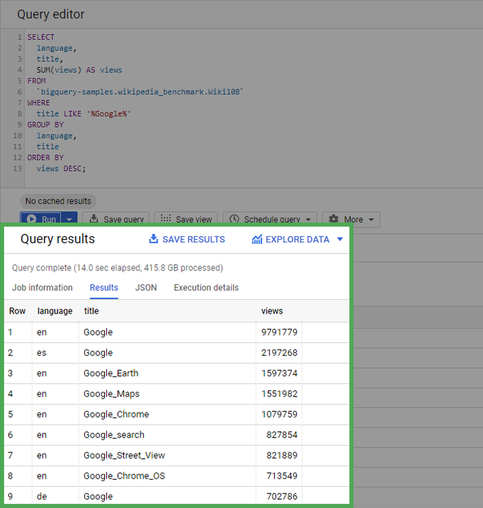

# Hands-On Activity: Processing time with SQL

## Activity overview

In this activity, you’ll explore how the amount of data processed by a SQL query affects how long it takes the query to run.

By the time you complete this activity, you’ll be familiar with the different units used to measure data quantity. This will help you understand how dataset size affects the amount of time queries take to run and how valuable tools like SQL can be to data analysts.

### Understand how data is measured

All information in a computer is represented as a binary number consisting solely of 0’s and 1’s. Each 0 or 1 in a number is a bit, which is the smallest unit of storage in computers. Data is measured by the number of bits it takes to represent it. This is then described in bytes, which are equal to 8 bits.

Take a moment to examine the table below to understand each data measurement and its size relative to the others..

| Unit        | Abbreviation | Equivalent to        | Example (with approximate size)                |
|-------------|--------------|----------------------|-----------------------------------------------|
| Byte        | B            | 8 bits               | 1 character in a string (1 byte)               |
| Kilobyte    | KB           | 1024 bytes           | A page of text (4 kilobytes)                   |
| Megabyte    | MB           | 1024 Kilobytes       | 1 song in MP3 format (2-3 megabytes)          |
| Gigabyte    | GB           | 1024 Megabytes       | 300 songs in MP3 format (1 gigabyte)          |
| Terabyte    | TB           | 1024 Gigabytes       | 500 hours of HD video (1 terabyte)            |
| Petabyte    | PB           | 1024 Terabytes       | 10 billion Facebook photos (1 petabyte)       |
| Exabyte     | EB           | 1024 Petabytes       | 500 million hours of HD video (1 exabyte)    |
| Zettabyte   | ZB           | 1024 Exabytes        | All the data on the internet in 2019 (4.5 ZB) |

### The amount of data in the world

Now that you’ve explored data measurements, think about the amount of data in the world. It’s growing at an incredible pace largely due to the more than 5.3 billion people in the world connected to the internet (as of November 2023). Smartphones and other internet-connected devices generate a staggering amount of new data. Many experts believe that the amount of all the data on the internet will swell to 175 ZB by the end of 2025!

### Dataset size is important

The size of the dataset you’re working with usually determines which tool—spreadsheets or SQL—is best suited for the task. Spreadsheets often start to have performance issues as dataset sizes increase beyond a few megabytes. SQL databases are much better at working with larger datasets that have billions of rows with sizes measured in gigabytes. Yet the dataset’s size still matters here: Even in SQL, it takes longer for queries to complete when they’re run on longer datasets, depending on the query’s content and the number of rows SQL has to process.

### Query a large dataset

You’ll now discover for yourself how query runtimes change with dataset size by running some queries on a huge dataset—Wikipedia!

#### Prepare to run queries

1. On the [Enable the BigQuery sandbox](https://cloud.google.com/bigquery/docs/sandbox) page, select **Go to BigQuery**. If you have a free trial version of BigQuery, you can use that instead.
    - Note: BigQuery Sandbox frequently updates its user interface. The latest changes may not be reflected in the screenshots presented in this activity, but the principles remain the same. Adapting to changes in software updates is an essential skill for data analysts, and it’s helpful for you to practice troubleshooting. You can also reach out to your community of learners on the discussion forum for help.
2. The main section is the home screen from which you can access the Query Editor. You can navigate to different projects and data sets available to you using the Explorer menu.
3. Select **Compose a new query** so that you can work through an example query.

#### Run a large query

Copy and paste the following query into the Query editor. Select **Run** to run it. The formatting improves readability, but it’s okay if it changes when copied over—it won’t affect how your code runs. This query sorts and filters data from the dataset `bigquery-samples.wikipedia_benchmark.Wiki10B`, which is a sample from the Wikipedia public dataset that contains 10 billion rows.

```sql
SELECT
  language,
  title,
  SUM(views) AS views
FROM
  `bigquery-samples.wikipedia_benchmark.Wiki10B`
WHERE
  title LIKE '%Google%'
GROUP BY
  language,
  title
ORDER BY
  views DESC;
```

**Note**: Later in this course and program, you will learn what each part of this query means and how to use its functions in your own work.

After the query finishes, you will get a table that displays the total number of times each Wikipedia page with “Google” in the title has been viewed in each language.



Note the information that BigQuery provides on the query you just ran.

You’ll find that the query processes more than 415 gigabytes of data when run—very impressive for 15 seconds! If you run the query on this dataset again, the runtime will be almost instant (as long as you haven’t changed the default caching settings). This is because BigQuery caches (stores in the background) the query results to avoid extra work if the query needs to be rerun.

### Step 3: Run a larger query

Now, run the same query on a 100-billion-row version of the Wikipedia dataset. Copy and paste the following query into the editor and run it:

**Note**: This query will only run in the free trial account, not in the sandbox version of BigQuery. If you use a sandbox account, use the results presented below.

```sql
SELECT
  language,
  title,
  SUM(views) AS views
FROM
  `bigquery-samples.wikipedia_benchmark.Wiki100B`
WHERE
  title LIKE '%Google%'
GROUP BY
  language,
```

After the query finishes, you will get a table that displays the total number of times each Wikipedia page with “Google” in the title has been viewed in each language.


Notice that this query takes longer to run than the first query, at least 25-30 seconds. At 100 billion rows, the query processed 4.1 terabytes of data!

## Reflection

### Question 1: The first query you ran processed 415.8 GB of data. The data preview displays the number of rows the query returned. How many rows were returned by the query?

- 305,710
- 198,768
- `214,710`: correct
- 225,038

> The first query you ran returns 214,710 rows of data. Going forward, you can apply this knowledge of data size measurements to better understand how much data you will work with and what tool is best suited to each data analysis project.

### Question 2: In this activity, you compared the amount of time it takes to process different sizes of queries in SQL. In the text box below, write 2-3 sentences (40-60 words) in response to each of the following questions

- How did working with SQL help you query a larger dataset?
- How long do you think it would take a team to analyze a dataset like this manually?
- How does the ability to query large datasets in reasonable amounts of time affect data analysts?

Working with SQL significantly facilitated querying a larger dataset by providing a structured and efficient way to filter, aggregate, and analyze data. SQL's ability to handle large datasets allows for faster and more effective data processing compared to manual methods.

Analyzing a dataset of this size manually would likely take a considerable amount of time, potentially weeks or even months, depending on the team's size and resources. Manual analysis is not only time-consuming but also prone to errors, making SQL a much more efficient solution.

The ability to query large datasets quickly enhances the productivity and efficiency of data analysts. It enables them to derive insights quickly, make informed decisions, and identify patterns or trends in extensive datasets. This efficiency is particularly valuable in a business environment where timely decision-making is essential.
It allows for more in-depth and timely analysis, enabling analysts to derive insights and make data-driven decisions faster. This capability is crucial in today's data-rich environment where large datasets are common.
