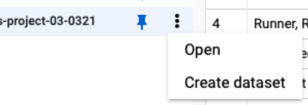
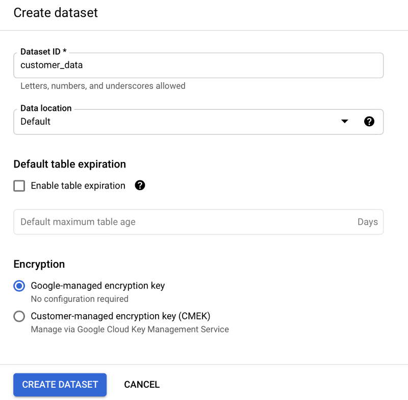
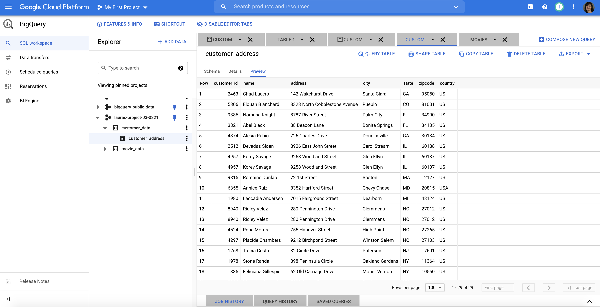

# Optional: Upload the customer dataset to BigQuery

In the next video, the instructor uses a specific dataset. The instructions in this reading are provided for you to upload the same dataset in your BigQuery console.

You must have a BigQuery account to follow along.

## Prepare for the next video

- First, download the .csv file from the attachment: [customer-table_sheet1.csv file](./resources/)

- Next, complete the following steps in your BigQuery console to upload the Customer Table dataset.

**Step 1**: Open your BigQuery console and click on the project you want to upload the data to.

**Step 2**: In the **Explorer** on the left, click the **Actions** icon (three vertical dots) next to your project name and select **Create dataset**.

This image shows the BigQuery Console; and a pinned project is open

**Step 3**: In the upcoming video, the name "customer_data" will be used for the dataset. If you plan to follow along with the video, enter **customer_data** for the Dataset ID.

This image shows the Dataset ID field, default settings, and the CREATE DATASET button in the Create dataset window.

**Step 4**: Click **CREATE DATASET** (blue button) to add the dataset to your project.

**Step 5**: In the **Explorer** on the left, click to expand your project, and then click the customer_data dataset you just created.

**Step**6: Click the **Actions** icon (three vertical dots) next to **customer_data** and select **Open**.

**Step 7**: Click the blue `+` icon at the middle to open the **Create table** window.

**Step 8**: Under Source, for the Create table from selection, choose where the data will be coming from.  

- Select **Upload**.
- Click **Browse** to select the Customer Table .csv file you downloaded.
- Choose **CSV** from the file format drop-down.

**Step9**: For Table name, enter **customer_address** if you plan to follow along with the video.

Step 10: For **Schema**, click the **Auto detect** check box.

Step 11: Click Create table (blue button). You will now see the **customer_address** table under your **customer_data** dataset in your project.

Step 12: Click **customer_address** and then select the **Preview** tab. Confirm that you see the data shown below.

And now you have everything you need to follow along with the next video. This is also a great table to use to practice querying data on your own. Plus, you can use these steps to upload any other data you want to work with.
