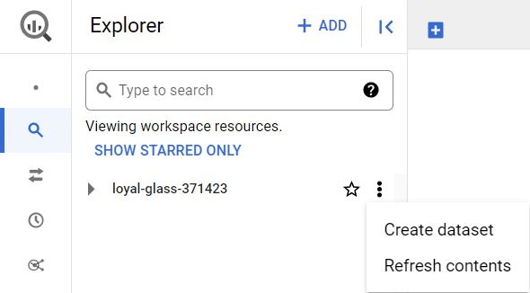

# Hands-On Activity: Clean data using SQL

## Activity overview

In previous lessons, you learned about the importance of being able to clean your data where it lives. When it comes to data stored in databases, that means using SQL queries. In this activity, you will create a custom dataset and table, import a .csv file, and use SQL queries to clean automobile data.

In this scenario, you are a data analyst working with a used car dealership startup venture. The investors want you to find out which cars are most popular with customers so they can make sure to stock accordingly.

By the time you complete this activity, you will be able to clean data using SQL. This will enable you to process and analyze data in databases, which is a common task for data analysts.

## What you will need

To get started, download the *automobile_data.csv* file. This is data from an external source that contains historical sales data on car prices and their features.

Click the link to the *automobile_data.csv* file to download it. Or you may download the .csv file directly from the attachments below.

Link to data: [automobile_data](https://docs.google.com/spreadsheets/d/1U3ktsROmhoCZG3Yz5xFLnjJmzm-MgBYYxwt4xcb6d3o/template/preview)

OR Download download data: [automobile_data.csv](./resources/automobile_data.csv)

## Upload your data

Now, create a dataset and a custom table to house your data. This will enable you to use SQL queries to explore and clean data. Once you’ve downloaded the automobile_data.csv file, create your dataset.

**Step 1: Create a dataset**
Go to the **Explorer** pane in your workspace and click the three dots next to your personal project name to open the drop-down menu. From here, select **Create dataset**.



From the **Create dataset** menu, fill out some information about the dataset. Input the Dataset ID as `cars`; you can keep the **Location type as Multi-region, US (multiple regions in United States)**, and the **Encryption** as **Google-managed encryption** key default settings. Then, click the **CREATE DATASET**  button.


The cars dataset should appear under your project in the Explorer pane as shown below.


**Step 2: Create table**
After clicking on cars to open your newly created dataset, you will be able to add a custom table for the insertion of your downloaded data.

From the **cars** dataset info window, click **CREATE TABLE**.


Within the **Create table** window, upload the automobile_data.csv by clicking the drop-down arrow under **Source** and choosing the **Upload** option. Click the **BROWSE** button and navigate to the folder where your .csv document is located, and notice the **File format** will automatically change to CSV. Ensure the dataset name is cars and name your table `car_info`. Set the schema to Auto-detect, and finally click the **Create table** button.


After creating your table, it will appear in your Explorer pane. You can click on the newly created table, `car_info`, to explore the **SCHEMA** and **DETAILS** buttons within your data page. Once you have gotten familiar with your data, you can start querying it.

## Cleaning your data

Your new dataset contains historical sales data, including details such as car features and prices. You can use this data to find the top 10 most popular cars and trims. But before you can perform your analysis, you’ll need to make sure your data is clean. If you analyze dirty data, you could end up presenting the wrong list of cars to the investors. That may cause them to lose money on their car inventory investment.

**Step 1: Inspect the fuel_type column**
The first thing you want to do is inspect the data in your table so you can find out if there is any specific cleaning that needs to be done. Get an initial understanding of the data table by clicking on the **PREVIEW** tab that sits below the `car_info` toolbar.


According to the [data’s description](https://archive.ics.uci.edu/ml/datasets/Automobile), the fuel_type column should only have two unique string values: `diesel` and `gas`. To check and make sure that’s true, run the following query. You can generate the default query setup by clicking on the **QUERY** button and selecting the **In split tab**. This will give you a dual view of the info window and the query.


Next, we can generate the first query in the workspace:  

```sql
SELECT
  DISTINCT fuel_type
FROM
  your project name.cars.car_info
LIMIT 1000
```

**NOTE**: Within the `FROM` clause of the syntax above, you will need to begin the `Table ID` line with your personalized project name,  period, the dataset name, period, and end with the table name. It's important to understand that the personal project name will be unique to each learner. You can also locate and copy the full `Table ID` filename by clicking on the **DETAIL** option tab in your `car_info` **Table info** window. Once copied, paste it after the `FROM` clause and run the above query.

This returns the following results:


This confirms that the fuel_type column doesn’t have any unexpected values. Also note that the default LIMIT 1000 is added to your query, but in this case, BigQuery is only returning two distinct fuel types.

**Step 2: Inspect the length column**
Next, you will inspect a column with numerical data. The length column should contain numeric measurements of the cars. So you will check that the minimum and maximum lengths in the dataset align with the [data description](https://archive.ics.uci.edu/ml/datasets/Automobile), which states that the lengths in this column should range from 141.1 to 208.1. Run this query to confirm:

```sql
SELECT
  MIN(length) AS min_length,
  MAX(length) AS max_length
FROM
  you project name.cars.car_info;
```

Your results should confirm that 141.1 and 208.1 are the minimum and maximum values respectively in this column.


**Step 3: Fill in missing data**
Missing values can create errors or skew your results during analysis. You’re going to want to check your data for null or missing values. These values might appear as a blank cell or the word `null` in BigQuery.

You can check to see if the `num_of_doors` column contains null values using this query:

```sql
SELECT
  *
FROM
  your project name.cars.car_info 
WHERE 
  num_of_doors IS NULL;
```

This will select any rows with missing data for the `num_of_doors` column and return them in your results table. You should get two results, one Mazda and one Dodge:


In order to fill in these missing values, you check with the sales manager, who states that all Dodge gas sedans and all Mazda diesel sedans sold had four doors. If you are using the BigQuery free trial, you can use this query to update your table so that all Dodge gas sedans have four doors:

```sql
UPDATE
  your project name.cars.car_info
SET
  num_of_doors = "four"
WHERE
  make = "dodge"
  AND fuel_type = "gas"
  AND body_style = "sedan";
```

You should get a message telling you that three rows were modified in this table. To make sure, you can run the previous query again:

```sql
SELECT
  *
FROM
  your project name.cars.car_info 
WHERE 
  num_of_doors IS NULL;
```

Now, you only have one row with a `NULL` value for num_of_doors. Repeat this process to replace the null value for the Mazda.

If you are using the BigQuery Sandbox, you can skip these `UPDATE` queries; they will not affect your ability to complete this activity.

**Step 4: Identify potential errors**
Once you have finished ensuring that there aren’t any missing values in your data, you’ll want to check for other potential errors. You can use `SELECT DISTINCT` to check what values exist in a column. You can run this query to check the num_of_cylinders column:

```sql
SELECT
  DISTINCT num_of_cylinders
FROM
  your project name.cars.car_info;
```

After running this, you notice that there are one too many rows. There are two entries for two cylinders: rows 6 and 7. But the *two* in row 7 is misspelled.


To correct the misspelling for all rows, you can run this query if you have the BigQuery free trial:

```sql
UPDATE
  your project name.cars.car_info
SET
  num_of_cylinders = "two"
WHERE
  num_of_cylinders = "tow";
```

You will get a message alerting you that one row was modified after running this statement. To check that it worked, you can run the previous query again:

```sql
SELECT
  DISTINCT num_of_cylinders
FROM
  your project name.cars.car_info;
```

Next, you can check the compression_ratio column. According to the [data description](https://archive.ics.uci.edu/ml/datasets/Automobile), the compression_ratio column values should range from 7 to 23. Just like when you checked the length values , you can use `MIN` and `MAX` to check if that’s correct:

```sql
SELECT
  MIN(compression_ratio) AS min_compression_ratio,
  MAX(compression_ratio) AS max_compression_ratio
FROM
  your project name.cars.car_info;
```

Notice that **this returns a maximum of 70**. But you know this is an error because the maximum value in this column should be 23, not 70. So the 70 is most likely a 7.0. Run the above query again without the row with 70 to make sure that the rest of the values fall within the expected range of 7 to 23.

```sql
SELECT
  MIN(compression_ratio) AS min_compression_ratio,
  MAX(compression_ratio) AS max_compression_ratio
FROM
  your project name.cars.car_info
WHERE
  compression_ratio <> 70;
```

Now the highest value is 23, which aligns with the data description. So you’ll want to correct the 70 value. You check with the sales manager again, who says that this row was made in error and should be removed. Before you delete anything, you should check to see how many rows contain this erroneous value as a precaution so that you don’t end up deleting 50% of your data. If there are too many (for instance, 20% of your rows have the incorrect 70 value), then you would want to check back in with the sales manager to inquire if these should be deleted or if the 70 should be updated to another value. Use the query below to count how many rows you would be deleting:

```sql
SELECT
   COUNT(*) AS num_of_rows_to_delete
FROM
   your project name.cars.car_info
WHERE
   compression_ratio = 70;
```

Turns out there is only one row with the erroneous 70 value. So you can delete that row using this query:  

```sql
DELETE your project name.cars.car_info
WHERE compression_ratio = 70;
```

If you are using the BigQuery sandbox, you can replace `DELETE` with `SELECT` to see which row would be deleted.

**Step 5: Ensure co**nsistency
Finally, you want to check your data for any inconsistencies that might cause errors. These inconsistencies can be tricky to spot—sometimes even something as simple as an extra space can cause a problem.

Check the `drive_wheels` column for inconsistencies by running a query with a `SELECT DISTINCT` statement:

```sql
 SELECT
  DISTINCT drive_wheels
FROM
  your project name.cars.car_info;
```

It appears that 4wd appears twice in results. However, because you used a `SELECT DISTINCT` statement to return unique values, this probably means there’s an extra space in one of the 4wd entries that makes it different from the other 4wd.


To check if this is the case, you can use a `LENGTH` statement to determine the length of how long each of these string variables:

```sql
SELECT
  DISTINCT drive_wheels,
  LENGTH(drive_wheels) AS string_length
FROM
  your project name.cars.car_info;
```

According to these results, some instances of the 4wd string have four characters instead of the expected three (4wd has 3 characters). In that case, you can use the `TRIM` function to remove all extra spaces in the drive_wheels column if you are using the BigQuery free trial:

```sql
UPDATE
  your project name.cars.car_info
SET
  drive_wheels = TRIM(drive_wheels)
WHERE TRUE;
```

Then, you run the SELECT DISTINCT statement again to ensure that there are only three distinct values in the drive_wheels column:

```sql
 SELECT
  DISTINCT drive_wheels
FROM
  your project name.cars.car_info;
```

And now there should only be three unique values in this column! Which means your data is clean,  consistent, and ready for analysis!

## Reflection

### Question 1:What is the maximum value in the price column of the car_info table?

- 5,1180
- `45,400`: correct
- 16,430
- 12,978

> The maximum value is 45,400. To ensure that the values in the price column fell within the expected range, you used the MIN and MAX functions to determine that the maximum price was 45,400. Knowing this, you were able to clean this column and prepare for analysis. Going forward, you will continue to check columns with numeric data in BigQuery to make sure your data is clean. This will help you quickly identify issues with your data that might cause errors during analysis.

## Question 2:In the text box below, write 2-3 sentences (40-60 words) in response to each of the following questions

- Why is cleaning data before your analysis important?
- Which of these cleaning techniques do you think will be most useful for you in the future?

Cleaning data is crucial before analysis because inaccurate or inconsistent data can lead to faulty insights and incorrect conclusions. By ensuring data quality, analysts can trust their findings and make informed decisions, preventing potential financial losses or misguided actions based on flawed information.

The `TRIM` function to remove extra spaces in string variables seems particularly useful. Inconsistent whitespace can cause subtle errors, and using `TRIM` ensures data consistency. This technique is valuable for maintaining clean datasets and avoiding issues related to string discrepancies in various fields.

> Congratulations on completing this hands-on activity! In this activity you checked your data for errors and fixed any inconsistencies. A good response would include that cleaning data is an important step of the analysis process that will save you time and help ensure accuracy in the future.

> Cleaning data where it lives is incredibly important for analysts. For instance, you were able to use SQL to complete multiple cleaning tasks, which allows you to clean data stored in databases. In upcoming activities, you will use your cleaning skills to prepare for analysis!
