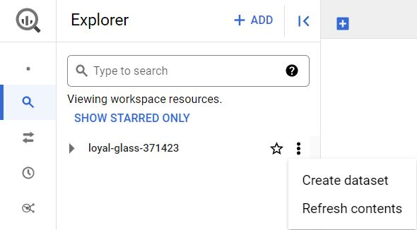
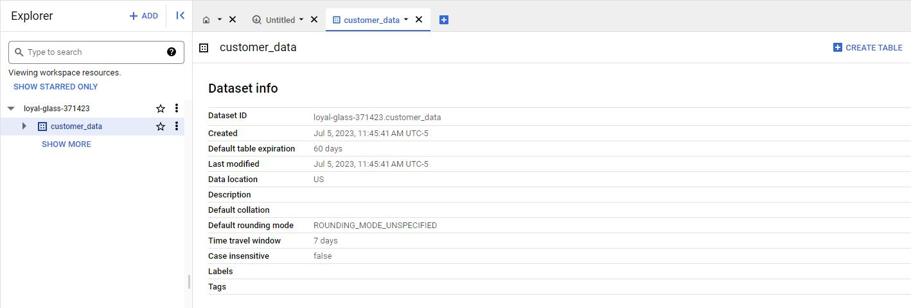
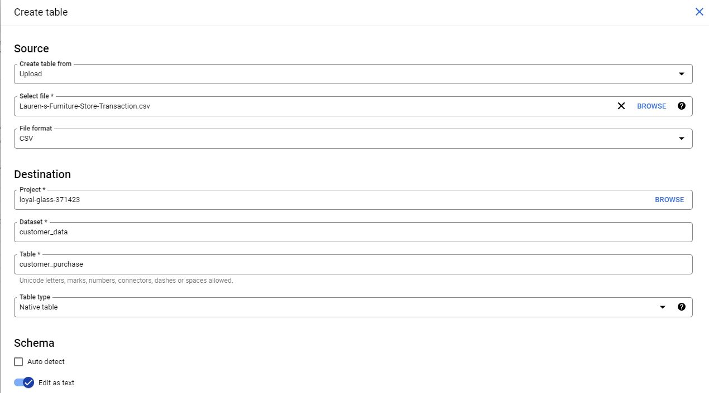
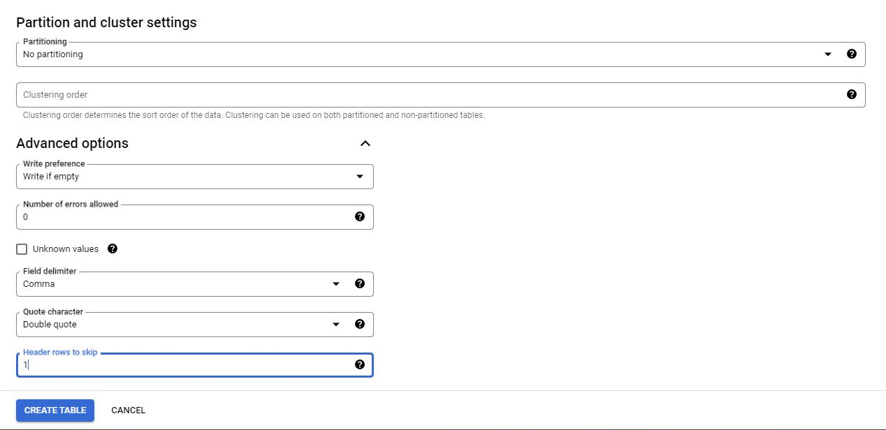
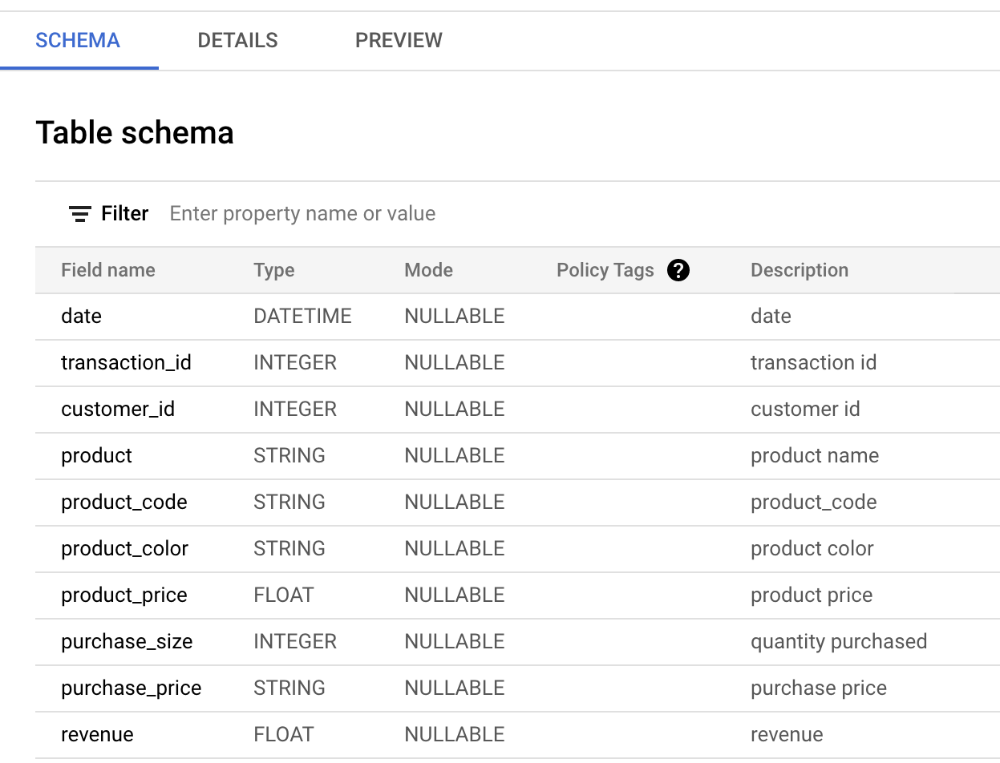
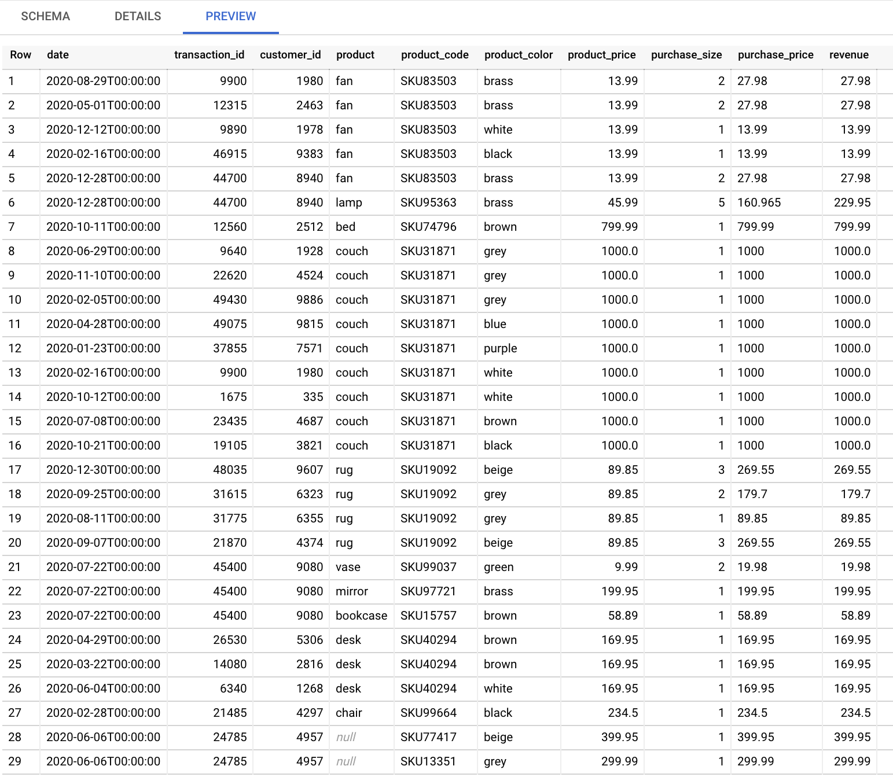

# Optional: Upload the store transactions dataset to BigQuery

In the next video, the instructor uses a specific dataset. The instructions in this reading are provided for you to upload the same dataset in your BigQuery console so you can follow along.

You must have a BigQuery account to follow along.

## Prepare for the next video

First, download the .csv file from the attachment below.

- [lurens-furniture-store-transaction-table.csv](./resources/lurens-furniture-store-transaction-table.csv)

Next, complete the steps below in your BigQuery console to upload the Store Transaction dataset.

**Note**: These steps will be different from what you performed before. In previous instances, you selected the **Auto detect** check box to allow BigQuery to auto-detect the schema. This time, you will choose to create the schema by editing it as text. This method can be used when BigQuery doesn't automatically set the desired type for a particular field. In this case, you will specify `STRING` instead of `FLOAT` as the type for the purchase_price field.

**Step 1**: Open your BigQuery console and click on the project you want to upload the data to. If you already created a `customer_data` dataset for your project, jump to step 5; otherwise, continue with step 2.

**Step 2**: In the **Explorer** on the left, click the **Actions** icon (three vertical dots) next to your project name and select **Create dataset**.



**Step 3**: In the **Create dataset** window, enter **customer_data** for the Dataset ID. Make sure the Location type is set to **Multi-region, US (Multiple regions in United States)**, and all the default Advanced options remain set to the **Google-managed encryption key** option.

**Step 4**: Click **CREATE DATASET** (blue button) to add the dataset to your project.

**Step 5**:In the **Explorer** pane, click on the expansion arrow under your project name, and then click the **customer_data** dataset.



**Step 6**: On the far right hand side of the new **Dataset info** page, click the blue + **CREATE TABLE** button to open the Create table window. Use the visual settings in the next image to complete the steps below.



**Step 7**: Under **Source**, for the **Create table** from selection, choose where the data will be coming from.

- Select **Upload**.
- Click **Browse** to select the Store Transaction Table .csv file you downloaded.
- Choose **CSV** from the file format drop-down.

**Step 8**: For Table name, enter **customer_purchase** if you plan to follow along with the video.

**Step 9**: For Schema, click the toggle switch for **Edit as text**. This opens up a box for  the text.

**Step 10**: Copy and paste the following text into the box. Be sure to include the opening and closing brackets. They are required.

```json
[
  {
    "description": "date",
    "mode": "NULLABLE",
    "name": "date",
    "type": "DATETIME"
  },
  {
    "description": "transaction id",
    "mode": "NULLABLE",
    "name": "transaction_id",
    "type": "INTEGER"
  },
  {
    "description": "customer id",
    "mode": "NULLABLE",
    "name": "customer_id",
    "type": "INTEGER"
  },
  {
    "description": "product name",
    "mode": "NULLABLE",
    "name": "product",
    "type": "STRING"
  },
  {
    "description": "product_code",
    "mode": "NULLABLE",
    "name": "product_code",
    "type": "STRING"
  },
  {
    "description": "product color",
    "mode": "NULLABLE",
    "name": "product_color",
    "type": "STRING"
  },
  {
    "description": "product price",
    "mode": "NULLABLE",
    "name": "product_price",
    "type": "FLOAT"
  },
  {
    "description": "quantity purchased",
    "mode": "NULLABLE",
    "name": "purchase_size",
    "type": "INTEGER"
  },
  {
    "description": "purchase price",
    "mode": "NULLABLE",
    "name": "purchase_price",
    "type": "STRING"
  },
  {
    "description": "revenue",
    "mode": "NULLABLE",
    "name": "revenue",
    "type": "FLOAT"
  }
]
```

**Step 11**: Scroll down and expand the **Advanced options** section.

**Step 12**: For the **Header rows to skip** field, enter 1.

**NOTE**: It is ***very important*** that you don't skip the last step, or you will receive 'parsing' errors, as BigQuery will try to apply the schema editing functions to the title row.



**Step 13**: Click **Create table** (blue button). You will now see the **customer_purchase** table under your **customer_data** dataset in your **Explorer** pane.

**Step 14**: Click the **customer_purchase** table and in the **Schema** tab, confirm that the schema matches the schema shown below.



**Step 15**: Click the **Preview** tab and confirm that your data matches the data shown below.



Congratulations, you are now ready to follow along with the video!
